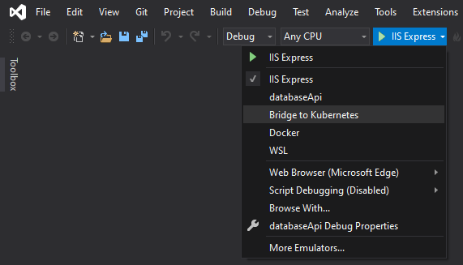
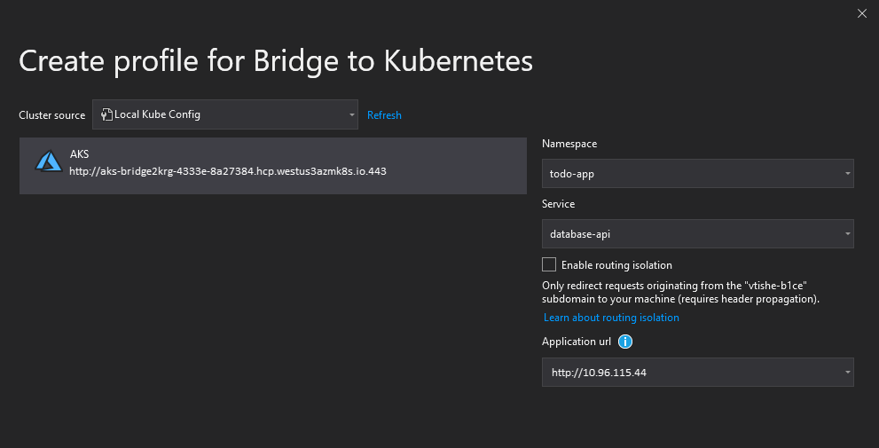
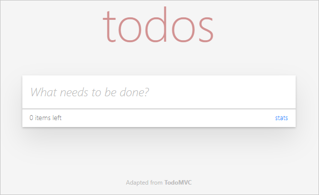
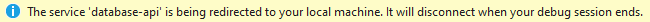
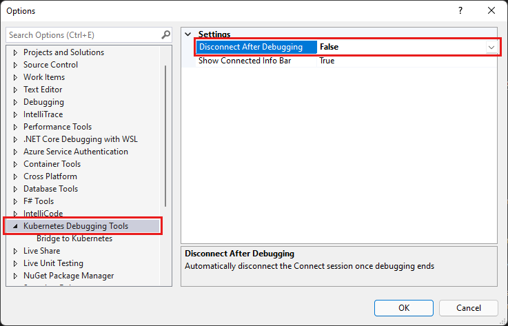
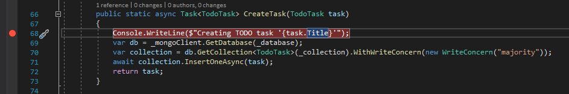
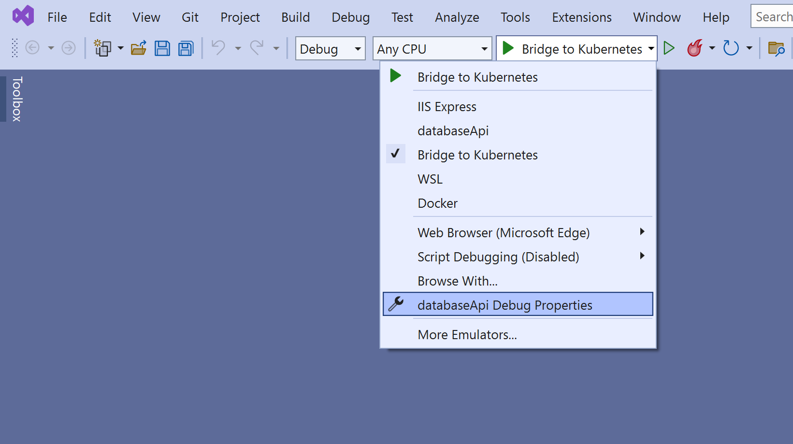
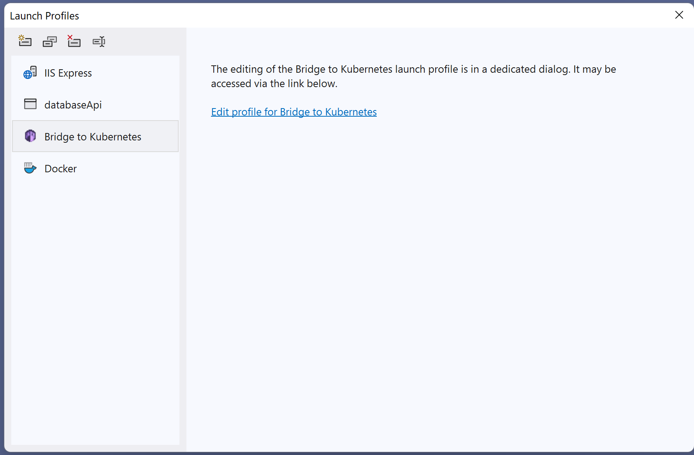

# Tutorial: Run and debug locally with Bridge to Kubernetes on Visual Studio

[!INCLUDE [Bridge to Kubernetes deprecation note](./includes/deprecation.md)]

In this tutorial, you'll learn how to redirect traffic between your Kubernetes cluster and your development computer.
This tutorial uses Bridge to Kubernetes and Visual Studio for debugging a service.
To use Visual Studio Code, see [Run and debug locally with Bridge to Kubernetes with VS Code](bridge-to-kubernetes-vs-code.md).

To learn more about Bridge to Kubernetes, see [How Bridge to Kubernetes works](overview-bridge-to-kubernetes.md).

In this tutorial, you learn how to:

> [!div class="checklist"]
> - Connect to your cluster with Bridge to Kubernetes.
> - Route requests to a locally running service for development purposes.
> - Debug a running service on your local machine.

## Prerequisites

- A Kubernetes cluster. You can create one in the [Azure portal](https://azure.microsoft.com/free/).  If you don't have an Azure subscription, you can [create an account for free](https://azure.microsoft.com/free/).
- The [kubectl](https://kubernetes.io/docs/reference/kubectl/kubectl/) executable installed on your system.
- [Visual Studio 2019](https://www.visualstudio.com/vs/) version 16.7 or later running on Windows 10 or later or [Visual Studio 2022](https://www.visualstudio.com/vs/).
- The [Bridge to Kubernetes extension for Visual Studio 2019](https://marketplace.visualstudio.com/items?itemName=ms-azuretools.mindaro) or [Bridge to Kubernetes extension for Visual Studio 2022](https://marketplace.visualstudio.com/items?itemName=ms-azuretools.mindaro2022).

## Set up a service

This tutorial uses Bridge to Kubernetes to work with a simple todo sample application on any Kubernetes cluster.

The sample application has a frontend to interact and a backend that provides persistent storage.

1. Open a Bash window and check that your cluster is available and ready.
   Then set the context to that cluster.

   ```bash
   kubectl cluster-info
   kubectl config use-context <kubernetes-cluster>
   ```

1. Clone the sample repo.

   ```bash
   git clone https://github.com/hsubramanianaks/b2k-samples
   ```

1. Change directory to *todo-app* and then create a namespace for the sample.

   ```cmd
   kubectl create namespace todo-app
   ```

1. Apply the deployment manifest:

   ```cmd
   kubectl apply -n todo-app -f deployment.yaml
   ```

   This simple deployment exposes the frontend using a service of type `LoadBalancer`.
   Wait for all the pods to be running and for the external IP of the `frontend` service to become available.

   If you're testing with MiniKube, use `minikube tunnel` to resolve an external IP.
   If you're using AKS or another cloud-based Kubernetes provider, an external IP is assigned automatically.

1. Use the following command to monitor the `frontend` service to wait until it's up and running:

   ```output
   kubectl get service -n todo-app frontend --watch

   NAME       TYPE           CLUSTER-IP    EXTERNAL-IP     PORT(S)        AGE
   frontend   LoadBalancer   10.0.245.78   10.73.226.228   80:31910/TCP   6m26s
   ```

## Connect to your cluster

1. Open Visual Studio. In the **Get started** window, select **Continue without code**.

1. Select **Open** > **Project/Solution**, then find the *todo-app\database-api\databaseApi.csproj* project and select **Open**.

1. In the project, select **Bridge to Kubernetes** from the launch settings as shown here:

   

1. Select the start button next to **Bridge to Kubernetes**.
   In the **Create profile for Bridge to Kubernetes** dialog box, enter the following values:

   - Select your cluster name.
   - Select *todo-app* for your namespace.
   - Select *database-api* for the **Service** to redirect.
   - Select the same URL you used previously to launch your browser.

   

1. If you want to run isolated, select **Enable routing isolation**.
   If you enable routing isolation, others who are using the cluster aren't affected by your changes.
   Isolation mode routes your requests to your copy of each affected service.
   It routes other traffic normally.
   For more information, see [How Bridge to Kubernetes Works](overview-bridge-to-kubernetes.md#using-routing-capabilities-for-developing-in-isolation).

1. Select **Save and debug** to save your changes.

   

   > [!NOTE]
   > EndpointManager prompts you to allow elevated privileges to your *hosts* file.

   Your development computer connects to the cluster.
   The status bar shows that you're connected to the `database-api` service.

   

1. Try entering tasks and marking them as complete.

1. Select **Debug** > **Stop Debugging** to stop debugging.
   A shortcut for this action is **Shift**+**F5** or use the **Stop Debugging** button in the toolbar.

Bridge to Kubernetes redirects all traffic for the *database-api* service.
It redirects to the version of your application on your development computer.
Bridge to Kubernetes also routes all outbound traffic from the application back to your Kubernetes cluster.

> [!NOTE]
> By default, stopping the debugging task also disconnects your development computer from your Kubernetes cluster.
> To change this behavior, select **Tools** > **Options**, then select **Kubernetes Debugging Tools**.
> Set **Disconnect After Debugging** to **False**.
>
>
>
> After updating this setting, your development computer remain connected when you stop and start debugging.
> To disconnect your development computer from your cluster click on the **Disconnect** button on the toolbar.

## Set a breakpoint

In this section, you set a breakpoint in your service.

1. In **Solution Explorer**, select **MongoHelper.cs** to open the file in the editor.
   If you don't see Solution Explorer, select **View** > **Solution Explorer**.

1. Set your cursor on the first line of the **CreateTask** method body.
   Then select **Debug** > **Toggle Breakpoint** to set a breakpoint. 

   

   A shortcut for this action is **F9**.

1. Select the start button next to **Bridge to Kubernetes**, as you did in the previous section.
   Debugging starts with the values you entered previously.

1. In the browser that opens, enter a value into the **todos** and select **Enter**.
   The code reaches the breakpoint you entered.
   While doing real debugging tasks, you can use the debugging options to step through the code.

1. Select **Debug** > **Stop Debugging** to stop debugging.

1. To remove the breakpoint, select that line and then select **Debug** > **Toggle Breakpoint** or select **F9**.

## Edit launch profile

If you need to change how Bridge to Kubernetes connects to your cluster, in this section, you'll edit the launch profile settings.

1. In the Visual Studio command bar, click on the arrow next to the start button (green triangle or "play" icon) to open the dropdown, then click on **databaseApi Debug Properties**.
 

1. Click on the **Edit profile for Bridge to Kubernetes** link in the **Launch Profiles** dialog.
 

Another way to get to this screen:

1. Right-click on the project node in Solution Explorer, and choose **Properties** (or press **Alt**+**Enter**).

1. Scroll down to **Debug**, and choose **Open debug launch profiles UI**.

## Clean up resources

If you used the sample todo app for this tutorial, you can remove it from your cluster by using the Azure portal.
If you cloned that repo locally, you can delete it manually.

## Next steps

Learn more about Bridge to Kubernetes at [How Bridge to Kubernetes works](overview-bridge-to-kubernetes.md).

To learn how to connect your development computer to a cluster by using Visual Studio Code, check out this article:
> [!div class="nextstepaction"]
> [Use Bridge to Kubernetes (VS Code)](bridge-to-kubernetes-vs-code.md)
