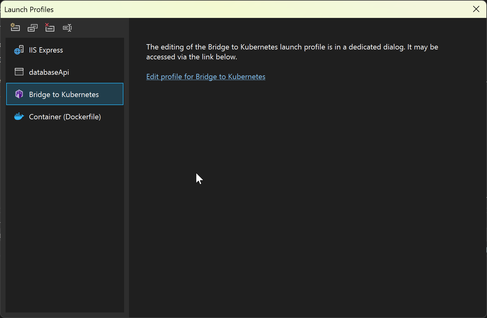
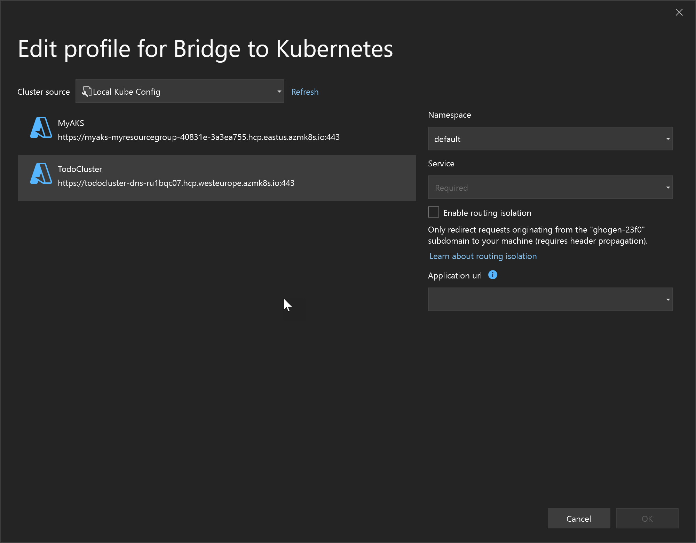

# Configure Bridge to Kubernetes

[!INCLUDE [Bridge to Kubernetes deprecation note](./includes/deprecation.md)]

You can configure the local Bridge to Kubernetes process using two methods. You can annotate services on your cluster and you can supply local configuration.

## Kubernetes configuration

The Kubernetes configuration (kubeconfig) file is default stored at `~/.kube/config`, but you can set it by using the KUBECONFIG environment variable.

If you're using Visual Studio, you can edit Bridge to Kubernetes launch profile in the IDE by using the **Debug launch profiles UI** in the Debug properties. See [Edit launch profile](./bridge-to-kubernetes-vs.md#edit-launch-profile).



From there, you can open the following screen, which provides a way to edit some of the most common configuration properties.



### Prevent Bridge to Kubernetes from forwarding specific ports

Configure Bridge to Kubernetes to ignore mapping specific ports on a Kubernetes service to your machine by adding the `bridgetokubernetes/ignore-ports` annotation on the service.

```
apiVersion: v1
kind: Service
metadata:
  annotations:
    bridgetokubernetes/ignore-ports:445,23
```

## Local configuration using (KubernetesLocalProcessConfig.yaml)

The `KubernetesLocalProcessConfig.yaml` file allows you to replicate environment variables and mounted files available to your pods in your cluster. You can specify the following actions in a `KubernetesLocalProcessConfig.yaml` file:

* Download a volume and set the path to that volume as an environment variable.
* Make a service running on your cluster available to processes running on your development computer.
* Create an environment variable with a constant value.

A default `KubernetesLocalProcessConfig.yaml` file is not created automatically so you must manually create the file at the root of your project.

### Download a volume

Under *env*, specify a *name* and *value* for each volume you want to download. The *name* is the environment variable that will be used on your development computer. The *value* is the name of the volume and a path on your development computer. The value for *value* takes the form *$(volumeMounts:VOLUME_NAME)/PATH/TO/FILES*.

For example:

```yaml
version: 0.1
env:
  - name: ALLOW_LIST_PATH
    value: $(volumeMounts:allow-list)/allow-list
```

The above example downloads the *allow-list* volume from the container and sets that location plus the path to the environment variable *ALLOW_LIST_PATH*. The default behavior is to download the files to the path you specify under a temporary directory on your development computer. In the above example, *ALLOW_LIST_PATH* is set to `/TEMPORARY_DIR/allow-list`. 

> [!NOTE]
> Downloading a volume will download the entire contents of that volume regardless of the path you set. The path is only used to set the environment variable for use on the development computer. Adding */allow-list* or */path/to/files* to the end of the token doesn't actually affect where the volume is persisted. The environment variable is just a convenience in case your app needs a reference to a specific file inside that volume.

You also have the option to specify a location to download the volume mount on your development computer instead of using a temporary directory. Under *volumeMounts*, specify a *name* and *localPath* for each specific location. The *name* is the volume name you want to match, and *localPath* is the absolute path on your development computer. For example:

```yaml
version: 0.1
volumeMounts:
  - name: default-token-*
    localPath: /var/run/secrets/kubernetes.io/serviceaccount
env:
  - name: KUBERNETES_IN_CLUSTER_CONFIG_OVERRIDE
    value: $(volumeMounts:default-token-*)
```

The above example uses the entry in *env* to download a volume matching *default-token-\**, such as *default-token-1111* or *default-token-1234-5678-90abcdef*. In cases where multiple volumes match, the first matching volume is used. All files are downloaded to `/var/run/secrets/kubernetes.io/serviceaccount` on your development computer using the entry in *volumeMounts*. The *KUBERNETES_IN_CLUSTER_CONFIG_OVERRIDE* environment variable is set to `/var/run/secrets/kubernetes.io/serviceaccount`.

### Make a service available

Under *env*, specify a *name* and *value* for each service you want to make available on your development computer. The *name* is the environment variable that will be used on your development computer. The *value* is the name of the service from your cluster and a path. The value for *value* takes the form *$(services:SERVICE_NAME)/PATH*.

For example:

```yaml
version: 0.1
env:
  - name: MYAPP1_SERVICE_HOST
    value: $(services:myapp1)/api/v1/
```

The above example makes the *myapp1* service available to your development computer and the *MYAPP1_SERVICE_HOST* environment variable is set to the local IP address of the *myapp1* service with the `/api/v1` path (that is, `127.1.1.4/api/v1`). The *myapp1* service is accessible using the environment variable, *myapp1*, or *myapp1.svc.cluster.local*.

> [!NOTE]
> Making a service available on your development computer will make the entire service available regardless of the path you set. The path is only used to set the environment variable for use on the development computer.
You can also make a service from a specific Kubernetes namespace available using *$(services:SERVICE_NAME.NAMESPACE_NAME)*. For example:

```yaml
version: 0.1
env:
  - name: MYAPP2_SERVICE_HOST
    value: $(services:myapp2.mynamespace)
```

The above example makes the *myapp2* from the *mynamespace* namespace available on your development computer and sets the *MYAPP2_SERVICE_HOST* environment variable to the local IP address of the *myapp2* from the *mynamespace* namespace.

## Create an environment variable with a constant value

Under *env*, specify a *name* and *value* for each environment variable you want to create on your development computer. The *name* is the environment variable that will be used on your development computer and the *value* is the value. For example:

```yaml
version: 0.1
env:
  - name: DEBUG_MODE
    value: "true"
```

The above example creates an environment variable named *DEBUG_MODE* with a value of *true*.

### Add a service dependency

You can specify a service dependency, such as a database or cache, using a generic dependencies field, similar to how services are declared. Specify a dependency here when the service you are debugging needs to connect to resources that are not running on your cluster. Declare a dependency as in the following example:

```yaml
version: 0.1
volumeMounts:
env:
  - name: DB_HOST
    value: $(externalendpoints:server-bridgetest123.database.windows.net:1433)
```

Provide the host DNS name (`server-bridgetest13.database.windows.net` in the example) and port (1433 in the example) for your dependency.

When you specify dependencies such as databases, redirection authentication models won't work. For example, for Azure SQL Database, you should set connection policy to "Proxy" (rather than "Redirect" or "Default"). 

### Example KubernetesLocalProcessConfig.yaml

Here is an example of a complete `KubernetesLocalProcessConfig.yaml` file:

```yaml
version: 0.1
volumeMounts:
  - name: default-token-*
    localPath: /var/run/secrets/kubernetes.io/serviceaccount
env:
  - name: KUBERNETES_IN_CLUSTER_CONFIG_OVERRIDE
    value: $(volumeMounts:default-token-*)
  - name: ALLOW_LIST_PATH
    value: $(volumeMounts:allow-list)/allow-list
  - name: MYAPP1_SERVICE_HOST
    value: $(services:myapp1)/api/v1/
  - name: MYAPP2_SERVICE_HOST
    value: $(services:myapp2.mynamespace)
  - name: DEBUG_MODE 
    value: "true"
```

## Next Steps

To get started using Bridge to Kubernetes to connect to your local development computer to your cluster, see [Use Bridge to Kubernetes with Visual Studio Code][bridge-to-kubernetes-vs-code] and [Use Bridge to Kubernetes with Visual Studio][bridge-to-kubernetes-vs].

[bridge-to-kubernetes-vs-code]: bridge-to-kubernetes-vs-code.md
[bridge-to-kubernetes-vs]: bridge-to-kubernetes-vs.md
