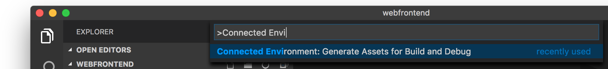
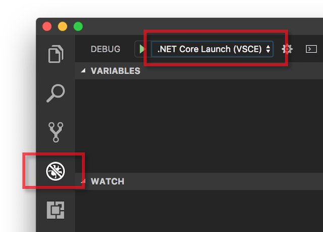
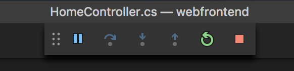

# Getting Started on Connected Environment with .NET Core

Previous step: [Create an ASP.NET Core Web App](get-started-netcore-03.md)

In this section, we'll use VS Code to directly debug our container running in Azure (be sure to have installed the [VS Code extension for Conneced Environment](get-started-netcore-01.md#get-kubernetes-debugging-tools)). We'll also learn how to make our edit-run-test loop even faster. To do this, we need to configure our code project so VS Code will communicate with our development environment in Azure.

## Initialize Debug Assets with the VS Code Extension
The VS Code extension for Connected Environment provides a helper command to set up debug configuration. 

Open the **Command Palette** (using the **View | Command Palette** menu), and use auto-complete to type and select this command: `Connected Environment: Generate Assets for Build and Debug`. 

This adds debug configuration for Connected Environment under the `.vscode` folder.



> [!Note]
> If you don't see any Connected Environment commands in the Command Palette, ensure you have [installed the VS Code extension for Connected Environment](get-started-netcore-01.md#get-kubernetes-debugging-tools).


## Select the VSCE Debug Configuration
1. To open the Debug view, click on the Debug icon in the **Activity Bar** on the side of VS Code.
1. Select **.NET Core Launch (VSCE)** as the active debug configuration.



## Debug the Container in Kubernetes
Hit **F5** to debug your code in Kubernetes!

As with the `up` command, code is synced to the development environment, and a container is built and deployed to Kubernetes. This time, of course, the debugger is attached to the remote container.

Set a breakpoint in a server-side code file, for example within the `Index()` function in the `Controllers/HomeController.cs` source file. Refreshing the browser page causes the breakpoint to hit.

You have full access to debug information just like you would if the code was executing locally, such as the call stack, local variables, exception information, etc.

## Edit and Refresh
With the debugger active, make a code edit; for example, modify the About page's message in `Controllers/HomeController.cs`. 

```
public IActionResult About()
{
    ViewData["Message"] = "My custom message in the About page.";
    return View();
}
```

Save the file, and in the **Debug actions pane**, click the **Refresh** button. 



Instead of rebuilding and redeploying a new container image each time code edits are made, which will often take considerable time, Connected Environment will incrementally recompile code within the existing container to provide a faster edit/debug loop.

Refresh the web app in the browser, navigate to the About page - you should see your custom message appear in the UI.

**Now you have a method for rapidly iterating on code and debugging directly in Kubernetes!** Next, we'll see how we can create and call a second container.

> [!div class="nextstepaction"]
> [Call another container](get-started-netcore-05.md)
