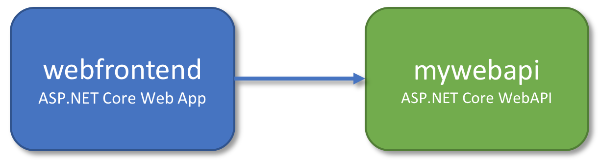

# Getting Started on Connected Environment with .NET Core

Previous step: [Debugging containers in Kubernetes](get-started-netcore-04.md)

In this section we're going to create a second service, `mywebapi`, and have `webfrontend` call it. Each service will run in separate containers. We'll then debug across both containers.



## Clone the Sample WebAPI Service
For the sake of time, we'll grab ready-to-go sample code for `mywebapi`.

```
git clone https://github.com/johnsta/mywebapi
```


## Run the WebAPI service
1. Open the folder `mywebapi` in a separate VS Code window.
1. Hit F5, and wait for the service to build and deploy.
1. Take note of the endpoint URL, it will look something like http://localhost:\<portnumber\>. It may seem like the container is running locally, but actually it is running in our development environment in Azure. The reason for the localhost address is because `mywebapi` has not defined any public endpoints and can only be accessed from within the Kubernetes instance. To facilitate interacting with the private service from your local machine, Connected Environment creates a temporary SSH tunnel.
1. When `mywebapi` is ready, open your browser to the localhost address. Append `/api/values` to the URL to access the default GET API for the `ValuesController`. 
1. If all the steps were successful, you should be able to see a response from the `mywebapi` service.

## Make a Request From 'webfrontend' to 'mywebapi'
Let's now write code in `webfrontend` that makes a request to `mywebapi`.
1. Switch to the VS Code window for `webfrontend`.
1. *Replace* the code for the About method:

```
public async Task<IActionResult> About()
{
    ViewData["Message"] = "Hello from webfrontend";
    
    // Use HeaderPropagatingHttpClient instead of HttpClient so we can propagate
    // headers in the incoming request to any outgoing requests
    using (var client = new HeaderPropagatingHttpClient(this.Request))
        {
            // Call 'mywebapi', and display its response in the page
            var response = await client.GetAsync("http://mywebapi/api/values/1");
            ViewData["Message"] += " and " + await response.Content.ReadAsStringAsync();
        }

    return View();
}
```

Note how Kubernetes' DNS service discovery is employed to simply refer to the service as `http://mywebapi`. **Code in our development environment is running the same way it will run in production**.

## Propagate Headers
Next, let's add the helper class `HeaderPropagatingHttpClient` that we reference in the above code. This helper propagates headers that are in the incoming request to the outgoing request - we can use this throughout our code when making similar requests to other services. We'll see later how this facilitates a more productive development experience in team scenarios.
1. Create a file named HeaderPropagation.cs in the `webfrontend` project.
1. Paste the following code:

```
using System;
using System.Net.Http;
using System.Threading;
using Microsoft.AspNetCore.Http;
 
namespace webfrontend
{
    public class HeaderPropagatingHttpClient : HttpClient
    {
        public HeaderPropagatingHttpClient(HttpRequest source)
            : this(source, null)
        {
        }
 
        public HeaderPropagatingHttpClient(HttpRequest source, HttpMessageHandler innerHandler)
            : this(source, null, innerHandler)
        {
        }
 
        public HeaderPropagatingHttpClient(HttpRequest source, string metaHeader, HttpMessageHandler innerHandler)
            : base(new HeaderPropagatingHttpHandler(source, metaHeader, innerHandler))
        {
        }
    }
 
    public class HeaderPropagatingHttpHandler : MessageProcessingHandler
    {
        public HeaderPropagatingHttpHandler(HttpRequest source, string metaHeader = null, HttpMessageHandler innerHandler = null)
            : base(innerHandler ?? new HttpClientHandler())
        {
            this.Source = source ?? throw new ArgumentNullException(nameof(source));
            this.MetaHeader = metaHeader ?? "Context-Headers";
        }
 
        public HttpRequest Source { get; private set; }
 
        public string MetaHeader { get; set; }
 
        protected override HttpRequestMessage ProcessRequest(HttpRequestMessage request, CancellationToken cancellationToken)
        {
            if (this.Source.Headers.ContainsKey(this.MetaHeader))
            {
                request.Headers.Add(this.MetaHeader, this.Source.Headers[this.MetaHeader][0]);

                foreach (var header in this.Source.Headers[this.MetaHeader][0].Split(","))
                {
                    request.Headers.Add(header, this.Source.Headers[header][0]);
                }
            }
            return request;
        }
 
        protected override HttpResponseMessage ProcessResponse(HttpResponseMessage response, CancellationToken cancellationToken)
        {
            return response;
        }
    }
}
``` 

## Debug Across Multiple Services
1. At this point, `mywebapi` should still be running with the debugger attached. If it is not, hit F5 in the `mywebapi` project.
1. Set a breakpoint in `mywebapi` that handles the `api/values/1` GET request.
1. In the `webfrontend` project, set a breakpoint just before it sends a GET request to `mywebapi/api/values`.
1. Hit F5 in the `webfrontend` project.
1. Invoke the web app, and step through code in both services.

Well done! You now have a multi-container application where each container can be developed and deployed separately.

> [!div class="nextstepaction"]
> [Learn about team development](get-started-netcore-06.md)

