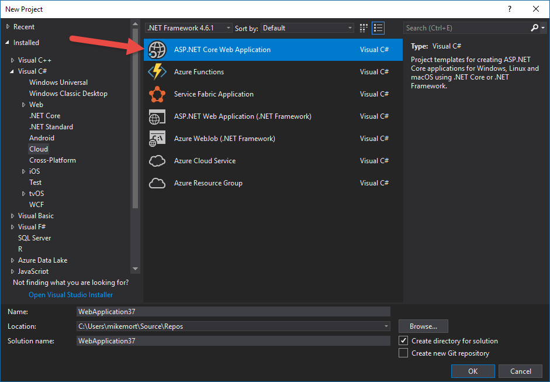
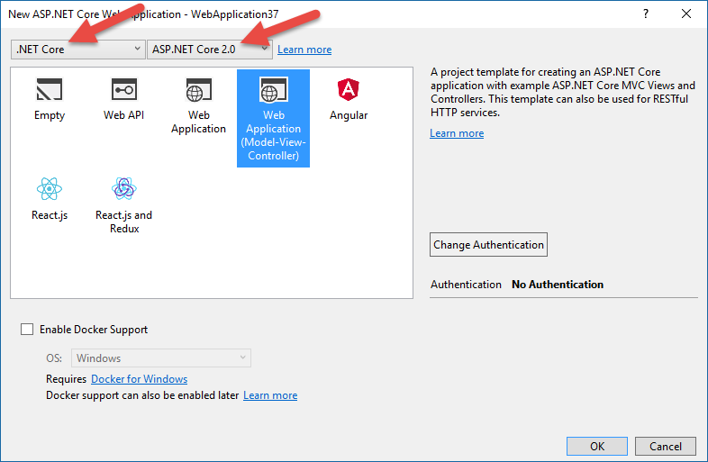

# Getting Started on Connected Environment with .NET Core

Previous step: [Install Tools](get-started-netcore-visualstudio-01.md)

## Create an ASP.NET Web App
From within Visual Studio 2017 create a new project, currently this must be an **ASP.NET Core Web Application**.

Select one of the two Web Application templates offered, in the image below I have selected the **Web Application (Model-View-Controller)** template. Be sure you are targeting **.NET Core** and **ASP.NET Core 2.0** in the two dropdowns at the top of the dialog. Click **OK** to create the project.

> [!div class="nextstepaction"]
> [Create a Dev Environment in Azure](get-started-netcore-visualstudio-03.md)