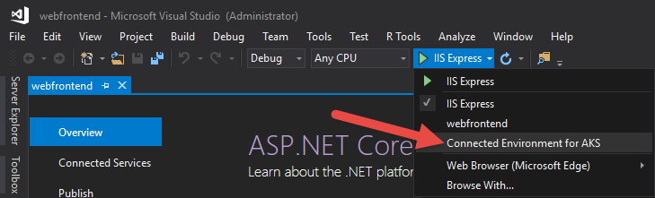
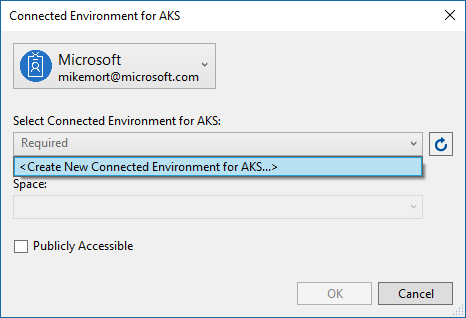
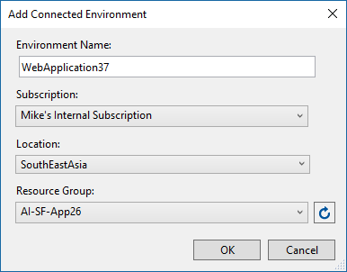

# Getting Started on Connected Environment with .NET Core

Previous step: [Create an ASP.NET Web Apps](get-started-netcore-visualstudio-02.md)

## Create a Dev Environment in Azure
With Connected Environment, you can create Kubernetes-based development environments that are fully managed by Azure and optimized for development. With the project we just created open, select **Connected Environment for AKS** from the launch settings dropdown as shown below.

In the dialog that is displayed next make sure you are signed in with the appropriate account and then either select an existing development environment or select **<Create New Connected Environment for AKS…>** to create a new one.

You can use the default values provided or adjust them as you like. Click **OK** when the values are set appropriately.

Back on the previous dialog leave the **Space** dropdown defaulted to your username for now, later we will discuss this in more detail. If you would like your web app to be accessible via a public endpoint check the **Publicly Accessible** checkbox, otherwise leave it uncheck. Don’t worry, in either case you will be able to debug your website using Visual Studio.

Click **OK** to select or create the development environment. If you chose to create a new development environment a background task will be started to accomplish this, it will take a number of minutes to complete. You can see if it is still being created by hovering your cursor over the **Background tasks** icon in the bottom left corner of the status bar (see below).

> [!Note]
Until the development environment is successfully created you cannot debug your application.

> [!div class="nextstepaction"]
> [Debug your App](get-started-netcore-visualstudio-04.md)
