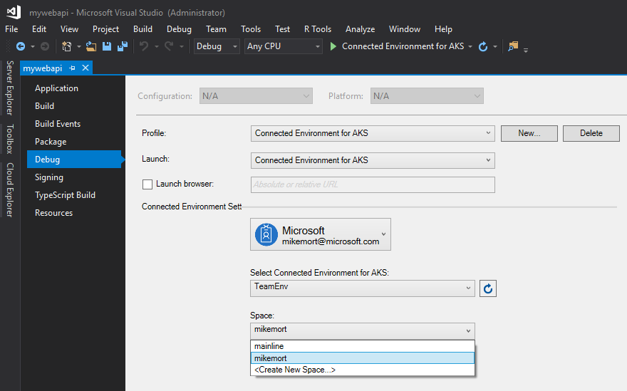
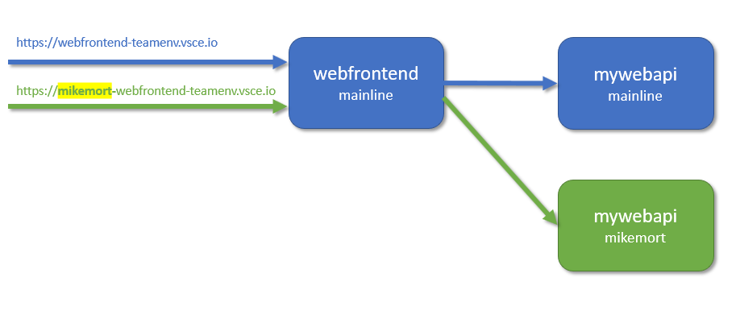

# Getting Started on Connected Environment with .NET Core and Visual Studio

Previous step: [Call another container](get-started-netcore-visualstudio-05.md)

## Learn about team development

So far we've run our application's code as if we were the only developer working on the app. In this section, we'll learn how Connected Environment streamlines team development by making it easy to:
* Enable a team of developers to work in the same development environment.
* Supports each developer iterating on their code in isolation and without fear of breaking others.
* Easily test code end-to-end, prior to code commit, without having to create mocks or simulate dependencies.

We will use the **Connected Environment CLI** in this section, if you have not already performed the following steps you will need to in order to continue.

### Sign in to Azure
We'll need to sign in to Azure to be able to run Connected Environment commands. Type the following command in a terminal window:
```cmd
az login
```

> [!Note]
> If you don't have an Azure subscription, you can create a [free account](https://azure.microsoft.com/free).

#### If you have multiple Azure subscriptions...
You can view your subscriptions by running: 
```cmd
az account list
```
Locate the  subscription which has `isDefault: true` in the JSON output.
If this isn't the subscription you want to use, you can change the default subscription:

```cmd
az account set --subscription <subscription ID>
```

### Select Connected Environment
Visual Studio and the Connected Environment CLI each have their own context for working with Connected Environments, do the following to make sure the development environment you created in Visual Studio is the selected environment in the CLI.

1. Run the following command to select your development environment:

    ```cmd
    vsce env select -n <env name> -g <env resource group name>
    ````
2. Run the following command to list your development environments:

    ```cmd
    vsce env list
    ````
3. Make sure the development environment you created in Visual Studio has an askterisk (*) in the first column, this indicates the selected environment

    ```
       Name     Resource Group  Location  Provisioning State
    -  -------  --------------  --------  ------------------
    *  TeamEnv  TeamEnv-rg      EastUS    Succeeded
    ```

## Challenges with Developing Microservices
Our sample application isn't very complex at the moment. But in real-world development, challenges soon emerge as more services are added and the development team grows.

Picture yourself working on a service that interacts with tens of other services.

1. It can become unrealistic to run everything locally for development. Your dev machine may simply not have enough resources to run the entire app; or maybe your app has endpoints that need to be publicly reachable (e.g. your app responds to a webhook from a SaaS app).
1. You can try to only run the services that you depend on, but this means you'd need know the full closure of dependencies (i.e. dependencies of dependencies). Or, it's simply a matter of not easily knowing how to build and run your dependencies because you didn't work on them.
1. Some developers resort to simulating, or mocking up, most of their service dependencies. This can help sometimes, but managing those mocks can soon take on its own development effort. Plus, this leads to your dev environment looking very different to production, and subtle bugs can creep in.
1. It follows that doing any type of end-to-end testing becomes difficult. Integration testing can only realistically happen post-commit, which means we see problems later in the development cycle.

    
microservices-challenges.png

## Work in a Shared Development Environment
With Connected Environment, you can easily set up a *shared* development environment in Azure. Each developer can focus on just their part of the application, and can iteratively develop *pre-commit code* in an environment that already contains all the other services and cloud resources that their scenarios depend on. Dependencies are always up to date, and developers are working in a way that mirrors production.

## Work in Your Own Space
As you develop code for your service, and before you're ready to check it in, code often won't be in a good state. You're still iteratively shaping it, testing it, and experimenting with solutions. Connected Environment provides the concept of a **space**, which allows you to work in isolation, and without the fear of breaking your team members.

Before you proceed, close any F5/debug sessions for both services, but keep the projects open in their Visual Studio windows. Now, in a command window navigate to the root folder on disk of the `webfrontend` project and run `vsce up`. This basically does the same as an F5 in Visual Studio except the debugger is not attached. Open another command window and navigate to the location of the `mywebapi` folder and run `vsce up`.

Once the two services are both running, let's take a closer look at them. Run the `vsce list` command, and you'll see output similar to the following:

```
Name         Space     Chart              Ports   Updated     Access Points
-----------  --------  -----------------  ------  ----------  -----------------------------------
mywebapi     mainline  mywebapi-0.1.0     80/TCP  7m 38s ago  http://localhost:60961
webfrontend  mainline  webfrontend-0.1.0  80/TCP  7m 45s ago  https://webfrontend-teamenv.vsce.io
```

The Space column shows that both services are running in a space named `mainline`. This is because currently in the CLI the default space for your development environment is `mainline`. This is different from Visual Studio where we set the space to `<username>`. 

Anyone who opens the public URL and navigates to the web app will invoke the code path we previously wrote that runs through both services using the default `mainline` Spcae. Now suppose we want to continue developing `mywebapi` - how can we do this and not interrupt other developers who are using the development environment? To do that, we'll set up our own space.

## Select a Different Space
To run our own version of `mywebapi` in a space other than `mainline`, we must select a different space. If you remember, when we created our new development environment in Visual Studio we left the default space set to our username, in my exmaple this was `mikemort`. 

From within Visual Studio you can create additional spaces and change the space you want to use when you F5 or Ctrl+F5 your service. You can call it anything you'd like and be flexible about what it means, like 'sprint4' or 'demo'.

Do the following to see how this is done:
1. Switch to the Visual Studio window with the `mywebapi` project.
2. Right-click on the project in **Solution Explorer**, and then select **Properties**.
3. Select the **Debug** tab on the left to show the Connected Environment settings.
4. From here you can change or create the Connected Environment and/or space that will be used when you F5 or Ctrl+F5. You can also create a new Connected Environment or space if needed. For now make sure the Connected Environment you created earlier is selected and the space with your username is selected, `mikemort` for my example.

    
    microservices-challenges.png

Now let's see it in action:
1. In the `mywebapi` project make a code change to the `string Get(int id)` method in file `ValuesController.cs` as follows:

    ```csharp
    [HttpGet("{id}")]
    public string Get(int id)
    {
        return "mywebapi now says something new";
    }
    ```

2. Hit F5 to start the `mywebapi` service. This will start the service in your development environment in the the selected space, which in this case is `mikemort`.

Here is a diagram that will help you understand how the different spaces work. The blue path shows a request via the `mainline` space, which is the default path used if no space is prepended to the URL. The green path shows a request via the `mikemort` space.



This built-in capability of Connected Environment enables you to easily test code end-to-end in a shared evironment without requiring each developer  to re-create the full stack of services in their space. Note that this routing requires propagation headers to be forwarded in your app code, as illustrated in the previous step of this guide.

## Test Code Running in the `mikemort` Space
To test our new version of `mywebapi` in conjunction with `webfrontend`, open your browser to the public access point URL for `webfrontend` (ex. https://webfrontend-teamenv.vsce.io) and navigate to the About page. You should see the original message "Hello from webfrontend and Hello from mywebapi".

Now, add the "mikemort-" part to the URL so it reads something like https://mikemort-webfrontend-teamenv.vsce.io and refresh the browser. You should now see the new message "Hello from webfrontend and mywebapi now says something new" (exhibited by the `mywebapi` version running in the `mikemort` space).

> [!div class="nextstepaction"]
> [Summarry](get-started-netcore-visualstudio-07.md)