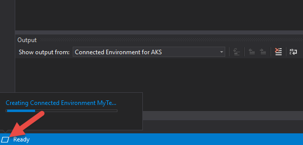
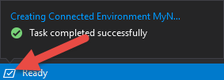

# Troubleshooting Guide

## Error 'upstream connect error or disconnect/reset before headers'
You may see this error when trying to access your service. For example, when you go to the service's URL in a browser. 

**Reason:** The container port is not available. These are the most common reasons: 
* The container is still in the process of being built and deployed. This can be the case if you run `vsce up` or start the debugger, and then try to access the container before it has successfully deployed.
* Port configuration is not consistent across your Dockerfile, Helm Chart, and any server code that opens up a port.

**Try:**
1. If the container is in the process of being built/deployed, you can wait 2-3 seconds and try accessing the service again. 
1. Check your port configuration. The specified port numbers should be **identical** in all the assets below:
    * **Dockerfile:** Specified by the `EXPOSE` instruction.
    * **Helm Chart:** Specified by the `externalPort` and `internalPort` values for a service (often located in a `values.yml` file),
    * Any ports being opened up in application code, for example in Node.js: `var server = app.listen(80, function () {...}`


## Config file not found
You run `vsce up` and get the following error: `Config file not found: .../vsce.yaml`

**Reason:** `vsce up` needs to run from the root directory of the code you want to run, and the code folder needs to have been initialized to run with Connected Environment.

**Try:**
1. Change your current directory to the root folder containing your service code. 
1. If you do not have a vsce.yaml file in the code folder, run `vsce init` to generate Docker, Kubernetes, and VSCE assets.

## Error: 'The pipe program 'vsce' exited unexpectedly with code 126.'
Starting the VS Code debugger may sometimes result in this error. This is a bug.

**Try:**
1. Close and re-open VS Code.
2. Hit F5 again.


## Debugging error 'Configured debug type 'coreclr' is not supported'
Running the VS Code debugger reports the error: `Configured debug type 'coreclr' is not supported.`

**Reason:** You do not have the VS Code extension for Connected Environment installed on your development machine.

**Try:**
Install the [VS Code extension for Connected Environment](get-started-netcore-01.md#get-kubernetes-debugging-for-vs-code).


## The Azure portal doesn't show Connected Environment instances

**Reason:** An Azure portal experience for Connected Environment is not yet ready for preview.


## Error during warmup displayed in Visual Studio Output Window
An error occurred during warmup for project '<projectname>'

**Reason:** This occurs when Visual Studio attempts to warmup a Connected Environment that has not yet finished being created, or is in an incomplete or error state. You will often see this right after you have started to create a new Connected Environment.

**Try:**
If you have just started the creation of a new Connected Environment, wait until it is successfully created before attempting to F5 or Ctrl+F5 your project/service. If this is a Connected Environment you created more than 15 minutes ago, it is likely in a bad state. You can try creating a new environment and wait for it to successfully be created. 

You can see if your Connected Environment is still being created by *hovering your cursor* over the **Background tasks** icon in the bottom left corner of the status bar.    


You can also see if a Connected Environment you recently created from within Visual Studio has been created sucessfully by *clicking* on the **Background tasks** icon in the bottom left corner of the status bar.    



## 'Microsoft.ConnectedEnvironment/register/action' authorization error when creating an environment
In the case where the user is not an owner/contributor on the selected Azure subscription, the following error is displayed:
`The client '<User email/Id>' with object id '<Guid>' does not have authorization to perform action 'Microsoft.ConnectedEnvironment/register/action' over scope '/subscriptions/<Subscription Id>'.`

**Try:**
Someone with Owner or Contributor access to the Azure subscription needs to manually register the subscription by running the following command:

```cmd
az provider register --namespace Microsoft.ConnectedEnvironment
```

