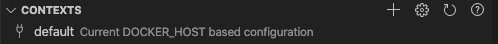
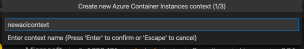
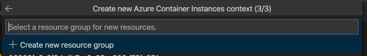
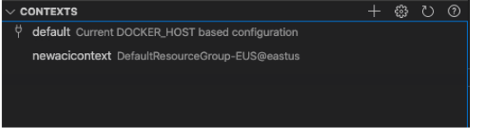
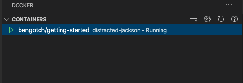
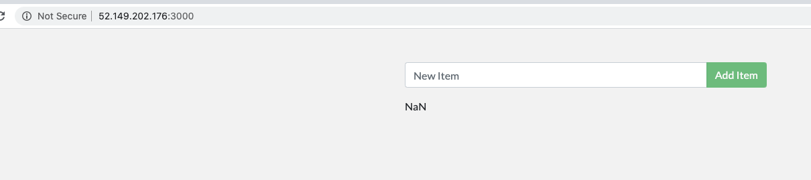

# Deploy to the cloud

Now that you have run your app locally, you can start to think about running it in the cloud so other people can access it and make use of it. To do this, you'll use Docker contexts. A context is the place where you're currently working with containers. Right now, you only have your "default" context, so you'll need to add a cloud one and deploy your app to it.

## Create your cloud context

1. To start, you can see what contexts you have by looking at the contexts section of the Docker panel:

   

You should only see your default context for local work.

1. To deploy to the cloud, you need to create a new ACI context, but to do this, you first need the Azure account extension to authenticate with Azure.

   

You'll need to set up an Azure account if you don’t already have one.

1. Now you can create your new ACI context. You can do this by clicking the plus button on the **Contexts** section of the Docker view.

   

This will ask you what resource group you want to run these containers under. Either select an existing group using the arrow keys, or use the default option to use the new group.



You can now see your ACI context listed and can right-click it to make it your current focus/in use context:



## Run containers in the cloud

1. Now, use your ACI context and run the container.

   ```bash
   docker context use myacicontext
   docker run  -dp 3000:3000 <username>/getting-started
   ```

1. Having run this, now look at the container in your context.

   

1. To check this is all working properly, you can right-click on the running container and choose **View in browser**.

   

And, you can see that the container is running in a public IP and working correctly!

1. Now, you can have a look at our running container to see how it is working. You can start by having a look at the container logs:
 
 ```bash
   docker logs distracted-jackson
   ```

1. You can also exec into your container as you would with a local container.
 
 ```bash
   docker exec -it distracted-jackson sh
   ```

1. Lastly to clean up your working space and to make sure you're not being charged for continuing to run the test container, you can simply right-click on the running container and choose **Remove**.

## Recap

Fantastic, you've now taken your workload and deployed it to the cloud successfully for the first time. You can do all of this from the command line as well from within your ACI context using `docker run` and also using `docker compose up` to run your multi-container applications. To find out more about running your containers in the cloud, read through the extended [documentation on using ACI](https://docs.docker.com/engine/context/aci-integration/).

## Next steps

Continue with the tutorial!

> [!div class="nextstepaction"]
> [What's next](whats-next.md)
