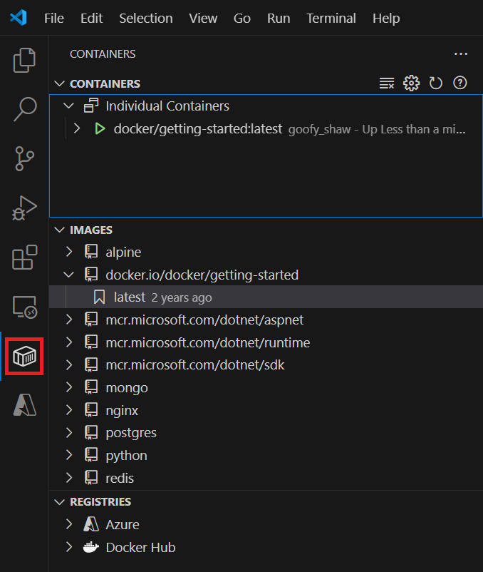

# Tutorial: Create a container app with Visual Studio Code

This tutorial is the beginning of a four-part series introducing [Docker](https://www.docker.com) for use with Visual Studio Code (VS Code).  You'll learn to create and run Docker containers, [persist data](tutorial-persist-data-layer-docker-app-with-vscode.md), and manage multiple containers with Docker Compose.

VS Code offers a Container Tools extension that lets you work with a local Docker Desktop service. Docker Desktop runs on your computer and manages your local containers, which are compact virtualized environments that provide a platform for building and running apps.  Containers don't require the size and overhead of a complete operating system.

In this first tutorial, you learn how to:

> [!div class="checklist"]
> - Create a Docker container.
> - Build a container image.
> - Start an app container.

## Prerequisites

- [Visual Studio Code](https://code.visualstudio.com/download) installed.
- [Container Tools VS Code Extension](https://code.visualstudio.com/docs/containers/overview) installed.
- [Docker Desktop](https://docs.docker.com/desktop/) configured to use Linux containers.
- A [Docker Hub](https://hub.docker.com/signup) account. You can create an account for free.

The tutorial works with Windows 10 or later and Docker Desktop configured to use Linux containers.

## Create a container

A container is a process on your computer. It's isolated from all other processes on the host computer.
That isolation uses kernel namespaces and control groups.

A container uses an isolated filesystem.
This custom filesystem is provided by a *container image*.
The image contains everything needed to run an application, such as all dependencies, configuration, scripts, and binaries.
The image also contains other configuration for the container, such as environment variables, a default command to run, and other metadata.

After you install the Container Tools extension for VS Code, you can work with containers in VS Code.
In addition to context menus in the Container Explorer, you can select **Terminal** > **New Terminal** to open a command-line window.
You can also run commands in a Bash window.
Unless specified, any command labeled as **Bash** can run in a Bash window or the VS Code terminal.

1. Set Docker to Linux container mode. To switch to Linux containers if you are currently set to Windows containers, right-click on the Docker icon in the system tray while Docker Desktop is running, and choose **Switch to Linux containers**.

1. In VS Code, select **Terminal** > **New Terminal**.

1. In the terminal window or a Bash window, run this command.

   ```bash
   docker run -d -p 80:80 docker/getting-started
   ```

   This command contains the following parameters:

   - `-d` Run the container in detached mode, in the background.
   - `-p 80:80` Map port 80 of the host to port 80 in the container.
   - `docker/getting-started` Specifies the image to use.

   > [!TIP]
   > You can combine single character flags to shorten the full command.
   > As an example, the command above could be written as:
   >
   > ```bash
   > docker run -dp 80:80 docker/getting-started
   > ```

1. In VS Code, select the Containers icon on the left to view the Container Explorer.

   

   The Container Tools VS Code Extension shows you the containers running on your computer.
   You can access container logs and manage container lifecycle, such as stop and remove.

   The container name, **modest_shockley** in this example, is randomly created.
   Yours will have a different name.

1. Right-click on **docker/getting-started** to open a context menu.
   Select **Open in Browser**.

   Instead, open a browser and enter `http://localhost/tutorial/`.

   You'll see a page, hosted locally, about DockerLabs.

1. Right-click on **docker/getting-started** to open a context menu.
   Select **Remove** to remove this container.

   To remove a container by using the command line, run this command to get its container ID:

   ```bash
   docker ps
   ```

   Then stop and remove the container:

   ```bash
   docker stop <container-id>
   docker rm <container-id>
   ```

1. Refresh your browser.
   The Getting Started page you saw a moment ago is gone.

## Build a container image for the app

This tutorial uses a simple Todo application.


The app allows you to create work items and to mark them as completed or delete them.

In order to build the application, create a *Dockerfile*.
A Dockerfile is a text-based script of instructions that is used to create a container image.

1. Go to the [Docker Getting Started Tutorial](https://github.com/docker/getting-started) repo, and then select **Code** > **Download ZIP**.
   Extract the contents to a local folder.

   

1. In VS Code, select **File** > **Open Folder**.
   Navigate to the *app* folder in the extracted project and open that folder.
   You should see a file called *package.json* and two folders called *src* and *spec*.

   

1. Create a file named *Dockerfile* in the same folder as the file *package.json* with the following contents.

   ```dockerfile
   FROM node:20-alpine
   RUN apk add --no-cache python3 g++ make
   WORKDIR /app
   COPY . .
   RUN yarn install --production
   CMD ["node", "/app/src/index.js"]
   ```

   > [!NOTE]
   > Be sure that the file has no file extension like `.txt`.

1. In the file explorer, on the left in VS Code, right-click the *Dockerfile* and then select **Build Image**.
   Enter *getting-started* as the tag for the image in the text entry box.

   The tag is a friendly name for the image.

   To create a container image from the command line, use the following command from the `app` folder that has the *Dockerfile*.

    ```bash
    docker build -t getting-started .
    ```

You've used the *Dockerfile* to build a new container image.
You might have noticed that many "layers" were downloaded.
The *Dockerfile* starts from the `node:20-alpine` image.
Unless that image was on your computer already, that image needed to be downloaded.

After the image was downloaded, the *Dockerfile* copies your application and uses `yarn` to install your application's dependencies.
The `CMD` value in the *Dockerfile* specifies the default command to run when starting a container from this image.

The `.` at the end of the `docker build` command tells that Docker should look for the *Dockerfile* in the current directory.

## Start your app container

Now that you have an image, you can run the application.

1. To start your container, use the following command.

   ```bash
   docker run -dp 3000:3000 getting-started
   ```

   The `-d` parameter indicates that you're running the container in detached mode, in the background.
   The `-p` value creates a mapping between the host port 3000 and the container port 3000.
   Without the port mapping, you wouldn't be able to access the application.

1. After a few seconds, in VS Code, in the Container Explorer, under **CONTAINERS**, right-click **getting-started** and select **Open in Browser**.
   You can instead open your web browser to `http://localhost:3000`.

   You should see the app running.

   

1. Add an item or two to test if it works as you expect.   You can mark items as complete and remove items.
   Your frontend is successfully storing items in the backend.

## Next steps

You've completed this tutorial and you have a running todo list manager with a few items.  You've learned to create container images and run a containerized app.

Keep everything that you've done so far to continue this series of tutorials.
Next, try part II of this series:

> [!div class="nextstepaction"]
> [Update and share a container app](docker-tutorial-share.md)

Here are some resources that might be useful to you:
- [Docker Cloud Integration](https://github.com/docker/compose-cli)
- [Examples](https://github.com/docker/awesome-compose)
