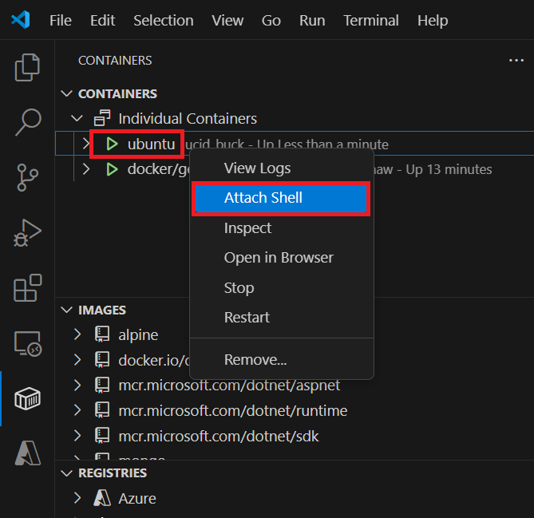

# Persist your data

In case you didn't notice, the todo list is being wiped clean every single time you launch the container. Why is this? Let's dive into how the container is working.

## The container's filesystem

When a container runs, it uses the various layers from an image for its filesystem. Each container also gets its own "scratch space" to create, update, or remove files. Any changes won't be seen in another container, *even if* they are using the same image.

### See this in practice

To see this in action, you're going to start two containers and create a file in each. What you'll see is that the files created in one container aren't available in another.

1. Start a `ubuntu` container that will create a file named `/data.txt` with a random number between 1 and 10000.

    ```bash
    docker run -d ubuntu bash -c "shuf -i 1-10000 -n 1 -o /data.txt && tail -f /dev/null"
    ```

    In case you're curious about the command, you're starting a bash shell and invoking two commands (why it has the `&&`). The first portion picks a single random number and writes it to `/data.txt`. The second command is simply watching a file to keep the container running.

1. Validate you can see the output by using `exec` to get into the container. To do so, open the VS Code extension and on click on the **Attach Shell** option. This will use `exec` to open a shell in the container within the VS Code terminal.

    

    You will see a terminal that is running a shell in the Ubuntu container. Run the following command to see the content of the `/data.txt` file. Close this terminal afterwards again.

    ```bash
    cat /data.txt
    ```

    If you prefer the command line, you can use the `docker exec` command to do the same. You need to get the container's ID (use `docker ps` to get it) and get the content with the following command.

    ```bash
    docker exec <container-id> cat /data.txt
    ```

    You should see a random number!

1. Now, start another `ubuntu` container (the same image) and you'll see you don't have the same file.

    ```bash
    docker run -it ubuntu ls /
    ```

    And look! There's no `data.txt` file there! That's because it was written to the scratch space for only the first container.

1. Go ahead and remove the first container using the `docker rm -f` command.

## Container volumes

With the previous experiment, you saw that each container starts from the image definition each time it starts. While containers can create, update, and delete files, those changes are lost when the container is removed and all changes are isolated to that container. With volumes, you can change all of this.

[Volumes](https://docs.docker.com/storage/volumes/) provide the ability to connect specific filesystem paths of the container back to the host machine. If a directory in the container is mounted, changes in that directory are also seen on the host machine. If you mount that same directory across container restarts, you'd see the same files.

There are two main types of volumes. you will eventually use both, but you will start with **named volumes**.

## Persist your Todo data

By default, the todo app stores its data in a [SQLite Database](https://www.sqlite.org/index.html) at `/etc/todos/todo.db`. If you're not familiar with SQLite, no worries! It's simply a relational database in which all of the data is stored in a single file. While this isn't the best for large-scale applications,
it works for small demos. We'll talk about switching this to an actual database engine later.

With the database being a single file, if you can persist that file on the host and make it available to the next container, it should be able to pick up where the last one left off. By creating a volume and attaching (often called "mounting") it to the directory the data is stored in, you can persist the data. As the container writes to the `todo.db` file, it's persisted to the host in the volume.

As mentioned, you're going to use a **named volume**. Think of a named volume as simply a bucket of data. Docker maintains the physical location on the disk and you only need to remember the name of the volume. Every time you use the volume, Docker will make sure the correct data is provided.

1. Create a volume by using the `docker volume create` command.

    ```bash
    docker volume create todo-db
    ```

1. Stop the todo app container once again in the Docker view (or with `docker rm -f <id>`), as it is still running without using the persistent volume.

1. Start the todo app container, but add the `-v` flag to specify a volume mount. you will use the named volume and mount it to `/etc/todos`, which will capture all files created at the path.

    ```bash
    docker run -dp 3000:3000 -v todo-db:/etc/todos getting-started
    ```

1. Once the container starts up, open the app and add a few items to your todo list.

    

1. Remove the container for the todo app. Use the Docker view or `docker ps` to get the ID and then `docker rm -f <id>` to remove it.

1. Start a new container using the same command from above.

1. Open the app. You should see your items still in your list!

1. Go ahead and remove the container when you're done checking out your list.

Hooray! You've now learned how to persist data!

> [!TIP]
> While named volumes and bind mounts (which we'll talk about in a minute) are the two main types of volumes supported by a default Docker engine installation, there are many volume driver plugins available to support NFS, SFTP, NetApp, and more! This will be especially important once you start running containers on multiple hosts in a clustered environment with Swarm, Kubernetes, and so on.

## Dive into your volume

A lot of people frequently ask "Where is Docker *actually* storing my data when I use a named volume?" If you want to know, you can use the `docker volume inspect` command.

```bash
docker volume inspect todo-db
[
    {
        "CreatedAt": "2019-09-26T02:18:36Z",
        "Driver": "local",
        "Labels": {},
        "Mountpoint": "/var/lib/docker/volumes/todo-db/_data",
        "Name": "todo-db",
        "Options": {},
        "Scope": "local"
    }
]
```

The `Mountpoint` is the actual location on the disk where the data is stored. Note that on most machines, you'll need to have root access to access this directory from the host. But, that's where it is!

> [!NOTE]
> **Accessing Volume data directly on Docker Desktop**
> While running in Docker Desktop, the Docker commands are actually running inside a small VM on your machine. If you wanted to look at the actual contents of the *Mountpoint* directory, you would need to first get inside of the VM. In WSL 2, this is inside a WSL 2 distro and can be accessed through the File Explorer.

## Recap

At this point, you have a functioning application that can survive restarts! You can show it off to your investors and hope they can catch your vision!

However, you saw earlier that rebuilding images for every change takes quite a bit of time. There's got to be a better way to make changes, right? With bind mounts (which we hinted at earlier), there is a better way! Let's take a look at that now!

## Next steps

Continue with the tutorial!

> [!div class="nextstepaction"]
> [Using bind mounts](use-bind-mounts.md)
