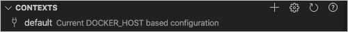
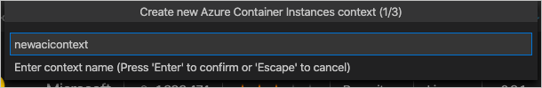
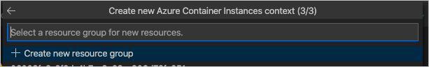
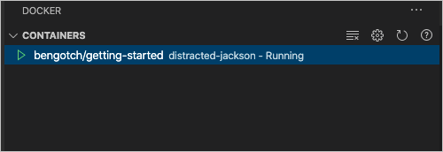
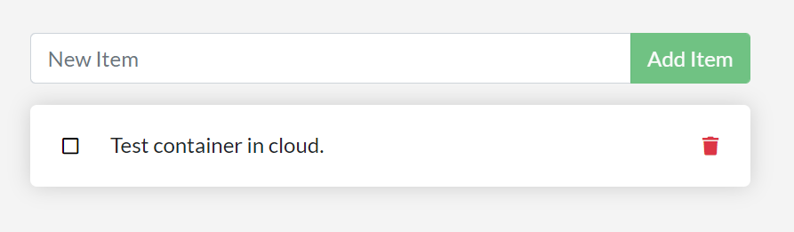

# Tutorial: Deploy your Docker app to Azure

In this tutorial, you'll learn to run your containerized application in the cloud.
Other people can access it and make use of it.

In this tutorial, you learn how to:

> [!div class="checklist"]
> - Create your cloud context.
> - Run containers in the cloud.

## Prerequisites

This tutorial continues the previous tutorial, [Create and share a Docker app with Visual Studio Code](docker-tutorial.md).
Start with that one, which includes prerequisites.
Then do this tutorial: [Persist data and layer Docker app](tutorial-persist-data-layer-docker-app-with-vscode.md).

For this tutorial, you also need the following items:

- An Azure account with an active subscription.
  [Create an account for free](https://azure.microsoft.com/free/).
- The Azure Account extension for VS Code.
  To install it, select the Extensions icon on the left side bar of VS Code and search for *Azure Account*.

## Create your cloud context

To deploy your app to the cloud, you'll use Docker contexts.
A context is the place where you're currently working with containers.
Right now, you only have your default context.

You need to create an Azure Container Instances (ACI) context.
This procedure creates a context.

1. In VS Code, check what contexts you have by looking at the **CONTEXTS** section of the Docker view.

   

   You should only see your default context for local work.

1. Select **View** > **Command Palette**. Enter **Docker Contexts: Create Azure Container Instance Context**.

   If you aren't signed in for Azure, VS Code prompts you.

1. Enter a name for your context.

   

1. Enter the resource group to use.
   You can, instead, create a resource group.

   

   Your ACI context now appears under CONTEXTS. Select it to be your current in-use context.

   

## Run containers in the cloud

After you create a context in Azure, you can run your container in the cloud.

1. Run these commands.

   ```bash
   docker context use newacicontext
   docker run  -dp 3000:3000 <username>/getting-started
   ```

1. In the Docker view, under **CONTAINERS**, check that your container is running.

   

1. To check your container is working properly, right-click the running container and select **Open in browser**.

   

   The container is running with a public IP address and working correctly.

1. Have a look at our running container to see how it's working.
   You can start by looking at the container logs:

   ```bash
   docker logs <container-name>
   ```

   Get the container name under **CONTAINERS**, next to **getting-started**

1. You can use the `docker exec` command in your container as you would with a local container.

   ```bash
   docker exec -it container-name sh
   ```

1. To clean up your working space and to make sure you're not being charged for continuing to run the test container, right-click the running container and select **Remove**.

## Clean up resources

Keep everything that you've done so far to continue with an additional tutorial, below.

The prerequisites you used in this tutorial series can be used for future Docker development.
Except for the test container you added to Azure, there's no reason to delete or uninstall anything.

## Next steps

You've completed this series of tutorials.
In this tutorial, you've taken your workload and deployed it to the cloud successfully.

Here are some other paths you can take working with containers.

- Container orchestration

  Tools like Kubernetes, Swarm, Nomad, and Azure Kubernetes Service (AKS) all address challenges in running containers in a production environment.

  In general, you have *managers* who receive *expected state*.
  The managers then look at the computers in the cluster and delegate work to worker nodes.
  Managers watch for changes, such as a container quitting, and work to make *actual state* reflect the expected state.

- Cloud Native Computing Foundation projects

  The Cloud Native Computing Foundation (CNCF) is a vendor-neutral home for various open-source projects, including Kubernetes, Prometheus, Envoy, and Linkerd.
  You can view [Graduated and incubating projects](https://www.cncf.io/projects/) and the entire [CNCF Cloud Native Interactive Landscape](https://landscape.cncf.io/).
  There are projects to help you address monitoring, logging, security, image registries, and messaging.

Learn more about using the VS Code Docker Extension:

- [VS Code Docker Extension overview](https://code.visualstudio.com/docs/containers/overview)
- [Get started with Node.js](https://code.visualstudio.com/docs/containers/quickstart-node)
- [Get started with Python](https://code.visualstudio.com/docs/containers/quickstart-python)
- [Get started with .NET Core](https://code.visualstudio.com/docs/containers/quickstart-aspnet-core)
- [Debug containerized apps](https://code.visualstudio.com/docs/containers/debug-common)

You might be interested in this optional tutorial, which builds on the current series of tutorials:

> [!div class="nextstepaction"]
> [Create multi-container apps with MySQL and Docker Compose](tutorial-multi-container-app-mysql.md)
