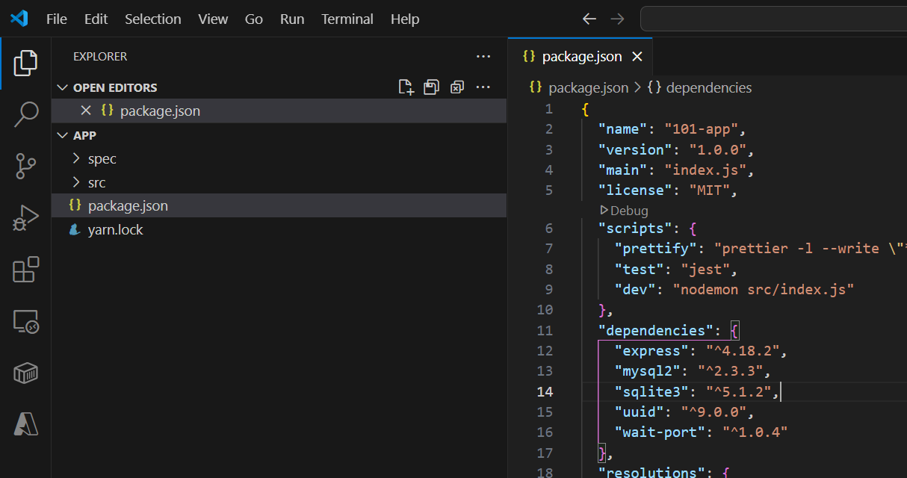

# Tutorial: Create and share a Docker app with Visual Studio Code

In this tutorial, you'll learn about creating and deploying Docker apps on Windows or Mac using Visual Studio Code (VS Code), including using multiple containers with a database, and using Docker Compose. You'll also deploy your containerized app to Azure.

Containers are compact virtualized environments, like virtual machines (VMs), that provide a platform for building and running apps, but without the full size and overhead of the complete operating system. [Docker](https://www.docker.com) is a third-party, industry standard container provider and container management system. Docker Desktop runs on your machine and manages your local containers. Development tools like Visual Studio and VS Code offer extensions that let you to work with a locally installed Docker Desktop service to create containerized apps, deploy apps to containers, and debug apps running on your containers.

For the rest of this tutorial, you'll be working with a simple todo list manager that is running in Node.js. If you're not familiar with Node.js, don't worry! No real JavaScript experience is needed!

At this point, your development team is quite small and you're simply building an app to prove out your MVP (minimum viable product). You want to show how it works and what it's capable of doing without needing to think about how it will work for a large team, multiple developers, and so on.

As a small feature request, you've been asked by the product team to change the "empty text" when you don't have any todo list items. They would like to transition it to the following:

> You have no todo items yet! Add one above!

Pretty simple, right? Let's make the change.


Now that we've built an image, let's share it! To share Docker images, you have to use a Docker registry. The default registry is Docker Hub and is where all of the images we've used have come from.


In this tutorial, you learn how to:

> [!div class="checklist"]
> - Start the tutorial.
> - Get the app
> - Build a container image for the app
> - Starting an app container
> - Update the source code
> - Replace the old container
> - Create a repo
> - Push the image
> - Run the image on a new instance

## Prerequisites

- [Visual Studio Code](https://code.visualstudio.com/download).
- [Docker VS Code Extension](https://code.visualstudio.com/docs/containers/overview).
- [Docker Desktop](https://docs.docker.com/desktop/).

## Start the tutorial

To start the tutorial, run this command:

```bash
docker run -d -p 80:80 docker/getting-started
```

This command contains the following parameters:

- `-d` - run the container in detached mode (in the background)
- `-p 80:80` - map port 80 of the host to port 80 in the container
- `docker/getting-started` - the image to use

> [!TIP]
> You can combine single character flags to shorten the full command.
> As an example, the command above could be written as:
>
> ```cli
> docker run -dp 80:80 docker/getting-started
> ```

The Docker VS Code Extension gives you a quick view of the containers running on your machine.
With this extension, you can access container logs manage container lifecycle, such as stop and remove.

Use the Docker icon on the left to open the Docker view.
If you open the extension now, you will see this tutorial running.
The container name (`angry_taussig` below) is a randomly created name.
So, you'll most likely have a different name.


A container is simply another process on your machine that has been isolated from all other processes on the host machine.
That isolation leverages kernel namespaces and cgroups.

A container uses an isolated filesystem.
This custom filesystem is provided by a *container image*.
Since the image contains the container's filesystem, it must contain everything needed to run an application, such as all dependencies, configuration, scripts, and binaries.
The image also contains other configuration for the container, such as environment variables, a default command to run, and other metadata.


## Get the app

Before you can run the application, you need to get the application source code onto your machine.
For real projects, you will typically clone the repo.
For this tutorial, we have created a ZIP file containing the application.

1. Download the source for the app from the [Docker](https://github.com/docker/getting-started) repo.
   You can download the ZIP file for the repo.
   To download the ZIP file, use the green **Code** button and choose **Download ZIP**.
   Open the ZIP file and Extract All to extract the source of the app from the *app* folder to a folder on your hard drive.

   

1. Once extracted, use VS Code to open the project.
   You should see the `package.json` and two subdirectories (`src` and `spec`).

    

## Build a container image for the app

In order to build the application, you need to use a `Dockerfile`.
A Dockerfile is a text-based script of instructions that is used to create a container image.

1. Create a file named `Dockerfile` in the same folder as the file `package.json` with the following contents.

   ```dockerfile
   FROM node:12-alpine
   WORKDIR /app
   COPY . .
   RUN yarn install --production
   CMD ["node", "/app/src/index.js"]
   ```

   > [!NOTE]
   > Be sure that the file `Dockerfile` has no file extension like `.txt`.

1. In a bash window, go to the `app` directory that has the `Dockerfile`.
   Build the container image using the `docker build` command.

    ```bash
    docker build -t getting-started .
    ```

    Alternatively, you can also right-click on the Dockerfile and choose **Build Image...** and then specify the tag at the prompt.

    This command used the Dockerfile to build a new container image. You might have noticed that a lot of "layers" were downloaded. This is because you instructed the builder that you wanted to start from the `node:12-alpine` image. But, since you didn't have that on your machine, that image needed to be downloaded.

    After the image was downloaded, you copied in your application and used `yarn` to install your application's dependencies. The `CMD` directive specifies the default command to run when starting a container from this image.

    Finally, the `-t` flag tags your image. Think of this simply as a human-readable name for the final image. Since you named the image `getting-started`, you can refer to that image when you run a container.

    The `.` at the end of the `docker build` command tells that Docker should look for the `Dockerfile` in the current directory.

## Starting an app container

Now that you have an image, run the application! To do so, use the `docker run` command.

1. Start your container using the `docker run` command and specify the name of the image you just created:

   ```bash
   docker run -dp 3000:3000 getting-started
   ```

   Remember the `-d` and `-p` flags? 
   You're running the new container in "detached" mode, in the background, and creating a mapping between the host's port 3000 to the container's port 3000.
   Without the port mapping, you wouldn't be able to access the application.

1. After a few seconds, open your web browser to `http://localhost:3000`.
    You should see the app!

    

1. Add an item or two and see that it works as you expect.
   You can mark items as complete and remove items.
   Your frontend is successfully storing items in the backend.

At this point, you should have a running todo list manager with a few items, all built by you
Now, let's make a few changes and learn about managing your containers.

If you look at the VS Code extension, you should see your two containers running now.
These are this tutorial and your freshly launched app container.


## Update the source code

1. In the `src/static/js/app.js` file, update line 56 to use the new empty text.

    ```diff
    -                <p className="text-center">No items yet! Add one above!</p>
    +                <p className="text-center">You have no todo items yet! Add one above!</p>
    ```

1. Build the updated version of the image, using the same command you used before.

    ```bash
    docker build -t getting-started .
    ```

1. Start a new container using the updated code.

    ```bash
    docker run -dp 3000:3000 getting-started
    ```

**Uh oh!** You probably saw an error like this (the IDs will be different):

```bash
docker: Error response from daemon: driver failed programming external connectivity on endpoint laughing_burnell 
(bb242b2ca4d67eba76e79474fb36bb5125708ebdabd7f45c8eaf16caaabde9dd): Bind for 0.0.0.0:3000 failed: port is already allocated.
```

So, what happened? The new container couldn't start, because your old container is still running. The reason this is a problem is because that container is using the host's port 3000 and only one process on the machine (containers included) can listen to a specific port. To fix this, remove the old container.

## Replace the old container

To remove a container, it first needs to be stopped. Once it has stopped, it can be removed. You have two ways that you can remove the old container. Feel free to choose the path that you're most comfortable with.

### Remove a container using the CLI

1. Get the ID of the container by using the `docker ps` command.

    ```bash
    docker ps
    ```

1. Use the `docker stop` command to stop the container.

    ```bash
    # Swap out <the-container-id> with the ID from docker ps
    docker stop <the-container-id>
    ```

1. Once the container has stopped, you can remove it by using the `docker rm` command.

    ```bash
    docker rm <the-container-id>
    ```

> [!TIP]
> You can stop and remove a container in a single command by adding the "force" flag to the `docker rm` command. For example: `docker rm -f <the-container-id>`

### Remove a container using the Docker view

If you open the VS Code Extension, you can remove a container.

1. With the extension opened, navigate to the container and right-click.

1. Click on the **Remove** option.

1. Confirm the removal.


### Start the updated app container

1. Now, start your updated app.

    ```bash
    docker run -dp 3000:3000 getting-started
    ```

1. Refresh your browser on `http://localhost:3000` and you should see your updated help text.


## Create a repo

To push an image, first, you need to create a repo on Docker Hub.

1. Go to [Docker Hub](https://hub.docker.com/signup/msftedge?utm_source=msftedge) and log in if you need to.

1. Click the **Create Repository** button.

1. For the repo name, use `getting-started`. Make sure the Visibility is `Public`.

1. Click the **Create** button!

If you look on the right-side of the page, you'll see a section named **Docker commands**. This gives an example command that you will need to run to push to this repo.


## Push the image

1. In the command line, try running the push command you see on Docker Hub. 
   Your command will use your namespace, not "docker".

    ```plaintext
    $ docker push docker/getting-started
    The push refers to repository [docker.io/docker/getting-started]
    An image does not exist locally with the tag: docker/getting-started
    ```

    Why did it fail? The push command was looking for an image named docker/getting-started, but didn't find one. If you run `docker image ls`, you won't see one either.

    To fix this, you need to "tag" your existing image we've built to give it another name.

1. Sign in to the Docker Hub using the command `docker login -u <username>`.

1. Use the `docker tag` command to give the `getting-started` image a new name. Be sure to swap out `<username>` with your Docker ID.

    ```bash
    docker tag getting-started <username>/getting-started
    ```

1. Now try your push command again. If you're copying the value from Docker Hub, you can drop the `tagname` portion, as you didn't add a tag to the image name. If you don't specify a tag, Docker will use a tag called `latest`.

    ```bash
    docker push <username>/getting-started
    ```

    Instead of the command line, you can also right-click on the image tag in the **Images** section of the Docker view, and choose **Push...**, then choose **Connect registry...** and then **Docker Hub**.

## Run the image on a new instance

Now that your image has been built and pushed into a registry, try running the app on a brand new instance that has never seen this container image.
To do this, you will use Play with Docker.

1. Open your browser to [Play with Docker](http://play-with-docker.com).

1. Sign in with your Docker Hub account.

1. Once you're logged in, click on the "+ ADD NEW INSTANCE" link in the left side bar. (If you don't see it, make your browser a little wider.) 
   After a few seconds, a terminal window will be opened in your browser.

    

1. In the terminal, start your freshly pushed app.

    ```bash
    docker run -dp 3000:3000 <username>/getting-started
    ```

    You should see the image get pulled down and eventually start up.

1. Click on the 3000 badge when it comes up and you should see the app with your modifications.
   If the 3000 badge doesn't show up, you can select **Open Port** and enter 3000.

## Clean up resources

Keep everything that you've done so far to continue this series of tutorials.

If you are stopping here, delete <resources> with the following steps:

1. From the left-hand menu...
1. ...click Delete, type...and then click Delete


## Next steps

You've completed this tutorial.

Here are some resources that might be useful to you:

- [Docker Cloud Integration](https://github.com/docker/compose-cli)
- [Examples](https://github.com/docker/awesome-compose)

Next, try the next tutorial in this series:

> [!div class="nextstepaction"]
> [Deploy a Docker app to Azure](tutorial-persist-data-layer-docker-app-with-vscode.md)