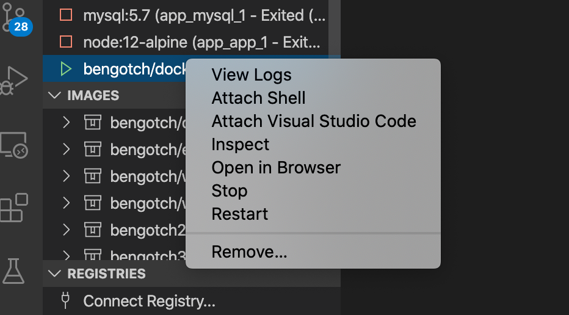

# Tutorial: Persist data in a container app using volumes in VS Code

In this tutorial, you'll learn to persist data in a container application.
When you run it or update it, the data is still available.
There are two main types of volumes used to persist data.
This tutorial focuses on **named volumes**.

You'll also learn about *bind mounts*, which control the exact mountpoint on the host.
You can use bind mounts to persist data, but it can also add more data into containers.
When working on an application, you can use a bind mount to mount source code into the container to let it see code changes, respond, and let you see the changes right away.

This tutorial also introduces image layering, layer caching, and multi-stage builds.

In this tutorial, you learn how to:

> [!div class="checklist"]
> - Understand data across containers.
> - Persist data using named volumes.
> - Use bind mounts.
> - View image layer.
> - Cache dependencies.
> - Understand multi-stage builds.

## Prerequisites

This tutorial continues the previous tutorial, [Create and share a container app with Visual Studio Code](docker-tutorial.md).
Start with that one, which includes prerequisites.

## Understand data across containers

In this section, you'll start two containers and create a file in each.
The files created in one container aren't available in another.

1. Start a `ubuntu` container by using this command:

   ```bash
   docker run -d ubuntu bash -c "shuf -i 1-10000 -n 1 -o /data.txt && tail -f /dev/null"
   ```

   This command starts invokes two commands by using `&&`.
   The first portion picks a single random number and writes it to `/data.txt`.
   The second command is watching a file to keep the container running.

1. In VS Code, in the Container Explorer, right-click the ubuntu container and select **Attach Shell**.

   

   A terminal opens that is running a shell in the Ubuntu container.

1. Run the following command to see the contents of the `/data.txt` file.

   ```bash
   cat /data.txt
   ```

   The terminal shows a number between 1 and 10000.

   To use the command line to see this result, get the container ID by using the `docker ps` command, and run the following command.

   ```bash
   docker exec <container-id> cat /data.txt
   ```

1. Start another `ubuntu` container.

   ```bash
   docker run -d ubuntu bash -c "shuf -i 1-10000 -n 1 -o /data.txt && tail -f /dev/null"
   ```

1. Use this command to look at the folder contents.

   ```bash
   docker run -it ubuntu ls /
   ```

   There should be no `data.txt` file there because it was written to the scratch space for only the first container.

1. Select these two Ubuntu containers. Right-click and select **Remove**.
   From the command line, you can remove them by using the `docker rm -f` command.

## Persist your todo data using named volumes

By default, the todo app stores its data in a [SQLite Database](https://www.sqlite.org/index.html) at `/etc/todos/todo.db`.
SQLite Database is a relational database that stores data a single file.
This approach works for small projects.

You can persist the single file on the host.
When you make it available to the next container, the application can pick up where it left off.
By creating a volume and attaching, or *mounting*, it to the folder that the data is stored in, you can persist the data.
The container writes to the *todo.db* file and that data persists to the host in the volume.

For this section, use a **named volume**.
Docker maintains the physical location the volume on the disk.
Refer to the name of the volume, and Docker provides the right data.

1. Create a volume by using the `docker volume create` command.

   ```bash
   docker volume create todo-db
   ```

1. Under **CONTAINERS**, select **getting-started** and right-click. Select **Stop** to stop the app container.

   To stop the container from the command line, use the `docker stop` command.

1. Start the **getting-started** container by using the following command.

   ```bash
   docker run -dp 3000:3000 -v todo-db:/etc/todos getting-started
   ```

   The volume parameter specifies the volume to mount and the location, `/etc/todos`.

1. Refresh your browser to reload the app.
   If you've closed the browser window, go to `http://localhost:3000/`.
   Add some items to your todo list.

   

1. Remove the **getting-started** container for the todo app.
   Either right-click the container in the Container Explorer and select **Remove** or use the `docker stop` and `docker rm` commands.

1. Start a new container using the same command:

   ```bash
   docker run -dp 3000:3000 -v todo-db:/etc/todos getting-started
   ```

   This command mounts the same drive as before.
   Refresh your browser.
   The items you added are still in your list.

1. Remove the **getting-started** container again.

Named volumes and bind mounts, discussed below, are the main types of volumes supported by a default Docker engine installation.

| Property | Named Volumes | Bind Mounts |
| -------- | ------------- | ----------- |
| Host Location | Docker chooses | You control |
| Mount Example (using `-v`) | my-volume:/usr/local/data | /path/to/data:/usr/local/data |
| Populates new volume with container contents | Yes | No |
| Supports Volume Drivers | Yes | No |

There are many volume driver plugins available to support NFS, SFTP, NetApp, and more.
These plugins are especially important to run containers on multiple hosts in a clustered environment such as Swarm or Kubernetes.

If you wonder where Docker *actually* stores your data, run the following command.

```bash
docker volume inspect todo-db
```

Look at the output, similar to this result.

```output
[
    {
        "CreatedAt": "2019-09-26T02:18:36Z",
        "Driver": "local",
        "Labels": {},
        "Mountpoint": "/var/lib/docker/volumes/todo-db/_data",
        "Name": "todo-db",
        "Options": {},
        "Scope": "local"
    }
]
```

The `Mountpoint` is the actual location where the data is stored.
On most computers, you need root access to access this directory from the host.

## Use bind mounts

With *bind mounts*, you control the exact mountpoint on the host.
This approach persists data, but is often used to provide more data into containers.
You can use a bind mount to mount source code into the container to let it see code changes, respond, and let you see the changes right away.

To run your container to support a development workflow, you'll take the following steps:

1. Remove any `getting-started` containers.

1. In the `app` folder, run the following command.

   ```bash
   docker run -dp 3000:3000 -w /app -v ${PWD}:/app node:20-alpine sh -c "yarn install && yarn run dev"
   ```

   This command contains the following parameters.

   - `-dp 3000:3000` Same as before. Run in detached mode and create a port mapping.
   - `-w /app` Working directory inside the container.
   - `-v ${PWD}:/app"` Bind mount the current directory from the host in the container into the `/app` directory.
   - `node:20-alpine` The image to use. This image is the base image for your app from the *Dockerfile*.
   - `sh -c "yarn install && yarn run dev"` A command. It starts a shell using `sh` and runs `yarn install` to install all dependencies. Then it runs `yarn run dev`. If you look in the `package.json`, the `dev` script is starting `nodemon`.

1. You can watch the logs using `docker logs`.

   ```bash
   docker logs -f <container-id>
   ```

   ```output
   $ nodemon src/index.js
   [nodemon] 2.0.20
   [nodemon] to restart at any time, enter `rs`
   [nodemon] watching path(s): *.*
   [nodemon] watching extensions: js,mjs,json
   [nodemon] starting `node src/index.js`
   Using sqlite database at /etc/todos/todo.db
   Listening on port 3000
   ```

   When you see the final entry on this list, the app is running.

   When you're done watching the logs, select any key in the terminal window or select **Ctrl**+**C** in an external window.

1. In VS Code, open *src/static/js/app.js*. Change the text of the **Add Item** button on line 109.

   ```diff
   - {submitting ? 'Adding...' : 'Add Item'}
   + {submitting ? 'Adding...' : 'Add'}
   ```

   Save your change.

1. Refresh your browser. You should see the change.

   

## View image layers

You can look at the layers that make up an image.
Run the `docker image history` command to see the command that was used to create each layer within an image.

1. Use `docker image history` to see the layers in the *getting-started* image that you created earlier in the tutorial.

   ```bash
   docker image history getting-started
   ```

   Your result should resemble this output.

   ```plaintext
   IMAGE               CREATED             CREATED BY                                      SIZE                COMMENT
   a78a40cbf866        18 seconds ago      /bin/sh -c #(nop)  CMD ["node" "/app/src/ind…   0B                  
   f1d1808565d6        19 seconds ago      /bin/sh -c yarn install --production            85.4MB              
   a2c054d14948        36 seconds ago      /bin/sh -c #(nop) COPY dir:5dc710ad87c789593…   198kB               
   9577ae713121        37 seconds ago      /bin/sh -c #(nop) WORKDIR /app                  0B                  
   b95baba1cfdb        13 days ago         /bin/sh -c #(nop)  CMD ["node"]                 0B                  
   <missing>           13 days ago         /bin/sh -c #(nop)  ENTRYPOINT ["docker-entry…   0B                  
   <missing>           13 days ago         /bin/sh -c #(nop) COPY file:238737301d473041…   116B                
   <missing>           13 days ago         /bin/sh -c apk add --no-cache --virtual .bui…   5.35MB              
   <missing>           13 days ago         /bin/sh -c #(nop)  ENV YARN_VERSION=1.21.1      0B                  
   <missing>           13 days ago         /bin/sh -c addgroup -g 1000 node     && addu…   74.3MB              
   <missing>           13 days ago         /bin/sh -c #(nop)  ENV NODE_VERSION=12.14.1     0B                  
   <missing>           13 days ago         /bin/sh -c #(nop)  CMD ["/bin/sh"]              0B                  
   <missing>           13 days ago         /bin/sh -c #(nop) ADD file:e69d441d729412d24…   5.59MB   
   ```

   Each of the lines represents a layer in the image.
   The output shows the base at the bottom with the newest layer at the top.
   Using this information, you can see the size of each layer, helping diagnose large images.

1. Several of the lines are truncated. If you add the `--no-trunc` parameter, you'll get the full output.

   ```bash
   docker image history --no-trunc getting-started
   ```

## Cache dependencies

Once a layer changes, all downstream layers have to be recreated as well.
Here's the *Dockerfile* again:

```dockerfile
FROM node:20-alpine
WORKDIR /app
COPY . .
RUN yarn install --production
CMD ["node", "/app/src/index.js"]
```

Each command in the *Dockerfile* becomes a new layer in the image.
To minimize the number of layers, you can restructure your *Dockerfile* to support caching of dependencies.
For Node-based applications, those dependencies are defined in the `package.json` file.

The approach is to copy only that file in first, install the dependencies, and *then* copy everything else.
The process only recreates the yarn dependencies if there was a change to the `package.json`.

1. Update the *Dockerfile* to copy in the `package.json` first, install dependencies, and then copy everything else.
   Here's the new file:

   ```dockerfile
   FROM node:20-alpine
   WORKDIR /app
   COPY package.json yarn.lock ./
   RUN yarn install --production
   COPY . .
   CMD ["node", "/app/src/index.js"]
   ```

1. Build a new image using `docker build`.

   ```bash
   docker build -t getting-started .
   ```

   You should see output like the following results:

   ```output
   Sending build context to Docker daemon  219.1kB
   Step 1/6 : FROM node:12-alpine
   ---> b0dc3a5e5e9e
   Step 2/6 : WORKDIR /app
   ---> Using cache
   ---> 9577ae713121
   Step 3/6 : COPY package* yarn.lock ./
   ---> bd5306f49fc8
   Step 4/6 : RUN yarn install --production
   ---> Running in d53a06c9e4c2
   yarn install v1.17.3
   [1/4] Resolving packages...
   [2/4] Fetching packages...
   info fsevents@1.2.9: The platform "linux" is incompatible with this module.
   info "fsevents@1.2.9" is an optional dependency and failed compatibility check. Excluding it from installation.
   [3/4] Linking dependencies...
   [4/4] Building fresh packages...
   Done in 10.89s.
   Removing intermediate container d53a06c9e4c2
   ---> 4e68fbc2d704
   Step 5/6 : COPY . .
   ---> a239a11f68d8
   Step 6/6 : CMD ["node", "/app/src/index.js"]
   ---> Running in 49999f68df8f
   Removing intermediate container 49999f68df8f
   ---> e709c03bc597
   Successfully built e709c03bc597
   Successfully tagged getting-started:latest
   ```

   All layers were rebuilt.
   This result is expected because you changed the *Dockerfile*.

1. Make a change to the *src/static/index.html*.
   For instance, change the title to say "The Awesome Todo App".

1. Build the Docker image now using `docker build` again. This time, your output should look a little different.

   ```plaintext hl_lines="5 8 11"
   Sending build context to Docker daemon  219.1kB
   Step 1/6 : FROM node:12-alpine
   ---> b0dc3a5e5e9e
   Step 2/6 : WORKDIR /app
   ---> Using cache
   ---> 9577ae713121
   Step 3/6 : COPY package* yarn.lock ./
   ---> Using cache
   ---> bd5306f49fc8
   Step 4/6 : RUN yarn install --production
   ---> Using cache
   ---> 4e68fbc2d704
   Step 5/6 : COPY . .
   ---> cccde25a3d9a
   Step 6/6 : CMD ["node", "/app/src/index.js"]
   ---> Running in 2be75662c150
   Removing intermediate container 2be75662c150
   ---> 458e5c6f080c
   Successfully built 458e5c6f080c
   Successfully tagged getting-started:latest
   ```

   Because you're using the build cache, it should go much faster.

## Multi-stage builds

Multi-stage builds are an incredibly powerful tool to help use multiple stages to create an image.
There are several advantages for them:

- Separate build-time dependencies from runtime dependencies
- Reduce overall image size by shipping only what your app needs to run

This section provides brief examples.

### Maven/Tomcat example

When you build Java-based applications, a JDK is needed to compile the source code to Java bytecode.
That JDK isn't needed in production.
You might be using tools like Maven or Gradle to help build the app.
Those tools also aren't needed in your final image.

```dockerfile
FROM maven AS build
WORKDIR /app
COPY . .
RUN mvn package

FROM tomcat
COPY --from=build /app/target/file.war /usr/local/tomcat/webapps 
```

This example uses one stage, `build`, to perform the actual Java build using Maven.
The second stage, starting at "FROM tomcat", copies in files from the `build` stage.
The final image is only the last stage being created, which can be overridden using the `--target` parameter.

### React example

When building React applications, you need a Node environment to compile the JavaScript code, Sass stylesheets, and more into static HTML, JavaScript, and CSS. If you aren't doing server-side rendering, you don't even need a Node environment for the production build.

```dockerfile
FROM node:20-alpine AS build
WORKDIR /app
COPY package* yarn.lock ./
RUN yarn install
COPY public ./public
COPY src ./src
RUN yarn run build

FROM nginx:alpine
COPY --from=build /app/build /usr/share/nginx/html
```

This example uses a `node:20` image to perform the build, which maximizes layer caching, and then copies the output into an *nginx* container.

## Clean up resources

Keep everything that you've done so far to continue this series of tutorials.

## Next steps

You've learned about options to persist data for container apps.

What do you want to do next? 

- Work with multiple containers by using Docker Compose:

  [Create multi-container apps with MySQL and Docker Compose](tutorial-multi-container-app-mysql.md)

- Deploy to Azure Container Apps:

  - [Quickstart: Deploy to Azure Container Apps using Visual Studio Code](/azure/container-apps/deploy-visual-studio-code)

  - [Tutorial: Deploy to Azure Container Apps](/azure/container-apps/tutorial-deploy-first-app-cli?tabs=bash)

- Deploy to Azure App Service

  - [Deploy a containerized app to Azure](https://code.visualstudio.com/docs/containers/app-service)
