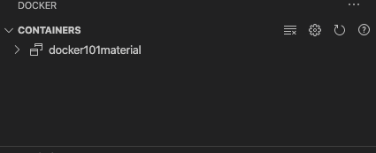
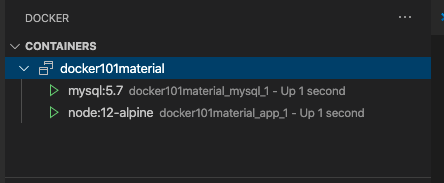

# Use Docker Compose

[Docker Compose](https://docs.docker.com/compose/) is a tool that was developed to help define and share multi-container applications. With Compose, you can create a YAML file to define the services and with a single command, can spin everything up or tear it all down.

The *big* advantage of using Compose is you can define your application stack in a file, keep it at the root of your project repo (it's now version controlled), and easily enable someone else to contribute to your project. Someone would only need to clone your repo and start the compose app. In fact, you might see quite a few projects on GitHub/GitLab doing exactly this now.

So, how do you get started?

## Install Docker Compose

If you installed Docker Desktop for either Windows or Mac, you already have Docker Compose! Play-with-Docker instances already have Docker Compose installed as well. If you are on a Linux machine, you will need to install Docker Compose using [the instructions here](https://docs.docker.com/compose/install/).

After installation, you should be able to run the following and see version information.

```bash
docker-compose version
```

## Create the compose file

1. At the root of the app project, create a file named `docker-compose.yml`.

1. In the compose file, we'll start off by defining the schema version. In most cases, it's best to use the latest supported version. You can look at the [Compose file reference](https://docs.docker.com/compose/compose-file/) for the current schema versions and the compatibility matrix.

    ```yaml
    version: "3.7"
    ```

1. Next, define the list of services (or containers) you want to run as part of your application.

    ```yaml hl_lines="3"
    version: "3.7"

    services:
    ```

And now, you'll start migrating a service at a time into the compose file.

## Define the App Service

To remember, this was the command you used to define your app container (replace the ` \ ` characters with `` ` `` in Windows PowerShell).

```bash
docker run -dp 3000:3000 \
  -w /app -v ${PWD}:/app \
  --network todo-app \
  -e MYSQL_HOST=mysql \
  -e MYSQL_USER=root \
  -e MYSQL_PASSWORD=secret \
  -e MYSQL_DB=todos \
  node:12-alpine \
  sh -c "yarn install && yarn run dev"
```

1. First, define the service entry and the image for the container. You can pick any name for the service. The name will automatically become a network alias, which will be useful when defining the MySQL service.

    ```yaml hl_lines="4 5"
    version: "3.7"

    services:
      app:
        image: node:12-alpine
    ```

1. Typically, you'll see the command close to the `image` definition, although there is no requirement on ordering. So, go ahead and move that into the file.

    ```yaml hl_lines="6"
    version: "3.7"

    services:
      app:
        image: node:12-alpine
        command: sh -c "yarn install && yarn run dev"
    ```

1. Migrate the `-p 3000:3000` part of the command by defining the `ports` for the service. You'll use the [short syntax](https://docs.docker.com/compose/compose-file/#short-syntax-1) here, but there is also a more verbose [long syntax](https://docs.docker.com/compose/compose-file/#long-syntax-1) available as well.

    ```yaml hl_lines="7 8"
    version: "3.7"

    services:
      app:
        image: node:12-alpine
        command: sh -c "yarn install && yarn run dev"
        ports:
          - 3000:3000
    ```

1. Next, migrate both the working directory (`-w /app`) and the volume mapping (`-v ${PWD}:/app`) by using the `working_dir` and `volumes` definitions. Volumes also has a [short](https://docs.docker.com/compose/compose-file/#short-syntax-3) and [long](https://docs.docker.com/compose/compose-file/#long-syntax-3) syntax.

   One advantage of Docker Compose volume definitions is you can use relative paths from the current directory.

    ```yaml hl_lines="9 10 11"
    version: "3.7"

    services:
      app:
        image: node:12-alpine
        command: sh -c "yarn install && yarn run dev"
        ports:
          - 3000:3000
        working_dir: /app
        volumes:
          - ./:/app
    ```

1. Finally, migrate the environment variable definitions using the `environment` key.

    ```yaml hl_lines="12 13 14 15 16"
    version: "3.7"

    services:
      app:
        image: node:12-alpine
        command: sh -c "yarn install && yarn run dev"
        ports:
          - 3000:3000
        working_dir: /app
        volumes:
          - ./:/app
        environment:
          MYSQL_HOST: mysql
          MYSQL_USER: root
          MYSQL_PASSWORD: secret
          MYSQL_DB: todos
    ```

### Define the MySQL service

Now, it's time to define the MySQL service. The command that you used for that container was the following (replace the ` \ ` characters with `` ` `` in Windows PowerShell):

```bash
docker run -d \
  --network todo-app --network-alias mysql \
  -v todo-mysql-data:/var/lib/mysql \
  -e MYSQL_ROOT_PASSWORD=secret \
  -e MYSQL_DATABASE=todos \
  mysql:5.7
```

1. First, define the new service and name it `mysql` so it automatically gets the network alias. Specify the image to use as well.

    ```yaml hl_lines="6 7"
    version: "3.7"

    services:
      app:
        # The app service definition
      mysql:
        image: mysql:5.7
    ```

1. Next, define the volume mapping. When you ran the container with `docker run`, the named volume was created automatically. However, that doesn't happen when running with Compose. You need to define the volume in the top-level `volumes:` section and then specify the mountpoint in the service config. By simply providing only the volume name, the default options are used. There are [many more options available](https://github.com/compose-spec/compose-spec/blob/master/spec.md#volumes-top-level-element) though.

    ```yaml hl_lines="8 9 10 11 12"
    version: "3.7"

    services:
      app:
        # The app service definition
      mysql:
        image: mysql:5.7
        volumes:
          - todo-mysql-data:/var/lib/mysql
    
    volumes:
      todo-mysql-data:
    ```

1. Finally, you only need to specify the environment variables.

    ```yaml hl_lines="10 11 12"
    version: "3.7"

    services:
      app:
        # The app service definition
      mysql:
        image: mysql:5.7
        volumes:
          - todo-mysql-data:/var/lib/mysql
        environment: 
          MYSQL_ROOT_PASSWORD: secret
          MYSQL_DATABASE: todos
    
    volumes:
      todo-mysql-data:
    ```

At this point, the complete `docker-compose.yml` should look like this:

```yaml
version: "3.7"

services:
  app:
    image: node:12-alpine
    command: sh -c "yarn install && yarn run dev"
    ports:
      - 3000:3000
    working_dir: /app
    volumes:
      - ./:/app
    environment:
      MYSQL_HOST: mysql
      MYSQL_USER: root
      MYSQL_PASSWORD: secret
      MYSQL_DB: todos

  mysql:
    image: mysql:5.7
    volumes:
      - todo-mysql-data:/var/lib/mysql
    environment: 
      MYSQL_ROOT_PASSWORD: secret
      MYSQL_DATABASE: todos

volumes:
  todo-mysql-data:
```

## Run the application stack

Now that you have the `docker-compose.yml` file, you can start it up!

1. First, make sure no other copies of the app and database are running (`docker ps` and `docker rm -f <ids>`).

1. Start up the application stack using the `docker-compose up` command. Add the `-d` flag to run everything in the background. Alternatively, you can right-click on your Compose file and select the **Compose Up** option for the VS Code side bar. 

    ```bash
    docker-compose up -d
    ```

    When you run this, you should see output like this:

    ```plaintext
    Creating network "app_default" with the default driver
    Creating volume "app_todo-mysql-data" with default driver
    Creating app_app_1   ... done
    Creating app_mysql_1 ... done
    ```

    You'll notice that the volume was created as well as a network! By default, Docker Compose automatically creates a network specifically for the application stack (which is why you didn't define one in the compose file).

1. Look at the logs using the `docker-compose logs -f` command. You'll see the logs from each of the services interleaved into a single stream. This is incredibly useful when you want to watch for timing-related issues. The `-f` flag "follows" the log, so will give you live output as it's generated.

    If you don't already, you'll see output that looks like this:

    ```plaintext
    mysql_1  | 2019-10-03T03:07:16.083639Z 0 [Note] mysqld: ready for connections.
    mysql_1  | Version: '5.7.27'  socket: '/var/run/mysqld/mysqld.sock'  port: 3306  MySQL Community Server (GPL)
    app_1    | Connected to mysql db at host mysql
    app_1    | Listening on port 3000
    ```

    The service name is displayed at the beginning of the line (often colored) to help distinguish messages. If you want to view the logs for a specific service, you can add the service name to the end of the logs command (for example, `docker-compose logs -f app`).

    > [!TIP]
    > **Waiting for the DB before starting the app**
    > When the app is starting up, it actually sits and waits for MySQL to be up and ready before trying to connect to it.Docker doesn't have any built-in support to wait for another container to be fully up, running, and ready before starting another container. For Node-based projects, you can use the [wait-port](https://github.com/dwmkerr/wait-port) dependency. Similar projects exist for other languages/frameworks.

1. At this point, you should be able to open your app and see it running. And hey! You're down to a single command!

## See the app stack in the Docker extension

If you look at the Docker extension, you can change the grouping options using the 'cog' and 'group by'. In this instance, you want to see containers grouped by Compose Project name:



If you twirl down the network, you will see the two containers you defined in the compose file.



## Tear it all down

When you're ready to tear it all down, simply run `docker-compose down`, or right-click on the application in the containers list in the VS Code Docker extension and select **Compose Down**. The containers will stop and the network will be removed.

> [!WARNING]
> **Removing Volumes**
> By default, named volumes in your compose file are NOT removed when running `docker-compose down`. If you want to remove the volumes, you will need to add the `--volumes` flag.

Once torn down, you can switch to another project, run `docker-compose up` and be ready to contribute to that project! It really doesn't get much simpler than that!

## Recap

In this section, you learned about Docker Compose and how it helps dramatically simplify the defining and sharing of multi-service applications. You created a Compose file by translating the commands you were using into the appropriate compose format.

At this point, you're starting to wrap up the tutorial. However, there are a few best practices about image building to cover, as there is a big issue with the Dockerfile you've been using. So, let's take a look!

## Next steps

Continue with the tutorial!

> [!div class="nextstepaction"]
> [Image-building best practices](image-building-best-practices.md)
