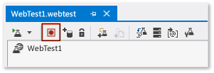
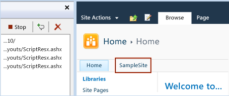

# Web performance and load testing SharePoint 2010 and 2013 applications
You can use web performance and load tests on your SharePoint applications to verify performance and stress abilities. Load tests can be configured to emulate conditions such as user loads, browser types, and network types.  
  
 **Requirements**  
  
-   Visual Studio Enterprise  
  
 *Where do I create, run and manage web performance and load tests?*  
 [Web performance and load tests](../test_notintoc/web-performance-and-load-tests-in-visual-studio.md) are managed using a web performance and load test project type, which is included with Visual Studio.  
  
 **In this topic**  
  
-   [Why do I want to run web performance and load tests on my SharePoint application?](#PerfLoadSharePointWhy)  
  
-   [Create and run a web performance test to record adding a task in SharePoint 2010](#PerfLoadSharePointCreateRunWebPerfTest)  
  
-   [What happened when the web performance test was created?](#PerfStressTestSharePointDynamicParameters)  
  
-   [Configuring Visual Studio options for recording SharePoint web performance tests](#PerfStressTestSharePointConfigOptions)  
  
-   [Verifying that your SharePoint application is working correctly by validating data using validation rules](#PerfStressTestSharePointValidation)  
  
-   [Verifying that your SharePoint application is working correctly by extracting data from web requests using extraction rules](#PerfStressTestSharePointExtractionRules)  
  
-   [Stress testing your SharePoint applications using load tests](#PerfStressTestSharePointLoadTests)  
  
-   [Analyzing web performance and load test results](#PerfStressTestSharePointAnalyzing)  
  
-   [Troubleshooting web performance test for SharePoint applications](#PerfStressTestSharePointTroubleshooting)  
  
##   Why do I want to run web performance and load tests on my SharePoint application?  
 Web performance and load tests can be used to verify the functionality, performance and stress capabilities of your SharePoint applications. Including web performance and load tests for your SharePoint application can significantly improve your team’s application lifecycle management process and is valuable if your application uses a continuous delivery methodology.  
  
 For more information, see [Testing for Continuous Shipping with Visual Studio 2012](http://go.microsoft.com/fwlink/?LinkID=255187).  
  
-   **Web performance tests**  
  
     Web performance tests can be recorded and then run and analyzed against your SharePoint applications. For example, you can create web performance tests that conduct the following operations on your SharePoint application:  
  
     **SharePoint 2010**  
  
    -   Site rendering  
  
    -   Document library operations  
  
    -   Task, calendar and library operations  
  
    -   Search content  
  
    -   Wikis  
  
    -   Customized web parts  
  
    -   Workflows  
  
    -   Multiple operations from the ribbon  
  
    -   Playing the tests against multiple sites and lists  
  
    -   Office Web Applications (OWA) – Uploaded and downloaded scenarios  
  
    -   Manage Metadata SA and look up columns in the lists and libraries  
  
    -   Integration of SharePoint and Excel Services  
  
    -   For InfoPath – you can use the plug-in (tool) from [CodePlex](http://ipfs2010webtest.codeplex.com/)  
  
     **SharePoint 2013**  
  
    -   All the scenarios listed above for SharePoint 2010  
  
    -   Social  
  
    -   SharePoint Apps  
  
-   **Load tests**  
  
     To stress test your SharePoint application simulating high user loads, differing network topologies and other conditions, you can create load tests that use your SharePoint web performance tests.  
  
 *What else should I know?*  
 **Notes**  
  
-    Web performance tests for SharePoint applications are supported only with SharePoint 2010 and SharePoint 2013.  
  
-    [Coded web performance tests](../test_notintoc/how-to--create-a-coded-web-performance-test.md) are not supported for SharePoint applications.  
  
     A *coded Web performance test* is typically created by converting an existing, recorded Web performance test into a code. A coded Web performance test is a .NET class that generates a sequence of WebTestRequests. It can be programmed by using either C# or Visual Basic.  
  
##   Create and run a web performance test to record adding a task in SharePoint 2010  
  
> [!NOTE]
>  This procedure assumes that you have a generic SharePoint 2010 site, http://SP2010, and a sub site named SampleSite. You can create a sub site by choosing **New Site** from the **Site Actions** drop-down list in SharePoint.  
  
1.  [Create a new web performance and load test project](assetId:///bd0a82fd-cec0-4861-bc09-e1b0b2d258ef). On the Visual Studio menu, choose **File**, **New**, and then **Project**. Expand either **Visual C#** or **Visual Basic** and choose **Test**. Choose **Web Performance and Load Test Project** and choose **OK**.  
  
2.  The Web Performance Test Editor displays with a blank test. To record the test, choose the **Add Recording** button.  
  
       
  
3.  A new blank web browser window appears with the web test recorder panel on the left side. Enter the name of your SharePoint site in the browser address bar. Visual Studio will record and list the URLs in the web test recorder panel.  
  
       
  
4.  Perform the following steps to navigate to the SharePoint sub site SampleSite and add a new item to the site task list:  
  
    1.  Choose **SampleSite** from the top of the SharePoint site.  
  
           
  
    2.  From the menu on the left side, choose **Tasks**.  
  
           
  
         The **SampleSite > Task: All Tasks** page appears.  
  
    3.  To add a new task to the list, choose the **Add new Item** link.  
  
           
  
         The **Tasks - New Item** dialog box appears. The only required field is **Title** and the value entered does not matter. Complete the information on the dialog box and choose **Save**.  
  
           
  
    4.  The web browser returns to the **SampleSite > Tasks: All Tasks**, which now lists the new task added in the previous step.  
  
           
  
    5.  To end the recording, choose **Stop** on the Web Test Recorder panel.  
  
         The [Dynamic Parameter](../test_notintoc/how-to--promote-dynamic-parameters-to-web-performance-test-parameters.md) detection dialog box appears. It indicates detection progress. This should only take a short while to complete.  
  
           
  
         Visual Studio will return you to the Web Performance Test Editor where your newly created web performance test is displayed.  
  
           
  
5.  To confirm that the test is running correctly, first browse the SharePoint site to view the existing list items:  
  
     **http://sp2010/SampleSite/Lists/Tasks/AllItems.aspx**  
  
6.  Go back to Visual Studio. Choose the **Run test** button on the Web Performance Test Editor. Your test runs, performing your recorded actions to add a new item to the task list in SharePoint.  
  
       
  
7.  Choose refresh on the browser window with your SharePoint site and you should now see a new task item added to the list.  
  
##   What happened when the web performance test was created?  
 Some websites and applications use [dynamic parameters](../test_notintoc/how-to--promote-dynamic-parameters-to-web-performance-test-parameters.md) in one or more of their web requests. A *dynamic parameter* is a parameter whose value is generated every time that a user runs the application. A dynamic parameter can cause your web performance test playback to fail because the dynamic value will likely be different every time that the test is run. Therefore, you cannot play back recorded values. An example of a dynamic parameter is a session ID. The session ID usually changes every 5 to 30 minutes.  
  
 Web performance tests recorded on SharePoint sites are sophisticated because of the dynamic nature of the request and the response format used by SharePoint. Even though record and playback of web performance tests will work on a single item or site, a significant number of modifications to the web performance tests are required to allow the tests to work across multiple SharePoint sites or servers. Each request to a SharePoint site can require over 30 individual modifications to address dynamic GUIDs and other aspects.  
  
 The web performance test recorder and playback engine automatically handle the most common types of dynamic parameters:  
  
-   Dynamic parameter values set in cookie value. The web performance test engine automatically handles these during playback.  
  
-   Dynamic parameter values set in hidden fields on HTML pages, such as ASP.NET view state. These are automatically handled by the recorder adding hidden field extraction rules to the test.  
  
-   Dynamic parameter values set as query string or form post parameters. These are handled through dynamic parameter detection when the test completes.  
  
-   [SharePoint GUID conversions](#PerfStressTestSharePointContextDynamicParamGUID)  
  
-   [SharePoint LISTID, ID, and other query string parameters](#PerfStressTestSharePointContextDynamicParamQueryString)  
  
-   [Create extraction rules for missing SharePoint headers](#PerfStressTestSharePointHeaders)  
  
-   [Create warnings for possible dynamic parameters](#PerfStressTestSharePointWarnings)  
  
 In addition to the dynamic parameter, Visual Studio performs the following actions on web performance test recordings for SharePoint applications:  
  
-   [Remove unnecessary requests](#PerfStressTestSharePointContextRequestsNoise)  
  
-   [Site name detection and parameterization](#PerfStressTestSharePointContextParameters)  
  
-   [Global validation rule for errors](#PerfStressTestSharePointValidationRules)  
  
### SharePoint GUID conversions  
 SharePoint frequently uses unique GUIDs and every GUID must be handled as a dynamic parameter if these tests are expected to run on a different SharePoint site. For example, on a single request, you can have 30 or more places where you need to handle dynamic GUIDs in your request. What makes this even more complex is the GUIDs are not just in the value portion of the form post request, but also appear in other parts of the request as well:  
  
-   **Dynamic GUIDS for post name fields**  
  
-   **GUIDs that are in the value of the form post parameters**  
  
     What makes this complex is that the GUID is located inside another dynamic parameter. Visual Studio automatically detects this condition and adds new extractions rules for you to handle this condition.  
  
-   **Dynamic GUID in the _EVENTARGET field**  
  
-   Although this is not a GUID, it shows an example of where you have the site name in a request that needs to be handled.  
  
###   SharePoint ListID, ID, and other query string parameters  
 In addition to GUIDs, SharePoint test contains many other dynamic values that need to be processed, such as ListIDs. Visual Studio adds the necessary extraction rules and then searches through the test to replace all occurrences.  
  
 ID is used when you select an item to view, such as when you view a task.  
  
 Depending upon your specific use case, you might want to select a random item instead of the specific one that was selected during the recording. To make this task easier, Visual Studio detects ID by using the extraction rule [SharePoint – Find List Item ID](../test_notintoc/using-validation-and-extraction-rules-in-web-performance-tests.md#UsingValidationExtractionRulesExtractionRules). If Visual Studio is not able to find the List item ID with the extraction rule, then Visual Studio creates a context parameter for the ID, and continues searching forward replacing all areas were the ID is detected.  
  
 If you wish to use dynamic values for the Item IDs, you can use extraction rules to simplify this process for you.  
  
###   Remove unnecessary requests  
 SharePoint generates a lot of requests, some of which are unnecessary noise. For example, it generates requests for cached URLs that are not required for the processing of core operations, such as request to blank.gif. This makes it hard to work on scripts. If your test goals do not require these requests, such as bandwidth/WAN testing, you can safely remove these requests from your test.  
  
> [!TIP]
>  The list of noise request filters can be modified, by [Configuring options for recording SharePoint web performance tests](#PerfStressTestSharePointConfigOptions).  
  
###   Site name detection and parameterization  
 To parameterize a string, you can create [context parameters](../test_notintoc/how-to--use-context-parameters-in-a-web-performance-test.md) to use in a web performance test. For example, you can create a context parameter for a Web site. The context parameter lets the test be changed quickly from one site to another. Visual Studio looks for SharePoint site names and adds context parameters for each site name that is detected. In addition, it also replaces all occurrences of the site name in the URL and other areas such as query strings, form post, or string body request where site names might be encountered.  
  
 There are conditions where the site name will be encountered, but is needed in a URL encoded format. Visual Studio will first attempt to enable URL encoding to minimize the number of parameters. If this doesn’t work, an additional site name will be added to indicate that the value must be URL encoded. You will encounter this condition if you use spaces or other special characters in your SharePoint site name.  
  
> [!TIP]
>  You can [Configure Visual Studio options for recording SharePoint web performance tests](#PerfStressTestSharePointConfigOptions) to specify site name parameterization.  
  
###   Global validation rule for errors  
 In many cases, SharePoint returns a success status code (http 200), but the request actually fails. This can cause you to think that your test is working correctly, when in reality it’s failing because of some error condition. A web test level [validation rule](../test_notintoc/using-validation-and-extraction-rules-in-web-performance-tests.md) is added that helps to detect these conditions and alert you to failed requests.  
  
 For more information about using validation rules, see [Verifying that your SharePoint application is working correctly by validating data using validation rules](#PerfStressTestSharePointValidation) in this topic.  
  
> [!TIP]
>  You can [Configuring Visual Studio options for recording SharePoint web performance tests](#PerfStressTestSharePointConfigOptions) to include global validation for errors.  
  
###   Create extraction rules for missing SharePoint headers  
 In some cases, SharePoint 2010 requires specific header values such as x-requestdigest. If these values do not exist, a request fails because of security or other errors. Visual Studio has the capability to record these headers and create [extraction rules](../test_notintoc/using-validation-and-extraction-rules-in-web-performance-tests.md) to dynamically update these values.  
  
 For more information about using extraction rules, see [Verifying that your SharePoint application is working correctly by extracting data from web requests using extraction rules](#PerfStressTestSharePointExtractionRules) in this topic.  
  
##   Configuring options for recording SharePoint web performance tests  
  
1.  From the Visual Studio menu, choose **TOOLS** and then choose **Options**.  
  
2.  Expand **Web Performance Test Tools**, and then expand **Web Test** and choose **SharePoint**.  
  
   
  
 By opening the Visual Studio options dialog box, you can configure the following options for web performance tests on SharePoint applications:  
  
1.  Enable or disable web performance and load testing for your SharePoint applications.  
  
2.  Filter out requests that you or your team might consider unnecessary noise in your test based on specified criteria. To help avoid noise, the following URL criteria and patterns are filtered by default. If your team needs to include any of these patterns in your tests, you can remove them from the list.  
  
    ### Default filters  
  
    |URL Criteria|URL Pattern|  
    |------------------|-----------------|  
    |Ends with|Blank.gif|  
    |Ends with|Blank.htm|  
    |Ends with|ScriptResx.ashx|  
    |Ends with|Commandui.ashx|  
  
3.  You or your team can parameterize the site name using a context parameter. Context parameters let you parameterize a string in a web performance test, and in this configuration option lets you quickly change the test from one site to another. By default, the context parameter is ‘SiteName’.  
  
4.  Apply a global validation rule for common error patterns. This will help in detecting if the error has occurred in the response by validating that the text entered for **ErrorPattern** is present in the HTTP response from the SharePoint server. You can enter multiple error patters in **ErrorPattern** by separating them with a delimiter semicolon (;). If one or more strings entered for **ErrorPattern** are present in the response, the web performance test will conclude that an error has occurred in the HTTP response and will fail the web performance test. By default the **ErrorPattern** contains the following error strings: \\[{"Error":[^n];"SharepointError";"HasException":true. These default error strings can be removed, or edited as your team requires.  
  
5.  The error strings can optionally be entered as regular expressions.  
  
##   Verifying that your SharePoint application is working correctly by validating data using validation rules  
 [Validation rules](../test_notintoc/how-to--add-a-validation-rule-to-a-web-performance-test.md) help verify that your SharePoint app is working correctly by validating the existence of text, tags, or attributes on the page returned by a web request. Validation rules can also verify the time that it takes a request to finish, and the existence of form fields and their values.  
  
 For a list of the validation rules including those used for SharePoint applications, see [Predefined Validation Rules](../test_notintoc/using-validation-and-extraction-rules-in-web-performance-tests.md#UsingValidationExtractionRulesValidationRules).  
  
##   Verifying that your SharePoint application is working correctly by extracting data from web requests using extraction rules  
 [Extraction rules](../test_notintoc/how-to--add-an-extraction-rule-to-a-web-performance-test.md) help verify that your SharePoint application is working correctly by extracting data from the responses to the web requests. Extraction rules store results in the test context as name value pairs. Extraction rules can extract form fields, text, attributes, headers, regular expressions, and hidden fields.  
  
 For a list of the extraction rules for SharePoint, see [Predefined Extraction Rules for SharePoint Applications](../test_notintoc/using-validation-and-extraction-rules-in-web-performance-tests.md#UsingValidationExtractionRulesSharePointExtractionRules).  
  
##   Stress testing your SharePoint applications using load tests  
 After creating web performance tests for your SharePoint application, you can create load tests to test your applications performance and stress abilities. A load test is created by using the New Load Test Wizard. When using the wizard, you can configure how you want to test your SharePoint application’s performance and stress abilities.  
  
   
  
 In **Solution Explorer**, Open the context menu for the Web performance and load test project node, choose **Add**, and then choose **Load Test**.  
  
 The wizard provides configuration options for the new load test including:  
  
-   [Load pattern](../test_notintoc/creating-load-tests.md#CreatingLoadTestsUsingWizardStep2_1): The number of virtual users who are active during the load test and the rate at which they are added during the test.  
  
-   [Test mix model](../test_notintoc/creating-load-tests.md#CreatingLoadTestsUsingWizardStep2_2): The probability of a virtual user running a given test in a load test scenario.  
  
-   [Test mix](../test_notintoc/creating-load-tests.md#CreatingLoadTestsUsingWizardStep2_3): The mixture of web performance test, unit test, and coded UI tests included in the load test.  
  
-   [Network mix](../test_notintoc/creating-load-tests.md#CreatingLoadTestsUsingWizardStep2_4): The network types used in the test. For example, LAN and 56K dial-up.  
  
-   [Browser mix](../test_notintoc/creating-load-tests.md#CreatingLoadTestsUsingWizardStep2_5): The web browser types used in the load test. For example, Windows Internet Explorer 9 and Windows Internet Explorer 10.  
  
-   [Counter sets](../test_notintoc/creating-load-tests.md#CreatingLoadTestsUsingWizardStep3): Counter sets are a set of system performance counters that are useful to monitor during a load test. Counter sets are organized by technology, for example, ASP.NET or SQL counter sets.  
  
    > [!NOTE]
    >  [Predefined performance counter sets](../test/specifying-the-counter-sets-and-threshold-rules-for-computers-in-a-load-test.md) used with load tests are not available for SharePoint.  
  
-   [Run settings](../test_notintoc/creating-load-tests.md#CreatingLoadTestsUsingWizardStep4) Run settings determine load test properties such as the length of the test, warm-up duration, maximum number of error details reported, and the sampling rate.  
  
 [Load tests are run](../test_notintoc/how-to--run-a-load-test.md) from the either the Load Test Editor, or the **LOAD TEST** menu.  
  
   
  
##   Analyzing web performance and load test results  
 The [Web Performance Test Results Viewer](../test_notintoc/web-performance-test-results-viewer-overview.md) lets you view the details of each request in your web performance test and the resulting response to those requests. The Web Performance Test Results Viewer uses a tree view to display the requests and any nested dependent requests under the top level request. Page redirects are also displayed in the tree.  
  
 You can use the [Load Test Analyzer](../test/load-test-analyzer-overview.md) to locate bottlenecks, identify errors, and measure improvements in your application. You can analyze load test results by using the Load Test Analyzer in the following ways:  
  
-   Monitor a load test when it is running.  
  
-   Analyze a load test after it has completed.  
  
-   View results from a previous load test.  
  
##   Troubleshooting web performance test for SharePoint applications  
  
> [!WARNING]
>  Coded web performance tests are not supported for SharePoint applications.  
  
### Add appointment- with create meeting workspace option selected fails  
 This fails because a new site is being created for the workspace and SharePoint is trying to create a site with same name during [dynamic parameter](../test_notintoc/how-to--promote-dynamic-parameters-to-web-performance-test-parameters.md) detection.  
  
 **Workaround:** Update the meeting title references in the form post parameters for create meeting and create meeting workspace web requests to use the unique meeting title every time you playback the web performance test. As a new site is created using the meeting title, it should be unique. Otherwise, create workspace request fails.  
  
### Upload of document fails if web performance test is added into a separate folder other than root folder of test project  
 **Workaround:** If the upload document web performance test is added into a separate folder then explicitly specify the same document as a deployment item in the test settings.  
  
 **-or-**  
  
 Create the web performance test at web performance and load test project’s root level instead of creating it in a separate Folder.  
  
### SharePoint delete operations  
 If you record a web performance test that deletes a task, a calendar appointment, or a document and you try to run the test, it fails because the corresponding task, appointment or document is already deleted.  
  
 **Workaround:** Use the **SharePoint2010.FindListItems** extraction rule to extract the desired list item’s GUID to a [context parameter](../test_notintoc/how-to--use-context-parameters-in-a-web-performance-test.md). You can filter the selection based on title name and index number. Pass that parameter in the subsequent **Delete** request.  
  
 **-or-**  
  
 Have a request plug-in to extract the desired item’s GUID from the previous request’s response and then pass that to the delete request.  
  
## External resources  
  
### Videos  
 [Introduction and Story Boarding for SharePoint Load Testing with Visual Studio 2012.1](http://go.microsoft.com/fwlink/?LinkID=275086)  
  
 [How to use Visual Studio 2012.1 for SharePoint Application Load Testing](http://go.microsoft.com/fwlink/?LinkID=275087)  
  
## See Also  
 [Web performance and load tests in Visual Studio](../test_notintoc/web-performance-and-load-tests-in-visual-studio.md)   
 [Create SharePoint Solutions](../Topic/Create%20SharePoint%20Solutions.md)   
 [Testing SharePoint 2010 Applications with Coded UI Tests](../codequality/testing-sharepoint-2010-applications-with-coded-ui-tests.md)   
 [Verifying and Debugging SharePoint Code](../Topic/Verifying%20and%20Debugging%20SharePoint%20Code.md)   
 [Building and Debugging SharePoint Solutions](../Topic/Building%20and%20Debugging%20SharePoint%20Solutions.md)   
 [Profiling the Performance of SharePoint Applications](../Topic/Profiling%20the%20Performance%20of%20SharePoint%20Applications.md)