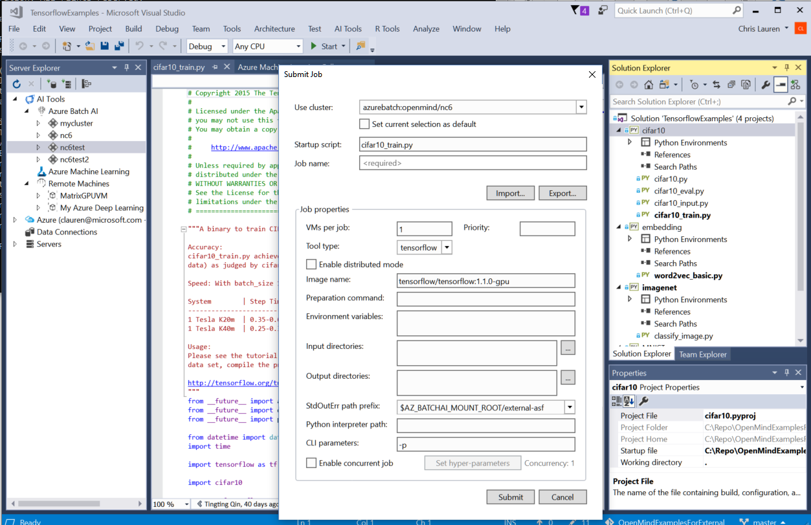

# Visual Studio Tools for AI

Visual Studio Tools for AI is an extension to build, test, and deploy Deep Learning / AI solutions. It seamlessly integrates with Azure Machine Learning for robust experimentation capabilities, including but not limited to submitting data preparation and model training jobs transparently to different compute targets. Additionally, it provides support for custom metrics and run history tracking, enabling data science reproducibility and auditing. Enterprise ready collaboration, allow to securely work on project with other people.

Get started with deep learning using [Microsoft Cognitive Toolkit (CNTK)](/cognitive-toolkit/), [Google TensorFlow](https://www.tensorflow.org), or other deep-learning frameworks today.

## Develop, debug, and deploy deep learning models and AI solutions
Use the productivity features of Visual Studio to accelerate AI innovation today. Use built-in code editor features like syntax highlighting, IntelliSense, and text auto formatting. You can interactively test your deep learning application in your local environment using step-through debugging on local variables and models.

## Get started quickly with the Azure Machine Learning Sample Gallery
Visual Studio Tools for AI is integrated with Azure Machine Learning to make it easy to browse through a gallery of sample experiments using CNTK, TensorFlow, MMLSpark, and more.

[Learn more about creating projects from the sample gallery](create-project-gallery.md)

## Scale out deep learning model training and/or inferencing to the cloud
This extension makes it easy to train models on your local computer or you can submit jobs to the cloud by using our integration with Azure Machine Learning. You can submit jobs to different compute targets like Spark clusters, Azure GPU virtual machines, and more.

[Learn more about training models in the cloud](tensorflow-vm.md)

## Supported Operating Systems
Currently this extension supports Windows 64-bit operating systems.

## Support
Support for this extension is provided on our [GitHub Issue Tracker](https://github.com/Microsoft/vs-tools-for-ai/issues). You can submit a bug report or feature suggestion and participate in discussions.
