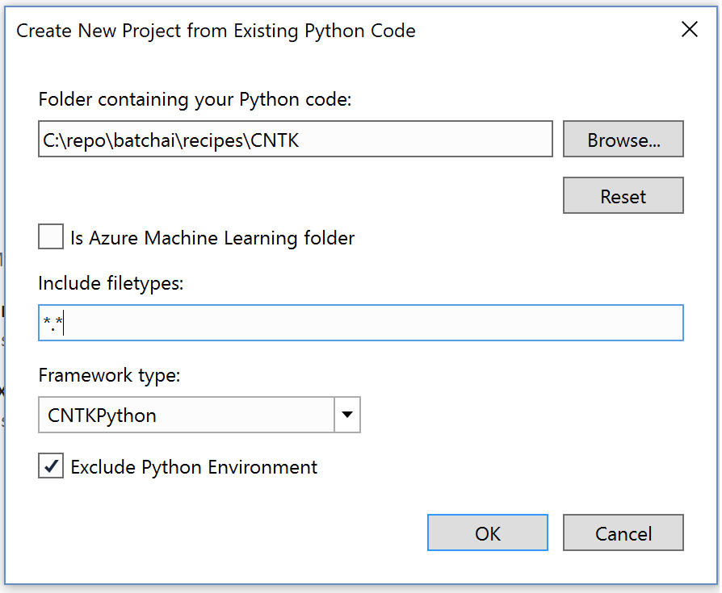

# Create an AI project from existing code

Once you've [installed Visual Studio Tools for AI](installation.md), it's easy to bring existing Python code into a Visual Studio project.

> [!Important]
> The process described here does not move or copy the original source files. If you want to work with a copy, duplicate the folder first.

1. Launch Visual Studio and select **File > New > Project**.

2. In the **New Project** dialog, search for "**AI Tools**", select the "**From Existing Python code**" template, give the project a name and location, and select **OK**.

   

3. In the wizard that appears, set the path to your existing code, set a filter for file types, and specify any search paths that your project requires, then select **OK**. If you don't know what search paths are, leave that field blank.

   

   If your existing code is part of an Azure Machine Learning project, check the **Is Azure Machine Learning folder** to ensure successful conversion of important Azure Machine Learning configuration details like the Experimentation account, Workspace, which compute contexts to use, and more.

4. To set a startup file, locate the file in **Solution Explorer**, right-click, and select **Set as Startup File**.

5. Run the program by pressing **Ctrl**+**F5** or selecting **Debug > Start Without Debugging**.

> [!div class="nextstepaction"]
> [Tutorial: Working with Python in Visual Studio](../python/tutorial-working-with-python-in-visual-studio-step-00-installation.md)

## See also

- [Manually identify an existing Python environment](../python/managing-python-environments-in-visual-studio.md#manually-identify-an-existing-environment)
