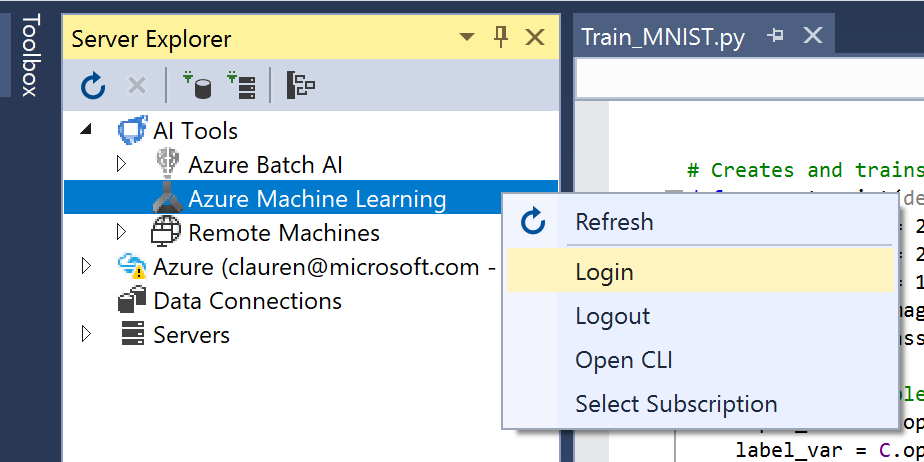
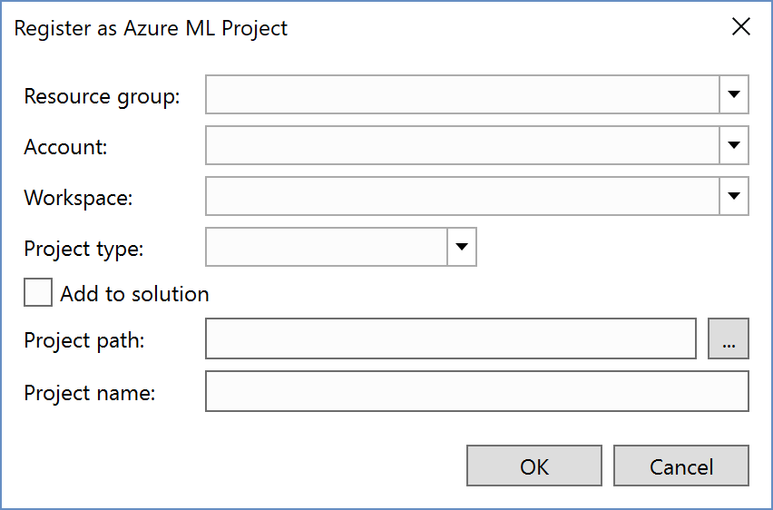
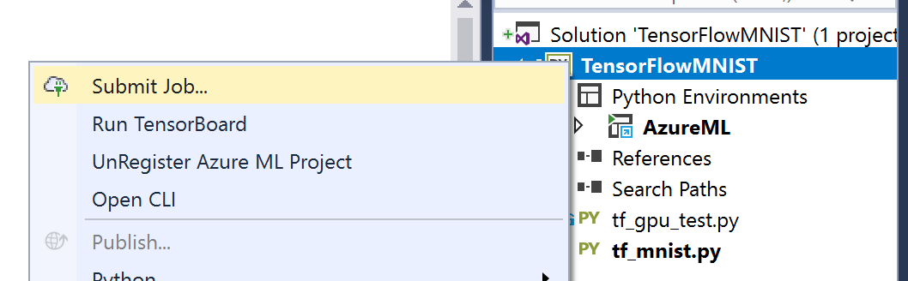
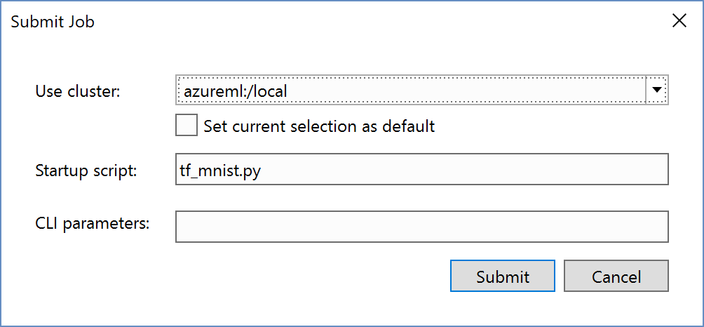

# Create an AI project from the Azure Machine Learning Gallery in Visual Studio

Azure Machine Learning is integrated with Visual Studio Tools for AI. You can use it to submit machine learning jobs to remote compute targets like Azure virtual machines, Spark clusters, and more. 

Once you've [installed Visual Studio Tools for AI](installation.md), it's easy to create a new Python project using pre-made recipes in the Azure Machine Learning Sample Gallery.

> [!NOTE]
> Azure Machine Learning Workbench must be installed. To install it please see the [Azure Machine Learning installation quickstart](https://docs.microsoft.com/azure/machine-learning/preview/quickstart-installation)

1. Launch Visual Studio. Open the **Server Explorer** by opening the **AI Tools** menu and choosing **Select Cluster**

    

2. Sign in to your Azure Machine Learning subscription by right-clicking the **Azure Machine Learning** node in the Server Explorer then select **Login** and follow the directions.

    

3. Select **AI Tools > Azure Machine Learning Sample Gallery**.

    

4. For this Quickstart, select the "**MNIST using TensorFlow**" sample and click **Install**. Provide the following:

   - **Resource Group**: Azure resource group where your metadata will be stored
   - **Account**: Azure Machine Learning experimentation Account
   - **Workspace**: Azure Machine Learning workspace
   - **Project Type**: The machine learning framework. In this case choose **TensorFlow**
   - **Add to Solution**: determines whether to add to your current Visual Studio Solution or a create and open a new solution
   - **Project Path**: Location to save the code
   - **Project Name**: Type **TensorFlowMNIST**

   

5. Visual Studio creates the project file (a `.pyproj` file on disk) along with other files defined in the sample. With the "MNIST" template, the project contains several files.

    

6. Submit the job to Azure Machine Learning.

    

7. Run in a Docker container or on your local machine

    
