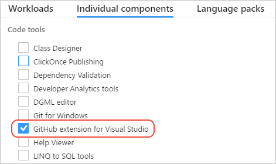
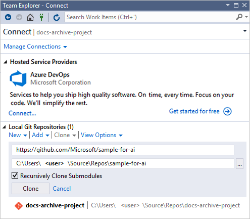
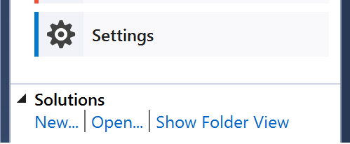
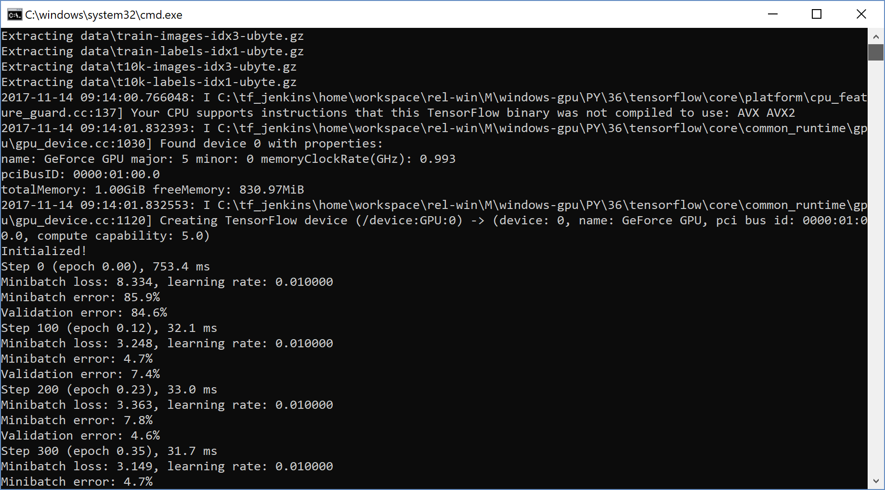
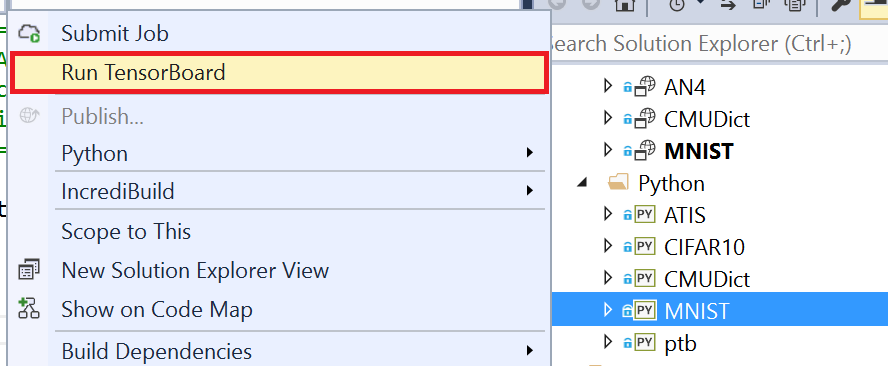

# Clone a repository of Python code in Visual Studio

Once you've [installed Visual Studio Tools for AI](installation.md), you can easily clone a repository of Python code and create a project from it.

1. To connect to GitHub repositories, run the Visual Studio installer, select **Modify**, and select the **Individual components** tab. Scroll down to the **Code tools** section, select **GitHub extension for Visual Studio**, and select **Modify**.

    

2. Launch Visual Studio.

3. Select **View > Team Explorer** to open the **Team Explorer** window in which you can connect to GitHub or Azure DevOps, or clone a repository.

    

4. In the URL field under **Local Git Repositories**, enter `https://github.com/Microsoft/samples-for-ai`, enter a folder for the cloned files, and select **Clone**.

    > [!Tip]
    > The folder you specify in Team Explorer is the specific folder to receive the cloned files. Unlike the `git clone` command, creating a clone in Team Explorer does not automatically create a subfolder with the name of the repository.

5. When cloning is complete, double-click the repository folder at the bottom of Team Explorer to navigate to the repository dashboard. Under **Solutions**, select **New**.

    

6. In the **New Project** dialog that appears, select "**From Existing Python Code**", specify a name for the project, set **Location** to the same folder as the repository, and select **OK**. In the wizard that appears, select **Finish**.

7. Select **View > Solution Explorer** from the menu.

8. In Solution Explorer, expand the `TensorFlow Examples> MNIST` node, right-click `convolutional.py`, and select **Set as Startup File**. This step tells Visual Studio which file it should use when running the project.

9. Press **Ctrl**+**F5** or select **Debug > Start Without Debugging** to run the program. If you see an error, recheck the working directory setting in the previous step.

10. When the program runs successfully, you'll see it start to download your training and test dataset, then train the model and output your error rate. You want error rate to decrease over time

    

   > [!NOTE]
   > If you're using Anaconda and get an error about missing numpy, you may need to [change your Python environment to use Anaconda](../python/selecting-a-python-environment-for-a-project.md).

11. You can visualize the progress with TensorBoard. Right click your project and click **Run TensorBoard** then select the directory of your output TensorBoard logs.

   

12. Notice the error decreasing overtime, which means the quality is improving.

   
