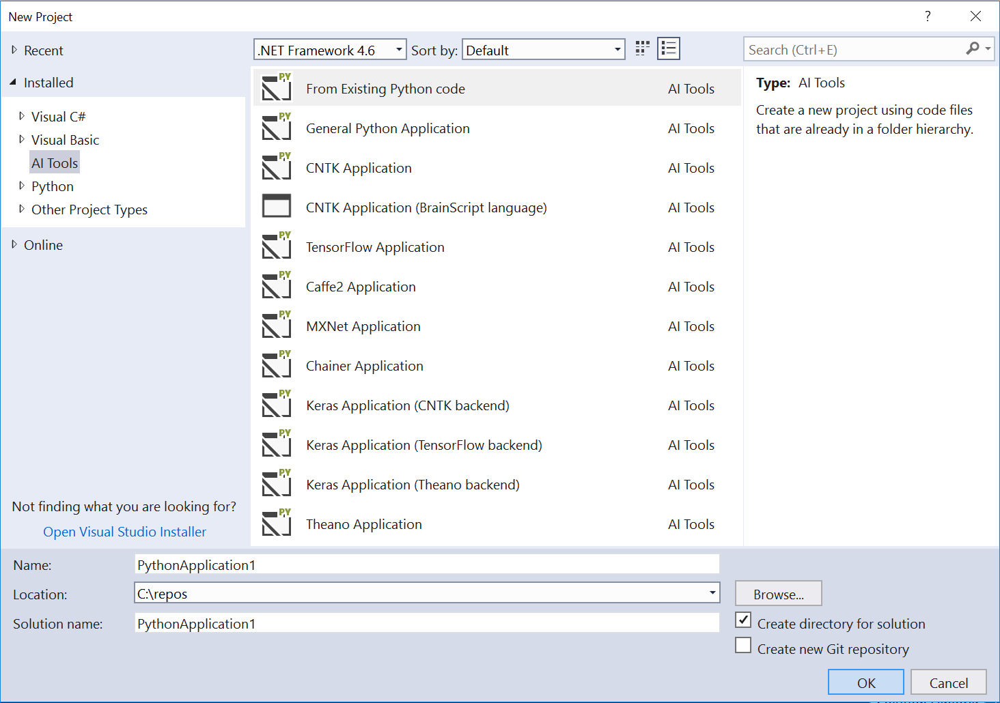
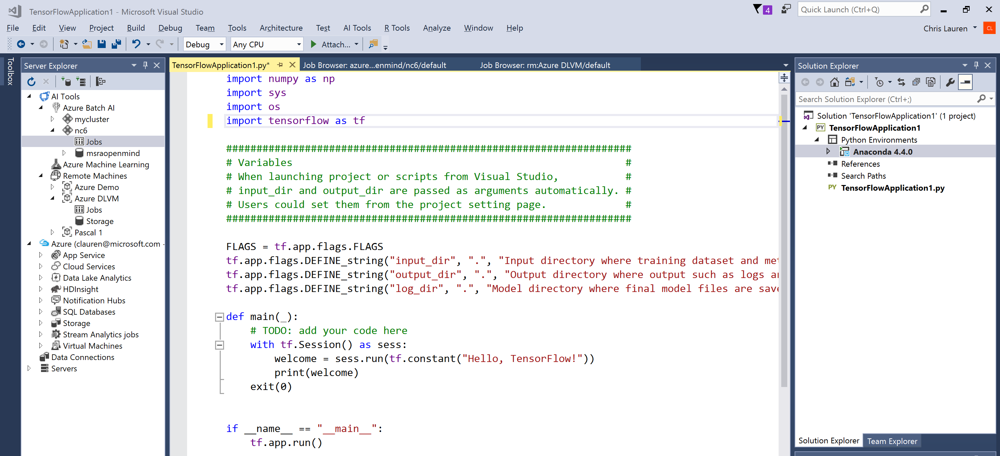
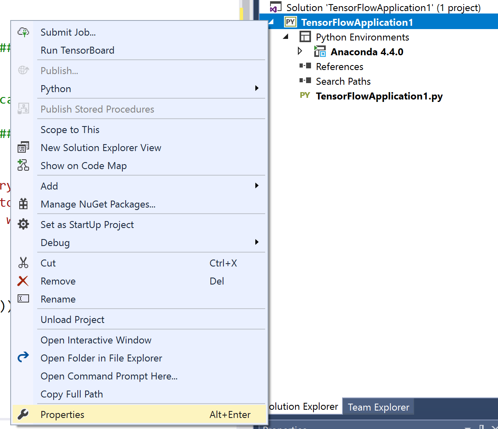
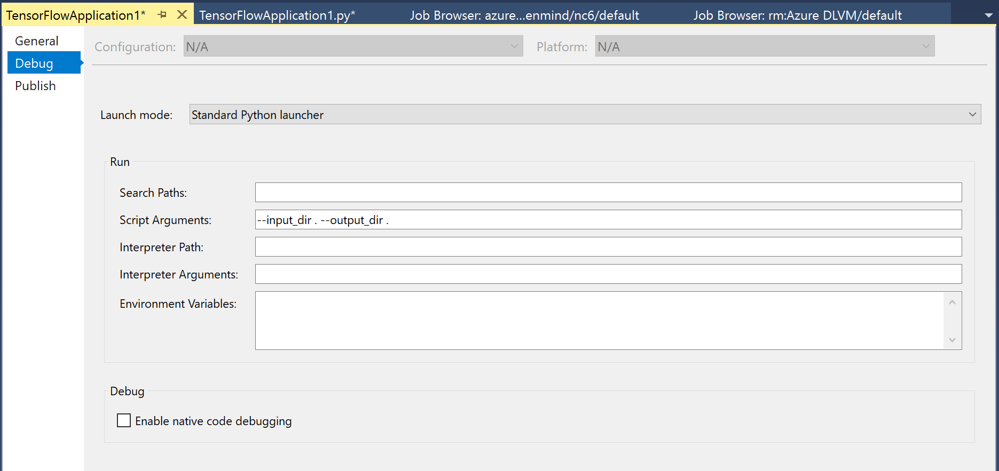

# Create an AI project from a template in Visual Studio

Once you've [installed Visual Studio Tools for AI](installation.md), it's easy to create a new AI project using a variety of templates.

1. Launch Visual Studio.

2. Select **File > New > Project** (Ctrl+Shift+N). In the **New Project** dialog, search for "**AI Tools**", and select the template you want. Note that selecting a template displays a short description of what the template provides.

    

3. For this Quickstart, select the "**TensorFlow Application**" template, give the project a name (such as "MNIST") and location, and select **OK**.

4. Visual Studio creates the project file (a `.pyproj` file on disk) along with any other files as described by the template. With the "TensorFlow Application" template, the project contains one file named the same as your project. The file is open in the Visual Studio editor by default.

    

5. Notice the code already imports several libraries including TensorFlow, numpy, sys and os. Additionally it starts your application ready with some input arguments to easily enable switching the location of input training data, output models and log files. These params are useful when you submit your jobs to multiple compute contexts (ie different directory on your local dev box than on an Azure File Share).

6. Your project also has some properties created to make it easy to debug your app by automatically passing commandline arguments to these input parameters. **Right click** your project then select **Properties**

    

7. Click the **Debug** tab to see the Script Arguments automatically added. you may change them as needed to where your input data is located and where you would like your output stored.

    

8. Run the program by pressing Ctrl+F5 or selecting **Debug > Start Without Debugging** on the menu. The results are displayed in a console window.
