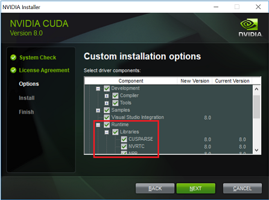
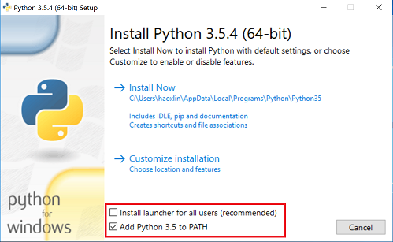

# Installation

Visual Studio Tools for AI can be installed on Windows 64-bit operating systems.

## Install Visual Studio Tools for AI

This extension works with Visual Studio 2015 and Visual Studio 2017, Community edition or higher.

You can download the tools from the [Visual Studio Marketplace](https://aka.ms/vstoolsforai), or from within Visual Studio:

1. Select **Tools** > **Extensions and Updates**.

   

2. In the **Extensions and Updates** dialog box, select **Online** on the left-hand side.
3. In the search box in the upper right-hand corner, type or enter "tools for ai".
4. Select **Visual Studio Tools for AI** from the results.
5. Click **Download**.

## Prepare your local machine

Before training deep learning models on your local computer, make sure you have the applicable prerequisites installed. This includes making sure you have the latest drivers and libraries for your NVIDIA GPU (if you have one). Also ensure you've installed Python and Python libraries such as NumPy, SciPy, and appropriate deep learning frameworks such as Microsoft Cognitive Toolkit (CNTK), TensorFlow, Caffe2, MXNet, Keras, Theano, PyTorch, and Chainer, that you plan to use in your project.

> [!NOTE]
> Software introduction in the following subsections is excerpted from their homepages.

### NVIDIA GPU driver

Deep learning frameworks take advantage of NVIDIA GPU to let machines learn at a speed, accuracy, and scale towards true artificial intelligence. If your computer has NVIDIA GPU cards, see [NVIDIA Driver Downloads](https://www.nvidia.com/Download/index.aspx) or try an operating system update to install the latest driver.

### CUDA

[CUDA](https://developer.nvidia.com/cuda-zone) is a parallel computing platform and programming model invented by NVIDIA. It enables dramatic increases in computing performance by harnessing the power of the GPU. Currently, CUDA Toolkit 8.0 is required by deep learning frameworks.

To install CUDA

- Visit this [site](https://developer.nvidia.com/cuda-80-ga2-download-archive), download CUDA, and install it.
- Make sure to install the CUDA runtime libraries, and then add CUDA binary path to the %PATH% or $Path environment variable.
- On Windows, this path is "C:\Program Files\NVIDIA GPU Computing Toolkit\CUDA\v8.0\bin" by default.



### cuDNN

[cuDNN](https://developer.nvidia.com/cudnn) (CUDA Deep Neural Network library) is a GPU-accelerated library of primitives for deep neural networks by NVIDIA. cuDNN v6 is required by latest deep learning frameworks.

To install cuDNN:

- Visit [NVIDIA Developer](https://developer.nvidia.com/rdp/cudnn-download) to download and install the latest package.
- Ensure to add the directory containing cuDNN binary to the %PATH% or $Path environment variable.
- On Windows, you can copy cudnn64_6.dll to "C:\Program Files\NVIDIA GPU Computing Toolkit\CUDA\v8.0\bin".

> [!NOTE]
> Previous deep learning frameworks such as CNTK 2.0 and TensorFlow 1.2.1 need cuDNN v5.1. However, you can install multiple cuDNN versions together.

### Python

Python has been the primary programming language for deep learning applications. **64-bit** Python distribution is required, and [Python 3.5.4](https://www.python.org/downloads/release/python-354/) is recommended for the best compatibility.

### To install Python on Windows

- We suggest installing the Python launcher for yourself only, and add Python to the %PATH% environment variable.
- Ensure to install pip, which is the package management system to install and manage software packages written in Python.

Deep learning frameworks rely on pip for their own installation.



Then, we need to verify whether Python 3.5 is installed correctly, and upgrade pip to the latest version by executing the following commands in a terminal:

- **Windows**

  ```cmd
  C:\Users\test>python -V
  Python 3.5.4

  C:\Users\test>pip3.5 -V
  pip 9.0.1 from c:\users\test\appdata\local\programs\python\python35\lib\site-packages (python 3.5)

  C:\Users\test>python -m pip install -U pip
  ```

- **macOS**

  ```bash
  MyMac:~ test$ python3.5 -V
  Python 3.5.4

  MyMac:~ test$ pip3.5 -V
  pip 9.0.1 from /Library/Frameworks/Python.framework/Versions/3.5/lib/python3.5/site-packages (python 3.5)

  MyMac:~ test$ python3.5 -m pip install -U pip
  ```

### Python on Visual Studio

Python is fully supported in Visual Studio through extensions.
Learn more about install [Python for Visual Studio Tools](../python/installing-python-support-in-visual-studio.md) for more details.

### NumPy and SciPy

- **NumPy** is a general-purpose array-processing package designed to efficiently manipulate large multi-dimensional arrays of arbitrary records without sacrificing too much speed for small multi-dimensional arrays.

- **SciPy** (pronounced "Sigh Pie") is open-source software for mathematics, science, and engineering, depending on NumPy. Starting from version 1.0.0, SciPy now has official prebuilt wheel package for Windows.

To install NumPy and SciPy, run the following command in a terminal:

```bash
pip3.5 install -U numpy scipy
```

> [!NOTE]
> The above command upgrades existing old or unofficial (e.g. third-party packages from http://www.lfd.uci.edu/~gohlke/pythonlibs/ for Windows) NumPy and SciPy to the latest official ones.

### Microsoft Cognitive Toolkit (CNTK)

The [Microsoft Cognitive Toolkit](https://cntk.ai) is a unified deep-learning toolkit that describes neural networks as a series of computational steps via a directed graph. CNTK supports both Python and BrainScript programming languages.

> [!NOTE]
> CNTK currently does not support macOS.

To install CNTK Python package, see [how to install CNTK](https://docs.microsoft.com/cognitive-toolkit/Setup-CNTK-on-your-machine).

### TensorFlow

[TensorFlow](https://www.tensorflow.org/) is an open-source software library for numerical computation using data flow graphs. Refer to [here](https://www.tensorflow.org/install/) for detailed installation.

> [!NOTE]
> As of version 1.2, TensorFlow no longer provides GPU support for macOS.

### Caffe2

[Caffe2](https://caffe2.ai/) is a lightweight, modular, and scalable deep learning framework. Building on the original Caffe, Caffe2 is designed with expression, speed, and modularity in mind.

Currently, there's no prebuilt Caffe2 python wheel package available.

Visit [here](https://caffe2.ai/docs/getting-started.html) to build from source code.

### MXNet

[Apache MXNet (incubating)](https://mxnet.incubator.apache.org/) is a deep learning framework designed for both efficiency and flexibility. It allows you to **mix** [symbolic and imperative programming](http://mxnet.io/architecture/index.html#deep-learning-system-design-concepts) to maximize efficiency and productivity.

To install MXNet, run the following command in a terminal:

- With GPU

  ```bash
  pip3.5 install mxnet-cu80==0.12.0
  ```

- Without GPU

  ```bash
  pip3.5 install mxnet==0.12.0
  ```

### Keras

[Keras](https://keras.io/) is a high-level neural networks API, written in Python, that's capable of running on top of CNTK, TensorFlow, or Theano. It was developed with a focus on enabling fast experimentation. Being able to go from idea to result with the least possible delay is key to doing good research.

To install Keras, run the following command in a terminal:

```bash
pip3.5 install Keras==2.0.9
```

### Theano

[Theano](http://deeplearning.net/software/theano/) is a Python library that allows you to define, optimize, and evaluate mathematical expressions involving multi-dimensional arrays efficiently.

To install Theano, run the following command in a terminal:

```bash
pip3.5 install Theano==0.9.0
```

### PyTorch

[PyTorch](https://pytorch.org/) is a python package that provides two high-level features:

- Tensor computation (like numpy) with strong GPU acceleration
- Deep Neural Networks built on a tape-based autograd system

To install PyTorch, run the following command in a terminal:

- **Windows**

  There's no official wheel package yet. You can download a third-party package from [Anaconda](https://anaconda.org/pytorch/repo?type=all) or [University of California](https://www.lfd.uci.edu/~gohlke/pythonlibs/#pytorch).

  - Decompress it to your home directory, for example, *C:\Users\test\pytorch*.
  - Add *C:\Users\test\pytorch\Lib\site-packages* to the %PYTHONPATH% environment variable.

    ```bash
    pip3 install http://download.pytorch.org/whl/cu80/torch-0.4.0-cp36-cp36m-win_amd64.whl
    pip3 install torchvision
    ```

- **macOS**

  ```bash
  pip3.5 install http://download.pytorch.org/whl/torch-0.2.0.post3-cp35-cp35m-macosx_10_7_x86_64.whl
  ```

  > [!NOTE]
  > macOS binaries don't support CUDA, install from source if CUDA is needed

- **Linux**

  ```bash
  pip3.5 install http://download.pytorch.org/whl/cu80/torch-0.2.0.post3-cp35-cp35m-manylinux1_x86_64.whl
  ```

  > [!NOTE]
  > This single package supports both GPU and CPU.

Finally, install torchvision on non-Windows:

```bash
pip3.5 install torchvision
```

### Chainer

[Chainer](https://chainer.org/) is a Python-based deep learning framework aiming at flexibility. It provides automatic differentiation APIs based on the define-by-run approach (also known as dynamic computational graphs) as well as object-oriented high-level APIs to build and train neural networks.

To enable CUDA support, install [CuPy](https://github.com/cupy/cupy):

```bash
pip3.5 install cupy
```

> [!NOTE]
> On Windows, you need the 2015 version of [Visual Studio](https://visualstudio.microsoft.com/) or the [Microsoft Visual C++ Build Tools](https://visualstudio.microsoft.com/visual-cpp-build-tools/) to compile CuPy with CUDA 8.0.

To install Chainer, run the following command in a terminal:

```bash
pip3.5 install chainer==3.0.0
```
