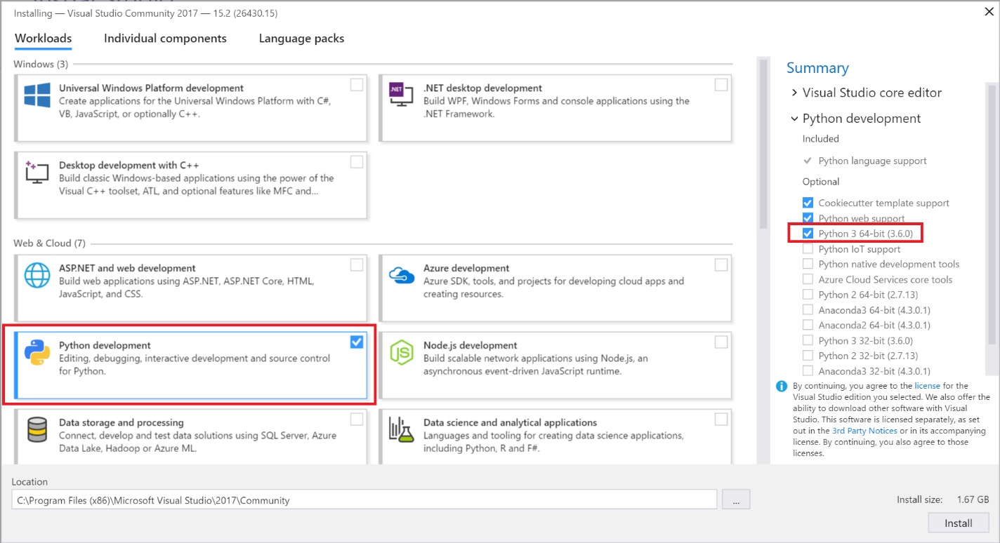
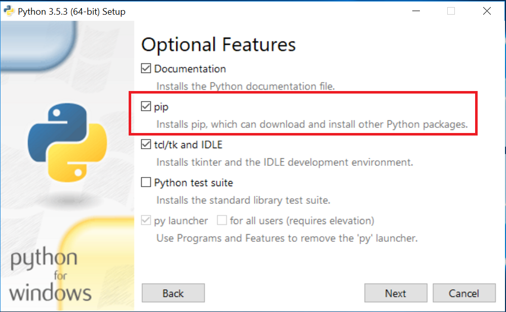
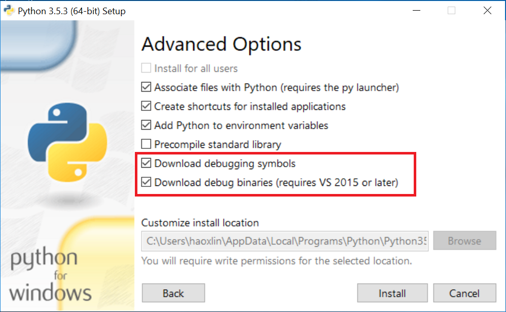
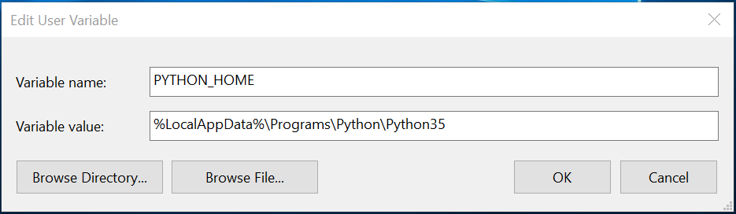
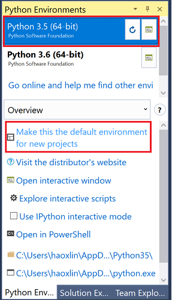
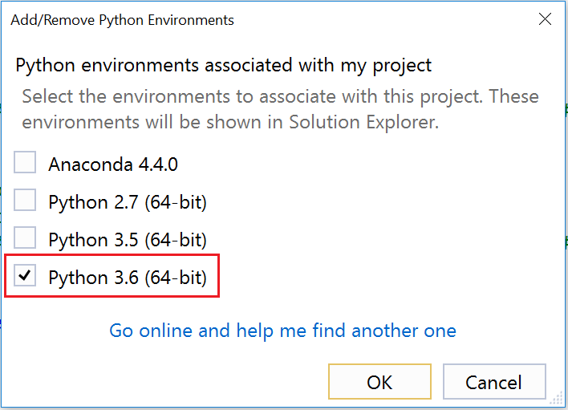

<!--
# Prerequisites <a id="prerequisites"></a>
-->

## Overview <a id="overview"></a>

We assume that you are working on a Windows 10 x64 machine.
Other 64-bit OSes such as Windows 7/8.1 (both Professional and Enterprise editions), Server 2012 R2/2016 (both Standard and Datacenter editions) should work, but they are not fully tested.

> [!WARNING]
> We **don’t** support 32-bit Windows at all.


If your machine has NVIDIA GPU cards, please make sure to have installed the latest driver, CUDA 8.0 and cuDNN 5.1.

OpenMind Studio supports both Visual Studio 2015 and 2017 by providing two different extension package files.
Depending on which Visual Studio users have installed, one appropriate extension file or both should be installed.

Since Python is the primary programming language supported by Deep Learning frameworks, PythonTools for Visual Studio, and 64-bit Python 3.5 (e.g. 3.5.3) are required by OpenMind Studio.
Users are free to choose other Python interpreters such as [Anaconda](https://www.continuum.io/downloads#windows), [WinPython](https://sourceforge.net/projects/winpython/files/), or different versions such as 2.7, 3.4, 3.6.
However, users must then manually install Deep Learning frameworks and their dependencies instead of using OpenMind Studio’s One-Click installer.

## Visual Studio 2015 and PythonTools <a id="vs2015"></a>

OpenMind Studio works on Visual Studio 2015 Enterprise, Professional and [Community](https://imagine.microsoft.com/en-us/Catalog/Product/101) with Update 3.
When Visual Studio 2015 installation starts, please choose **Custom** type, and then select **Python Tools for Visual Studio** for Python language support.
Please refer to the official Visual Studio Python [document](https://docs.microsoft.com/en-us/visualstudio/python/python-in-visual-studio) for details.
<br>

<center></center>
<center>Figure: Install Visual Studio 2015 with Python Tools.</center>

## Visual Studio 2017 and PythonTools <a id="vs2017"></a>

OpenMind Studio works on Visual Studio 2017 Enterprise, Professional and [Community](https://www.visualstudio.com/thank-you-downloading-visual-studio/?sku=Community&rel=15) with Update 3.3.
When Visual Studio installation starts, please choose **Python development** workload for Python language support.
Please refer to the official Visual Studio Python [document](https://docs.microsoft.com/en-us/visualstudio/python/python-in-visual-studio) for details.

A 64-bit Python 3.6 will also be installed by default, which may cause confusion and confliction.
If users try OpenMind Studio’s One-Click installer which installs Python 3.5, please refer to later [Setup Python environment in Visual Studio](#setup_python_vs) subsection.
<br>

<center></center>
<center>Figure: Install Visual Studio 2017 with Python Tools.</center>

## Python 3.5 <a id="python"></a>

OpenMind Studio requires 64-bit [Python 3.5](https://www.python.org/ftp/python/3.5.3/python-3.5.3-amd64.exe) on Windows because Python is the primary programming language for Deep Learning frameworks.
When you install Python, please make sure to install pip, which is the package management system used to install and manage software packages written in Python.
Deep Learning frameworks rely on pip for their own installation.
<br>

<center></center>
<center>Figure: Python 3.5 installer.</center>
<br>

To debug Python and C++ together (mixed mode debugging), you need to install debug symbols for the Python interpreter.
When Python installer starts, select **Custom** installation, select **Next** to get to **Advanced Options**, then select the boxes for **Download debugging symbols** and **Download debug binaries**:
<br>

<center></center>
<center>Figure: Enable mix mode debugging in Python installer</center>
<br>

After having installed Python (in "%LocalAppData%\\Programs\\Python\\Python35" by default),
please go to ***Control Panel &gt; System and Security &gt; System &gt; Advanced system settings &gt; Advanced &gt; Environment Variables***,
and set the %PYTHON\_HOME% environment variable to the installation target directory.
<br>

<center></center>
<center>Figure: Set %PYTHON\_HOME% environment variable.</center>
<br>

Then, please make sure that the following Python executables’ paths are added to the %PATH% environment variable.
<br>

<center></center>
<center>Figure: Set %PATH% environment variable.</center>
<br>

After having set those environment variables, users should open a new terminal windows for later installation steps.

Users may need to upgrade pip (Python package manager) to the latest version by executing the following command in a terminal:

```cmd
C:\>python.exe -m pip install -U pip
```

Finally, please verify whether Python 3.5 and pip are installed correctly by executing the following command in a terminal:

```cmd
C:\>python.exe -V
Python 3.5.3

C:\>pip.exe -V
pip 9.0.1 from c:\users\your_user_name\appdata\local\programs\python\python35\lib\site-packages (python 3.5)
```

## Setup Python environment in Visual Studio <a id="setup_python_vs"></a>

Before using OpenMind Studio, users should setup the default Python environment for new Deep Learning projects if there are multiple ones installed.
E.g. Visual Studio 2017 PythonTools brings Python 3.6.0 by default, while OpenMind Studio’s One-Click installer setups Python 3.5.
Or users install Anaconda and [create](https://conda.io/docs/using/envs.html) several virtual Python environments.

To set the default Python environment globally for Visual Studio, please go to menu ***Tools &gt; Python &gt; Python Environments*** (Visual Studio 2017), or ***Tools &gt; Python Tools &gt; Python Environments*** (Visual Studio 2015). Then, select "**Python 3.5 (64 bit)**" from OpenMind Studio’s One-Click installer, and click "**Make this the default environment for new projects**".
<br>

<center></center>
<center>Figure: Set Python 3.5 as the default environment.</center>
<br>

Sometimes, users may need to change Python environment for a specific project instead of affecting others.
E.g. they want to try the latest CNTK with Python 3.6.
Or the project is shared by others with a non-existed Python environment.
Please right click the project’s "**Python Environments**" node, and click "**Add/Remove Python Environments…**" menu.
Then, select another environment.
<br>

<center></center>
<br>
<center></center>
<center>Figure: Change the Python environment for one project.</center>
<br>

## NVIDIA GPU card, driver, CUDA 8.0 and cuDNN 5.1 <a id="cuda"></a>

Part of this section is excerpted from <https://www.tensorflow.org/install/install_windows>.

To speed up local Deep Learning experiences, the following NVIDIA hardware and software must be installed on your system:

1.  GPU card with CUDA Compute Capability 3.0 or higher.
    See [NVIDIA’s documentation](https://developer.nvidia.com/cuda-gpus) for a list of supported GPU cards.

2.  CUDA® Toolkit 8.0. For details, see [NVIDIA's documentation](http://docs.nvidia.com/cuda/cuda-installation-guide-microsoft-windows/).

    a.  There are two CUDA installers on Windows. One is for Windows 10/Server 2016, and the other is for Windows 7/8.1/Server 2012 R2.

    b.  Ensure to install **Runtime**-&gt;**Libraries**:
    ><center></center>
    ><center>Figure: Install CUDA.</center>
    <br>

    c.  Suppose CUDA is installed in "C:\\Program Files\\NVIDIA GPU Computing Toolkit\\CUDA\\v8.0".
    Ensure relevant CUDA paths such as "C:\\Program Files\\NVIDIA GPU Computing Toolkit\\CUDA\\v8.0\\bin" are added to the %PATH% environment variable as described in the NVIDIA documentation.

3.  The NVIDIA drivers associated with CUDA Toolkit 8.0.

4.  cuDNN v5.1. For details, see [NVIDIA's documentation](https://developer.nvidia.com/cudnn).

    a.  There are two cuDNN packages on Windows.
        One is for Windows 10/Server 2016, and the other is for Windows 7/8.1/Server 2012 R2.

    b.  For manual installation, we recommend installing cuDNN under CUDA directory.
        If you install cuDNN in a different location from the other CUDA DLLs, ensure that you add the directory where you installed the cuDNN DLL to your %PATH% environment variable.

## NumPy 1.13.1 and SciPy 0.19.1 <a id="numpy_scipy"></a>

NumPy is a general-purpose array-processing package designed to efficiently manipulate large multi-dimensional arrays of arbitrary records without sacrificing too much speed for small multi-dimensional arrays.
SciPy (pronounced "Sigh Pie") is open-source software for mathematics, science, and engineering, depending on NumPy.

Because SciPy has no official prebuilt package on Windows, you need to install both NumPy and SciPy from a third party [web site](http://www.lfd.uci.edu/~gohlke/pythonlibs/).
We store these two packages [here](file:///\\GRGSI-91\Share\OpenMindStudio\Installation\0.2.7\pip_whls).
Please first download them to a local directory, and then run the following commands in a terminal:

```cmd
C:\>pip.exe install numpy-1.13.1+mkl-cp35-cp35m-win_amd64.whl
C:\>pip.exe install scipy-0.19.1-cp35-cp35m-win_amd64.whl
```

## Microsoft Cognitive Toolkit (CNTK) 2.1 <a id="cntk"></a>

Download CNTK for Windows GPU with 1bit-SGD from [here](https://cntk.ai/dlw1-2.1.html).
CNTK will automatically choose devices between CPU and GPU by default, which means the above package still works even you don’t have any GPU cards.

Decompress CNTK-2-1-Windows-64bit-GPU-1bit-SGD.zip to "%AppData%\\Microsoft\\OpenMindStudio\\runtime" (you may need to create this directory first).
If you decompress the package to another place, you need to set this path in the CNTK setting page. Please refer to the later subsection **OpenMind Studio Options and Settings**-&gt;**CNTK settings**.

Install Microsoft MPI from "%AppData%\\Microsoft\\OpenMindStudio\\runtime\\cntk\\prerequisites\\MSMpiSetup.exe", which is required by CNTK.

CNTK supports BrainScript/Python programs in both CPU and GPU modes. To run CNTK Python programs, you need to install CNTK Python package by running the following command in a terminal:

```cmd
C:\>pip.exe install https://cntk.ai/PythonWheel/GPU-1bit-SGD/cntk-2.1-cp35-cp35m-win_amd64.whl
```

## Google TensorFlow 1.2.1 <a id="tensorflow"></a>

Please refer to [here](https://www.tensorflow.org/install/install_windows) for detailed installation of TensorFlow on Windows.
We briefly describe the steps.

First, you must choose whether to install TensorFlow with CPU support only, or TensorFlow with GPU support. Users cannot install both through pip command.

If users want to test multiple TensorFlow runtimes, our suggestion is:

1.  Unpack TensorFlow runtime packages to directories other than Python installation target.

2.  To use one runtime, add its directory to the %PYTHONPATH% environment variable, or set the SearchPath project property from OpenMind Studio.

To install TensorFlow with CPU support only, run the following command in a terminal:

```cmd
C:\>pip.exe install tensorflow==1.2.1
```

To install TensorFlow with GPU support, please first install NVIDIA drivers, CUDA® Toolkit 8.0, cuDNN 5.1 and ensure that you add the directories where you installed the CUDA and cuDNN binaries to your %PATH% environment variable. Then run the following command in a terminal:

```cmd
C:\>pip.exe install tensorflow-gpu==1.2.1
```

## Theano 0.9.0 <a id="theano"></a>

Theano is a Python library that allows you to define, optimize, and evaluate mathematical expressions involving multi-dimensional arrays efficiently.

To install Theano, please run the following command in a terminal:

```cmd
C:\>pip.exe install Theano==0.9.0
```

## Keras 2.0.8 <a id="keras"></a>

Keras is a high-level neural networks API, written in Python and capable of running on top of CNTK, TensorFlow or Theano. It was developed with a focus on enabling fast experimentation. Being able to go from idea to result with the least possible delay is key to doing good research.

To install Keras, please run the following command in a terminal:

```cmd
C:\>pip.exe install Keras==2.0.8
```

## Caffe2 0.7 <a id="caffe2"></a>

Caffe2 is a lightweight, modular, and scalable deep learning framework.
Building on the original Caffe, Caffe2 is designed with expression, speed, and modularity in mind.

To install Caffe2, please first install [Python 2.7](https://www.python.org/ftp/python/2.7.13/python-2.7.13.amd64.msi), then run the following command in a terminal:

```cmd
C:\>pip.exe install \\GRGSI-91\Share\OpenMindStudio\Installation\0.2.7\caffe2\caffe2_gpu-0.7-cp27-cp27m-win_amd64.whl
```

The above Caffe2 package automatically chooses devices between CPU and GPU by default, which means the above package still works even you don’t have any GPU cards.
