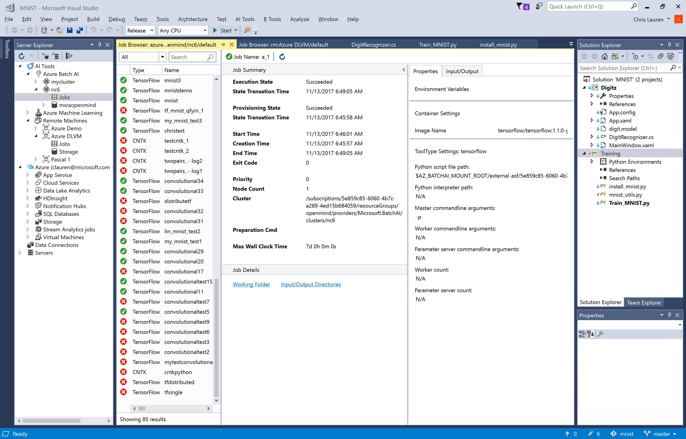

# View recent job performance and details

Once the jobs are submitted, you can view the list of jobs to see their status, duration and more.

1. In the **Server Explorer**, expand the specific compute context.
2. Double-click **Jobs**.
3. You will see the list of jobs submitted to that compute context.
4. Select a specific **Job** in the list to view details.

> Job history submitted to Linux VMs is stored on the VM in the /tmp directory. Therefore, whenever it is rebooted the job history is cleared. For a permanent record of your job history, please configure your VM as a compute context in Azure Machine learning, then Submit Job to Azure Machine Learning (selecting your VM as the compute context).
