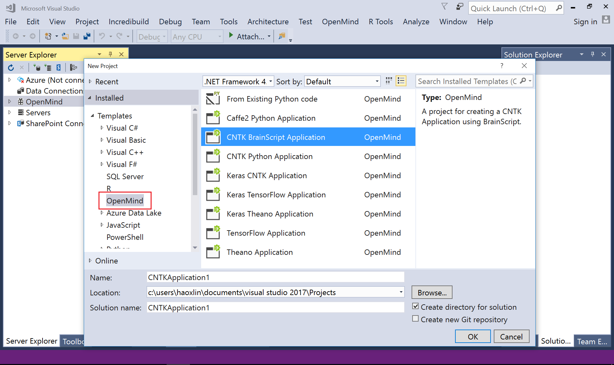
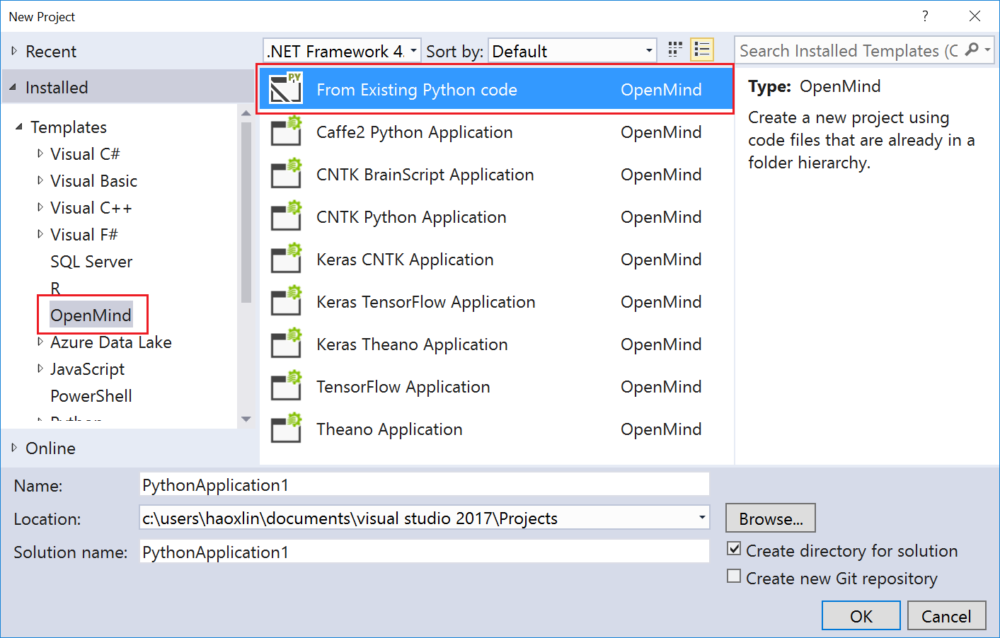
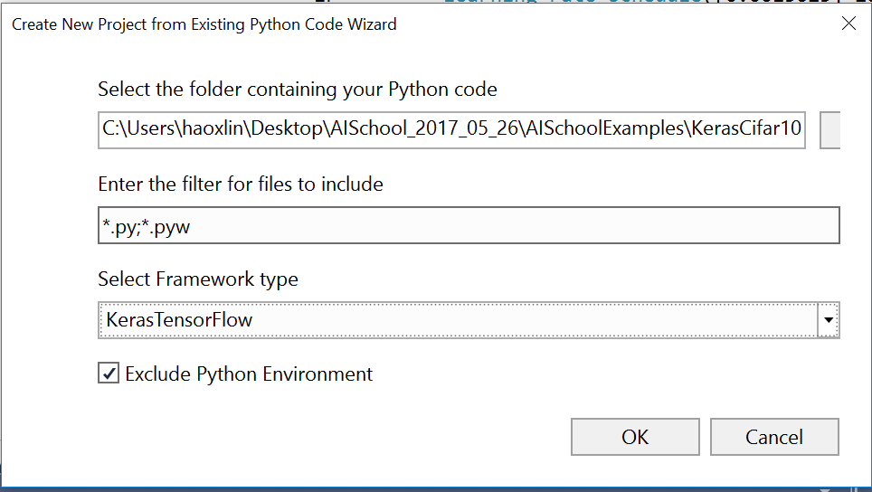
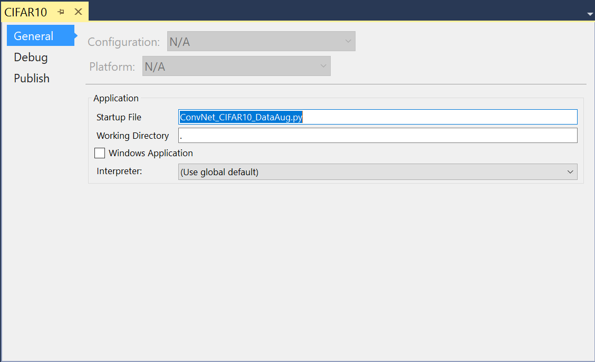
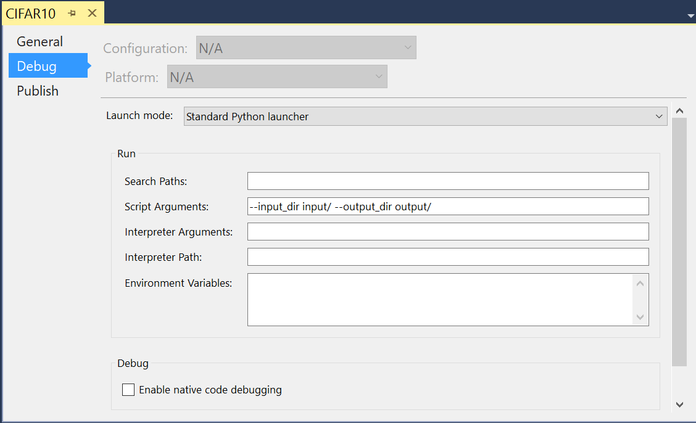
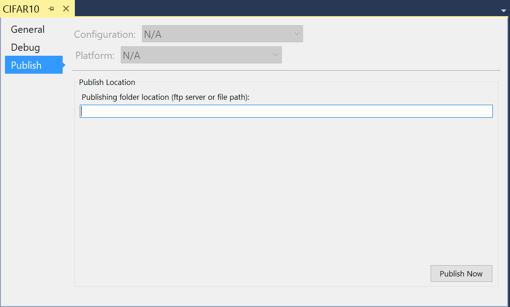
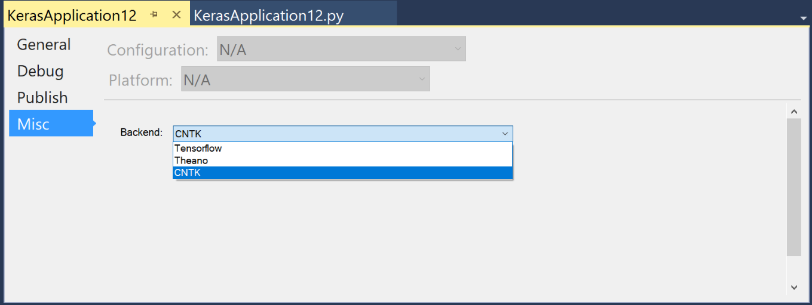

# Manage projects

## Project templates

OpenMind Studio provide the following project templates:

1.  "From Existing Python code" template for creating applications by importing existing Python files in a folder.

1.  "Caffe2 Python Application" template for creating Caffe2 applications with Python language.

1.  "CNTK BrainScript Application" template for creating CNTK applications with BrainScript language.

1.  "CNTK Python Application" template for creating CNTK applications with Python language.

1.  "Keras Application (CNTK backend)" template for creating Keras applications with Python language using CNTK backend.

1.  "Keras Application (TensorFlow backend)" template for creating Keras applications with Python language using TensorFlow backend.

1.  "Keras Application (Theano backend)" template for creating Keras applications with Python language using Theano backend.

1.  "TensorFlow Application" template for creating TensorFlow applications with Python language.

1.  "Theano Application" template for creating Theano applications with Python language.

## Create New Projects from Templates 

To create a new OpenMind project, go to ***File &gt; New &gt; Project***.
On the left explorer pane, OpenMind projects can be found under ***Installed-&gt; Templates-&gt;OpenMind***.

Figure: Create a new OpenMind project.

## Create New Projects by Importing Existing Code 

OpenMind Studio provides a wizard for users to create a new Deep Learning project by importing existing source files and keeping hierarchy.

Figure: Create a new project by importing existing code.

Figure: Import wizard.

## Setup Projects 

### Project Properties 

Users right click on the project node and select the ***Properties*** context menu.
Then project scoped parameters are showed in the following pages:

1.  "General" property page:

    

    
Figure: "General" property page.

    a. "Startup File": the name of the file to start when launching your application.
    
    b. "Working Directory": working directory for debugging and executing.

    c. "Windows Application": is Windows Application?

    d. "Interpreter:"

1.  "Debug" property page:

    

    
Figure: "Debug" property page.

    a. "Search Paths": users could specify additional directories which are added to Python sys.path for making libraries available for importing.
    
    b. "Script Arguments": command line arguments to be passed into the application on project start.

    c. "Interpreter Arguments": command line arguments to be passed to the interpreter.

    d. "Interpreter Path": the interpreter which is used to start the project.

    e. "Environment Variables": this Specifies environment variables to be set in the spawned process in the form:

        NAME1=value1
        NAME2=value2
        …

    f. "Enable native code debugging": users could debug into native code written by C/C++.

1.  "Publish" property page:

    

    
Figure: "Publish" property page.

    a. "Publish Location": location where the project could be published to.

1.  "Misc" property page:

    Keras projects have an additional "Misc" property page for users to change backends.

    

    
Figure: "Misc" property page for Keras project.

    a. "Backend": users could switch to another backend.

### Include multiple projects in a Solution 

To add a new project to the solution, right-click on the solution in the ***Solution Explorer*** and select ***Add***.

A Startup Project runs alongside a solution, and the startup script in the startup project will be executed.

### Include multiple scripts in one project 

To create a new script within a project, right-click on the project in Solution Explorer and select ***Add &gt; New Item***. To add an existing script to a OpenMind project, right-click on the project and select ***Add &gt; Existing Item***.

Users set one of the scripts as the startup script by right-clicking it and select "**Set as Startup File**". The startup file serves as the main entry of the whole project. E.g. when users press F5 to run a project, the startup script is executed. The startup file node uses bolding font.