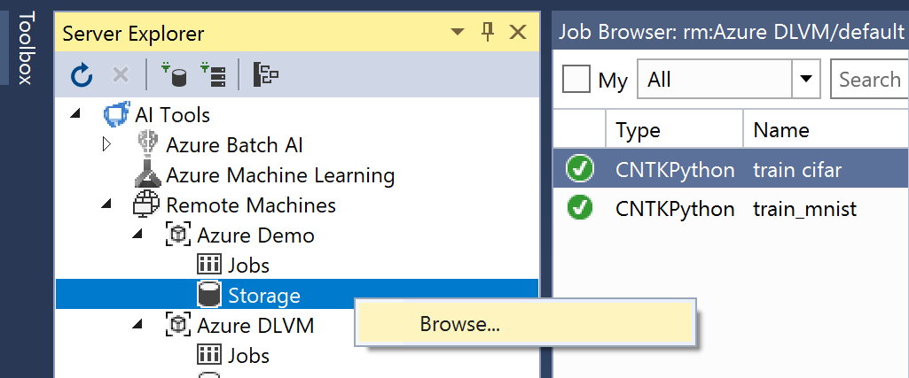
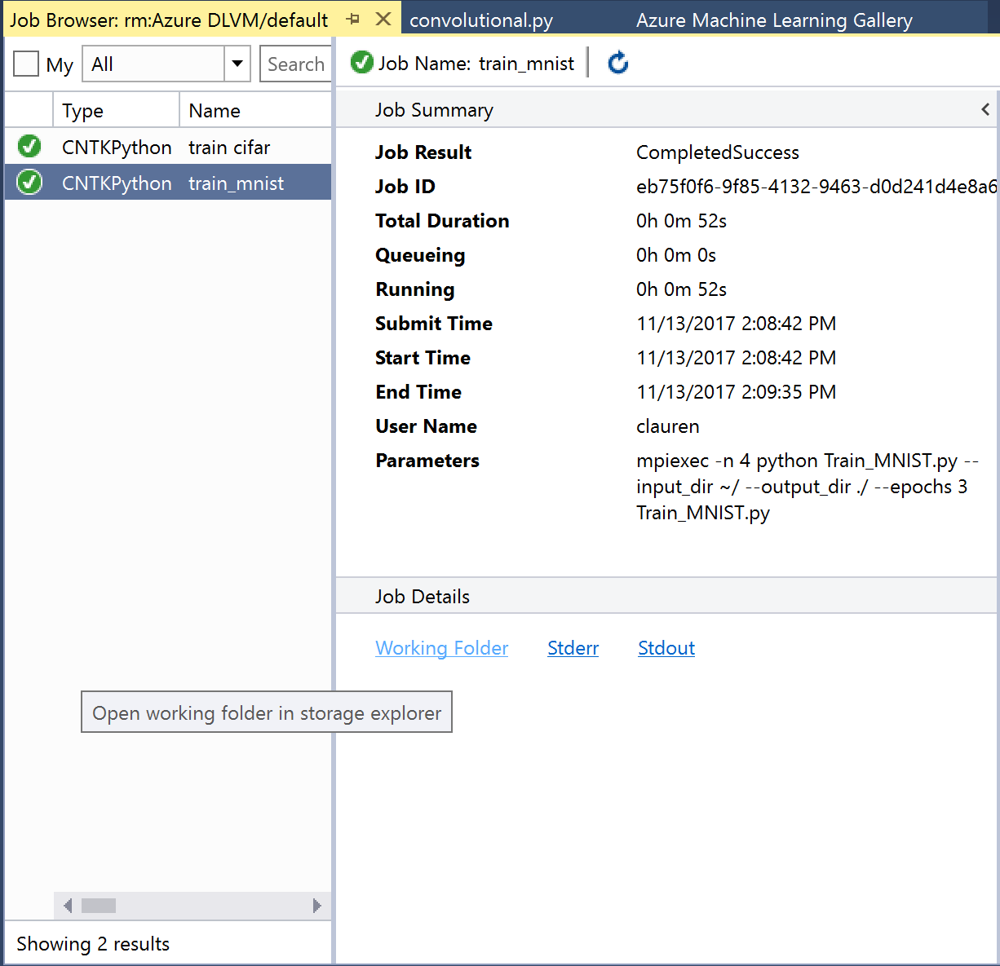

# Browse storage to upload data or download models and logs

You can browse all storage on the remote machine or Azure file share to enable uploading data or downloading models and logs. Or, if you want to access logs and job outputs for a specific job, you can do that as well in the job browser.

## To access all data on the remote machine or file share

1. Open the **Server Explorer**.
2. Expand the remote machine or Batch AI compute context.
3. Right-click **Storage**; then, click **Browse**.

    

## To access job-specific data on the remote machine or file share

1. Open the [Job History](job-details.md)
2. Select the job.
3. Click **Working Folder** or click **StdOut / Stderr** for quick access to these important log files.

    
