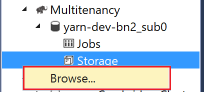
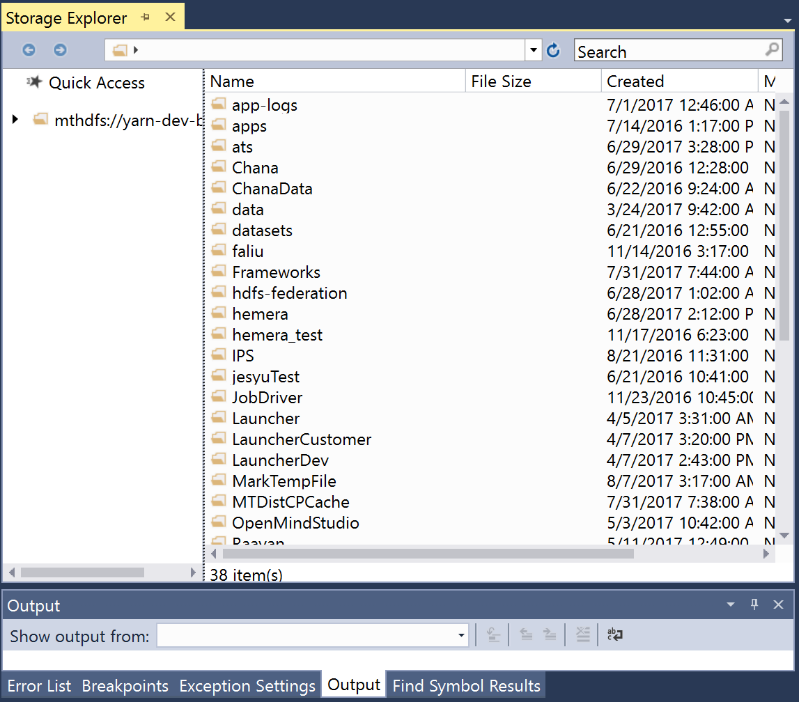

# Manage Storage 

A tree-style Storage Explorer enables users to browser folders and files on clouds. Users can right click on the "Storage" node under a cloud entry point, and then click "Browse" to launch the Storage Explorer. 

Figure: Launch Storage Explorer

 

Figure: Storage Explorer

 

The following operations are supported on files and folder:

- Right-click a single file to download, preview, delete, and rename.

- Right-click a folder to upload to or download all files from that folder directly. Users can upload multiple files at the same time.

- Copy relative/full path of a file/folder through right clicking.

- Download, delete and set expiration date of multiple files and folders simultaneously.

- Enable users to search files by name. A search box is added in the top right, users can enter file name to search.