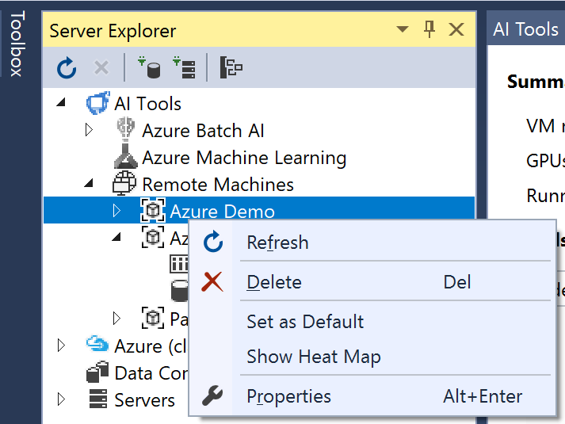
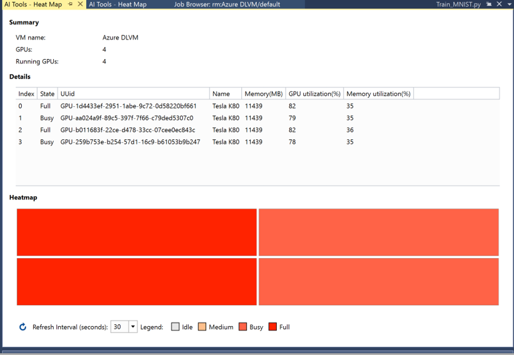

# Monitoring GPU Utilization

To monitor GPU utilization of remote Linux machines:

1. In **Server Explorer**, expand **Remote Machines**.
2. **Right-click** the remote machine you want to monitor.

    

3. Click **Show Heat Map**.

    
