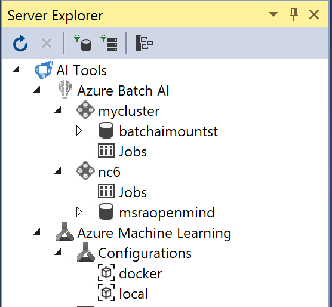
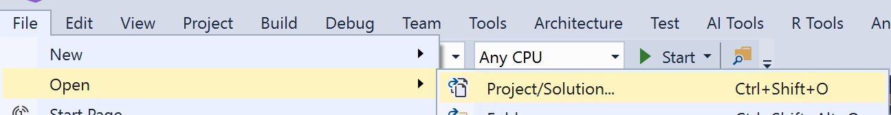
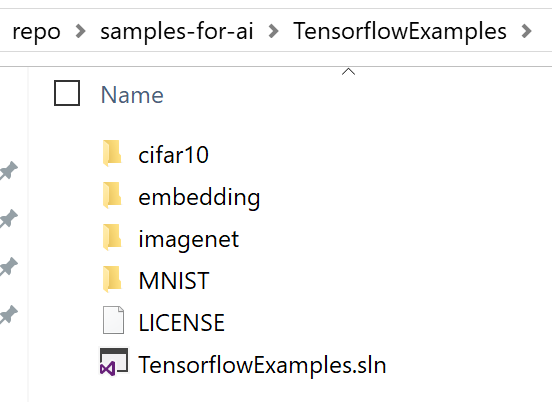
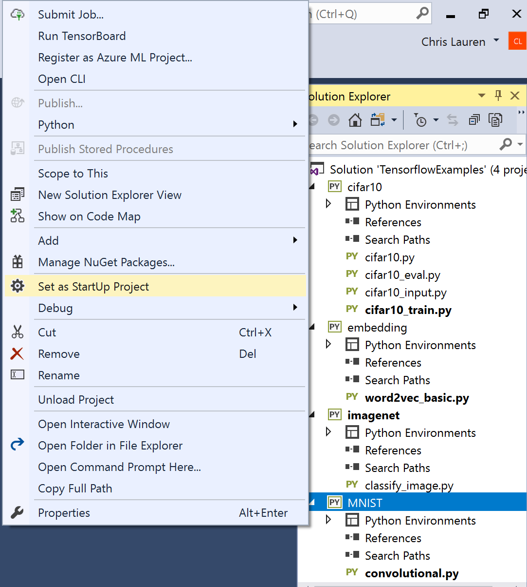
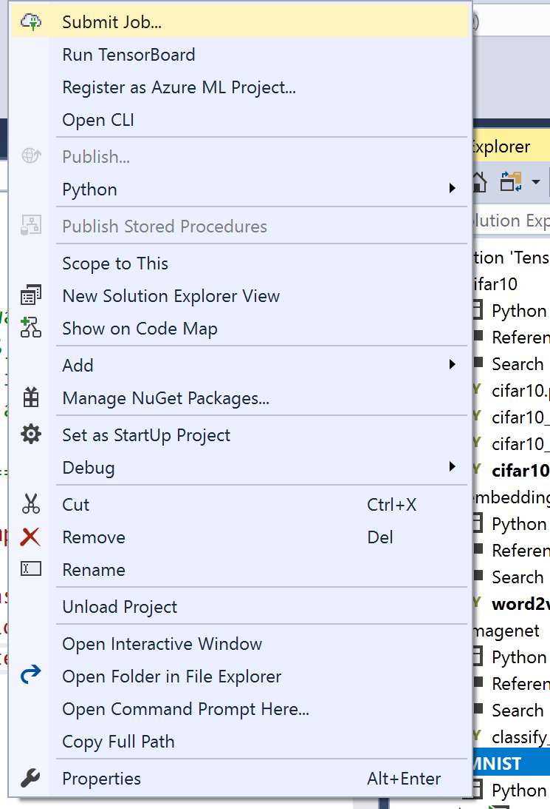
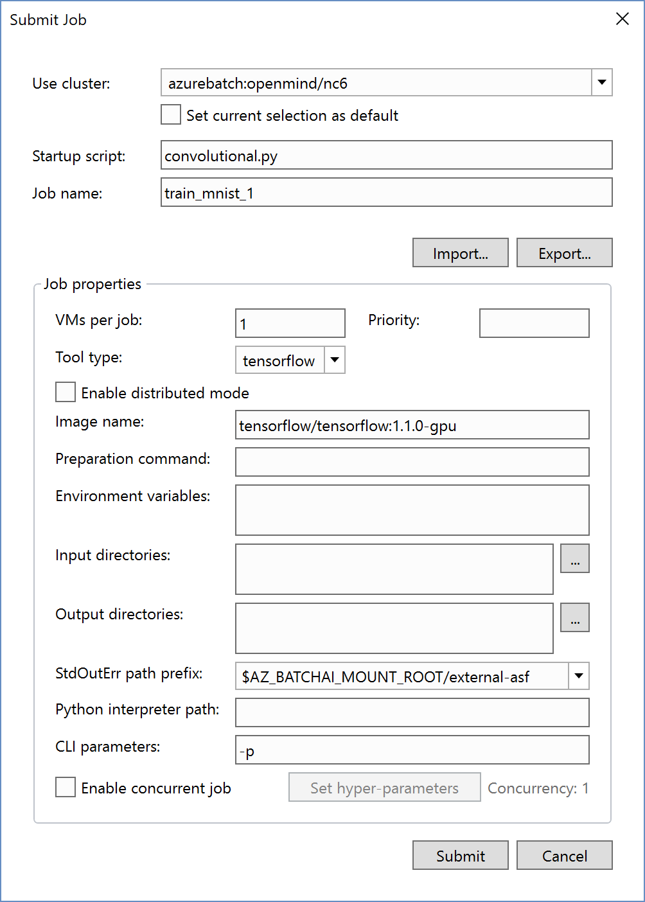

# Train AI models in Azure Batch AI

Batch AI is a managed service that enables data scientists and AI researchers to train AI and other machine learning models on clusters of Azure virtual machines, including VMs with GPU support. You describe the requirements of your job, where to find the inputs and store the outputs, and Batch AI handles the rest. [Learn more about Azure Batch AI](/azure/batch-ai/overview)

It's integrated with Visual Studio Tools for AI so you can dynamically scale out training models in Azure.  Once you've [installed Visual Studio Tools for AI](installation.md), it's easy to create a new Python project using pre-made recipes in the Azure Machine Learning Sample Gallery.

1. Launch Visual Studio. Open the **Server Explorer** by opening the **AI Tools** menu and choosing **Select Cluster**

    

2. Expand **AI Tools**. Any Batch AI resources you have will be auto-detected and appear in the Server Explorer.

    

3. Select **View > Team Explorer...** to open the **Team Explorer** window in which you can connect to GitHub or Azure DevOps, or clone a repository.

    

4. In the URL field under **Local Git Repositories**, enter `https://github.com/Microsoft/samples-for-ai`, enter a folder for the cloned files, and select **Clone**.

    > [!Tip]
    > The folder you specify in Team Explorer is the specific folder to receive the cloned files. Unlike the `git clone` command, creating a clone in Team Explorer does not automatically create a subfolder with the name of the repository.

5. When cloning is complete, click **File > Open Solution > Project / Solution**

    

6. Open **samples-for-ai\TensorFlowExamples\TensorFlowExamples.sln** in the directory you cloned the repository

    

7. Set MNIST project as the **Startup Project**

    

8. <strong>Right-click **MNIST project,** **Submit Job**</strong>

    
9. Select your **Azure Batch AI** cluster, then click **Import**. Select the `AzureBatchAI_TF_MNIST.json` file to quickly populate some default values like which Docker Image to use. Then click **Submit**

    
