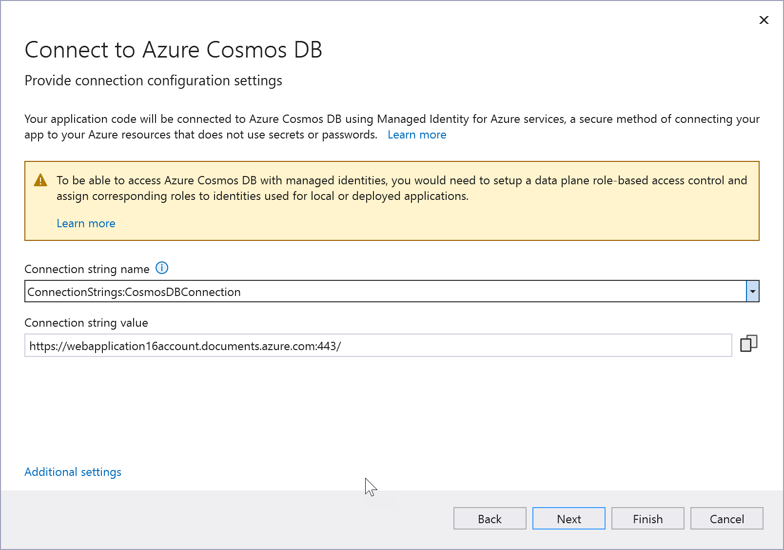

# Add Azure Cosmos DB to your app by using Visual Studio Connected Services

With Visual Studio, you can connect any of the following to Azure Cosmos DB by using the **Connected Services** feature:

- .NET Framework console app
- ASP.NET Model-View-Controller (MVC) (.NET Framework)
- ASP.NET Core
- .NET Core (including console app, WPF, Windows Forms, class library)
- .NET Core Worker Role
- Azure Functions
- Universal Windows Platform App
- Cordova

The connected service functionality adds all the needed references and connection code to your project, and modifies your configuration files appropriately.

## Prerequisites

- Visual Studio with the Azure workload installed.
- A project of one of the supported types
- [!INCLUDE [prerequisites-azure-subscription](includes/prerequisites-azure-subscription.md)]

## Connect to Azure Cosmos DB using Connected Services

:::moniker range="vs-2019"
1. Open your project in Visual Studio.

1. In **Solution Explorer**, right-click the **Connected Services** node, and, from the context menu, select **Add Connected Service**.

   If you don't see the **Connected Services** node, choose **Project** > **Connected Services** > **Add**.

1. In the **Connected Services** tab, select the + icon for **Service Dependencies**.

    

1. In the **Add Dependency** page, select **Azure Cosmos DB**.

    

    If you aren't signed in already, sign in to your Azure account. If you don't have an Azure account, you can sign up for a [free trial](https://azure.microsoft.com/pricing/purchase-options/azure-account?cid=msft_learn).

1. In the **Azure Cosmos DB** screen, select an existing Azure Cosmos DB, and select **Next**.

    If you need to create a database, go to the next step. Otherwise, skip to step 7.

    

1. To create an Azure Cosmos DB:

   1. Select **Create a new Azure Cosmos DB** at the bottom of the screen.

   1. Fill out the **Azure Cosmos DB: Create new** screen, and select **Create**.

       

   1. When the **Configure Azure Cosmos DB** dialog is displayed, the new database appears in the list. Select the new database in the list, and select **Next**.

1. Enter a connection string name, and choose whether you want the connection string stored in a local secrets file, or in [Azure Key Vault](/azure/key-vault).

   

1. The **Summary of changes** screen shows all the modifications that will be made to your project if you complete the process. If the changes look OK, choose **Finish**.

   

1. The connection appears under the **Service Dependencies** section of the **Connected Services** tab.

   
:::moniker-end

:::moniker range=">=vs-2022"

> [!NOTE]
> For .NET Framework projects, Connected Services UI is slightly different. To see the differences, compare to the [Visual Studio 2019 version of this page](./azure-cosmosdb-add-connected-service.md?view=vs-2019&preserve-view=true).

1. Open your project in Visual Studio.

1. In **Solution Explorer**, right-click the **Connected Services** node, and, from the context menu, select **Add** to open the menu of available services.

   

   If you don't see the **Connected Services** node, choose **Project** > **Connected Services** > **Add**.

1. Choose **Azure Cosmos DB**. The **Connect to dependency** page appears. You should see two options, one for a local emulator, **Azure Cosmos DB Emulator on container (Local)**, and one for connecting to the live Azure Cosmos DB service. You can reduce cost and simplify early development by starting with the local emulator. You can migrate to the live service later by repeating these steps and choosing the other option.

   

   If you choose to use the Azure Cosmos DB Emulator, click **Next** to see the **Summary of changes** screen, which shows how your project is being modified. A NuGet package reference is added to your project and the connection code for the local emulator is added to your project. Once you click **Finish** on the last screen, the container for the emulator is created; you'll see the image download status in the output window.

   If you want to connect to the Azure service, continue to the next step, or if you aren't signed in already, sign in to your Azure account before continuing. If you don't have an Azure account, you can sign up for a [free trial](https://azure.microsoft.com/pricing/purchase-options/azure-account?cid=msft_learn).

1. In the **Azure Cosmos DB** screen, select an existing Azure Cosmos DB, and select **Next**.

    If you need to create a database, go to the next step. Otherwise, skip to step 7.

    

1. To create an Azure Cosmos DB:

   1. Select **Create a new Azure Cosmos DB** at the bottom of the screen.

   1. Fill out the **Azure Cosmos DB: Create new** screen, and select **Create**.

       

   1. When the **Configure Azure Cosmos DB** dialog is displayed, the new database appears in the list. Select the new database in the list, and select **Next**.

1. Enter a connection string name, and choose whether you want the connection string stored in a local secrets file, or in [Azure Key Vault](/azure/key-vault).

   

   The connection string is added as a secret and made available in the app configuration. In ASP.NET Core apps, you can access this connection string by using the `Configuration` property on the `WebApplicationBuilder` object.

   > [!NOTE]
   > With Visual Studio 2022 version 17.12 and later, this procedure uses [Microsoft Entra managed identity](/entra/identity/managed-identities-azure-resources/overview), a passwordless authentication method, to connect to the database. The warning on this screen means that you need to perform a manual step in the Azure CLI after completing this procedure in Visual Studio. See [Use data plane role-based access control with Azure Cosmos DB for NoSQL](/azure/cosmos-db/nosql/security/how-to-grant-data-plane-role-based-access?tabs=built-in-definition%2Ccsharp&pivots=azure-interface-cli#disable-local-auth).

1. The **Summary of changes** screen shows all the modifications that will be made to your project if you complete the process. If the changes look OK, choose **Finish**.

   

1. In Solution Explorer, double-click on the **Connected Services** node to open the **Connected Services** tab. The connection appears under the **Service Dependencies** section:

   

   If you click on the three dots next to the dependency you added, you can see various options such as **Connect** to reopen the wizard and change the connection. You can also click the three dots at the top right of the window to see options to start local dependencies, change settings, and more.

1. By default, the memory limit in the container is set to 2G, but normally, more memory is required to run Azure Cosmos DB. To fix this, navigate to the `.vs/sd/<GUID>/local` folder under your solution folder. In Windows Explorer, you might have to enable hidden files to see the `.vs` folder. Find and open the file *cosmosdb1.docker-compose.yml*. Set a 4G or higher memory limit.

   ```yml
   mem_limit = 4G
   ```

    To restart the container with the new setting, in the **Service Dependencies** section of the **Connected Services** tab, click on the three dots, and choose **Start local dependencies**.

:::moniker-end

> [!NOTE]
> The local emulator for Azure Cosmos DB might reference a base image that uses a temporary license for Azure Cosmos DB. If the container doesn't start, check the **Logs** tab in the **Containers*** window for the Azure Cosmos DB container. If it mentions a PAL expiration issue, you need to get the latest base image for the local container. Run the following command from the console prompt: `docker pull mcr.microsoft.com/cosmosdb/linux/azure-cosmos-emulator:latest`. The license is periodically updated, and when it expires, refreshing to the newest container should solve the issue. You can view and report issues for the Azure Cosmos DB emulator at the [Azure Cosmos DB emulator GitHub repo](https://github.com/Azure/azure-cosmos-db-emulator-docker/issues).

## Next steps

Learn how to store secrets safely by following [Safe storage of app secrets in development in ASP.NET Core](/aspnet/core/security/app-secrets?tabs=windows). In particular, to read the connection string from the secrets store, you can add code as in [Read the secret via the configuration API](/aspnet/core/security/app-secrets?tabs=windows#read-the-secret-via-the-configuration-api). The code might look like this, where `builder` is an instance of `WebApplicationBuild` that appears in *Program.cs* in ASP.NET Core project templates:

```csharp
// New instance of CosmosClient class using a connection string
using CosmosClient client = new(
    connectionString: builder.Configuration["CosmosDBConnectionString"]
);
```

The `CosmosClient` provides access to Azure Cosmos DB functionality through its various methods. Once you have an instance of `CosmosClient`, you can create a NoSQL database by following this guide: [Create a database in Azure Cosmos DB for NoSQL using .NET](/azure/cosmos-db/nosql/how-to-dotnet-create-database).

## Related content

- [Azure Cosmos DB product page](https://azure.microsoft.com/services/cosmos-db/)
- [Azure Cosmos DB documentation](/azure/cosmos-db/)
- [Dependency injection in ASP.NET Core](/aspnet/core/fundamentals/dependency-injection)
