# Deploy your application to Azure using GitHub Actions workflows created by Visual Studio

Starting in Visual Studio 2019 version 16.11, you can create new GitHub Actions workflows for .NET projects hosted on GitHub.com.

## Prerequisites

- You must be signed in to your [GitHub account](../ide/work-with-github-accounts.md) in Visual Studio.
- [!INCLUDE [prerequisites-azure-subscription](includes/prerequisites-azure-subscription.md)]

## Deploy a single project to Azure using GitHub Actions

In Solution Explorer, right-click your GitHub.com hosted project and choose **Publish**.


On the next screen, select **Azure** and then choose **Next**.


Depending on your [project type](#which-project-types-are-supported), you get a different list of Azure services to pick from. Pick one of the [supported Azure services](#which-azure-services-are-supported) that fits your needs.


On the final step of the wizard, select **CI/CD using GitHub Actions workflows (generates yml file)** and then choose **Finish**.


Visual Studio generates a new GitHub Actions workflow and asks you to commit it and push it to GitHub.com.

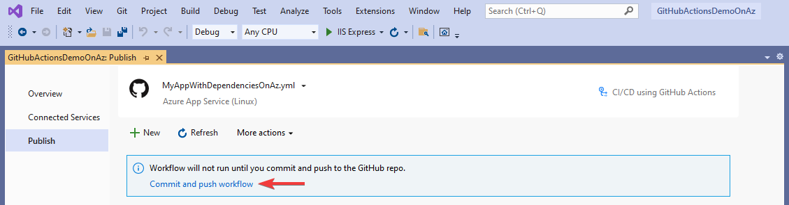

If you complete this step by using the [built-in Git tooling](../version-control/git-with-visual-studio.md?view=vs-2019&preserve-view=true#git-changes-window-in-visual-studio-2019), Visual Studio will detect the execution of the workflow.


## Setting the GitHub secrets

For the generated workflow to successfully deploy to Azure, it might require access to a [publish profile](/azure/app-service/deploy-github-actions?tabs=applevel#configure-the-github-secret).

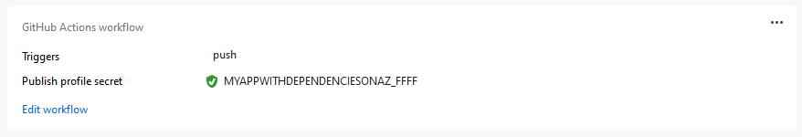

A successful deployment might also require access to a [service principal](/azure/app-service/deploy-github-actions?tabs=userlevel#configure-the-github-secret).

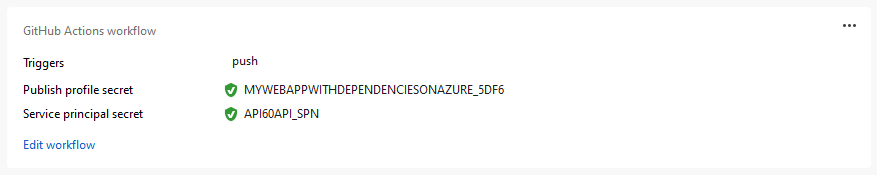

In all cases, Visual Studio tries to set the GitHub secret for you with the correct value. If it fails, it will let you know and give you the opportunity to try again.


If it fails to set the secret again, Visual Studio gives you the opportunity to get access to the secret manually, so you can complete the process through your repo's page on GitHub.com.


## Deploy multiple projects to Azure Container Apps using GitHub Actions

These steps are appropriate if you have more than one project that uses Docker containers, and you want to deploy them as a multiproject app. You can deploy multiproject apps such as those that implement microservices to [Azure Container Apps](/azure/container-apps) or [Azure Kubernetes Service (AKS)](/azure/aks). This article covers Azure Container Apps.

1. Right click on the **GitHub Actions** node in Solution Explorer, and choose **New workflow**. The GitHub Actions workflow wizard appears.

   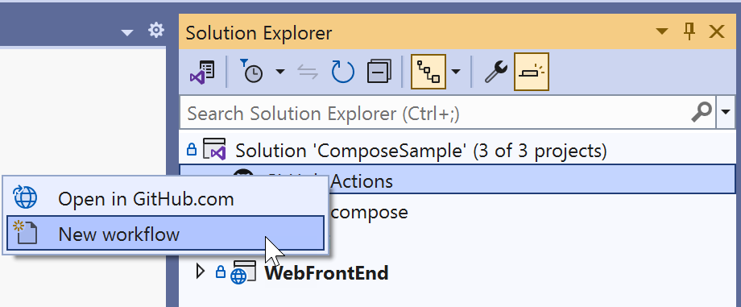

1. On the GitHub Actions Workflow target screen, choose **Azure**.

1. For the specific target, choose **Azure Container Apps**. The wizard advances to the **Container App** screen.

    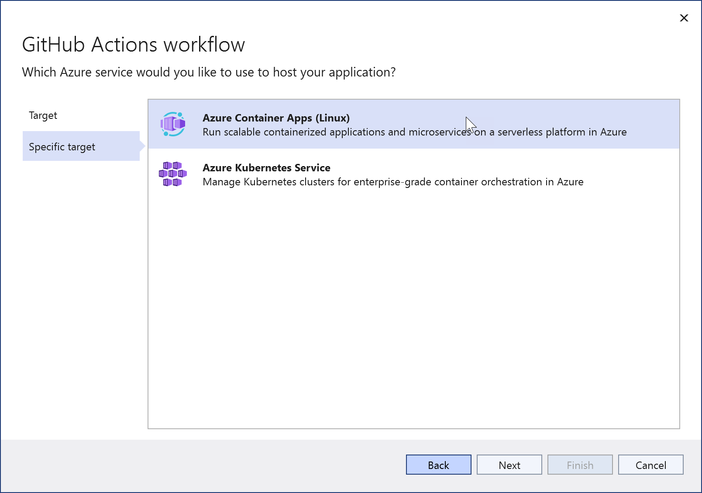

1. Choose an existing Azure Container App, or choose **Create new**.

   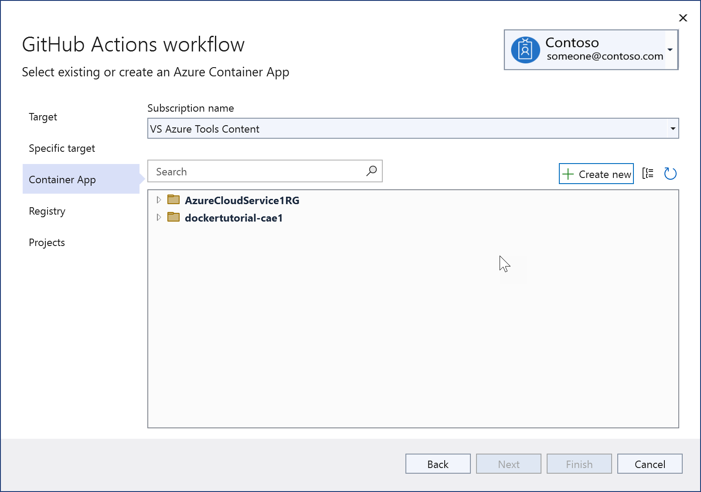

   When you create a new one, you see this screen. When testing or learning, it's usually best to create a new resource group to make it easier to delete everything later. A Container Apps environment is a secure boundary around groups of container apps that share the same virtual network and write logs to the same logging destination. See [Azure Container Apps environments](/azure/container-apps/environment). If you don't know what that is or haven't created one before, create a new one for this instance.

   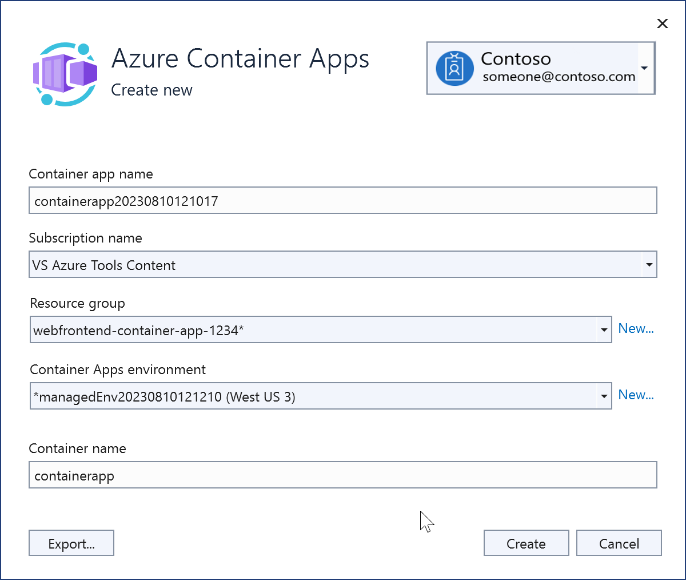

   Once created, the new Azure Container Apps instance is shown.

   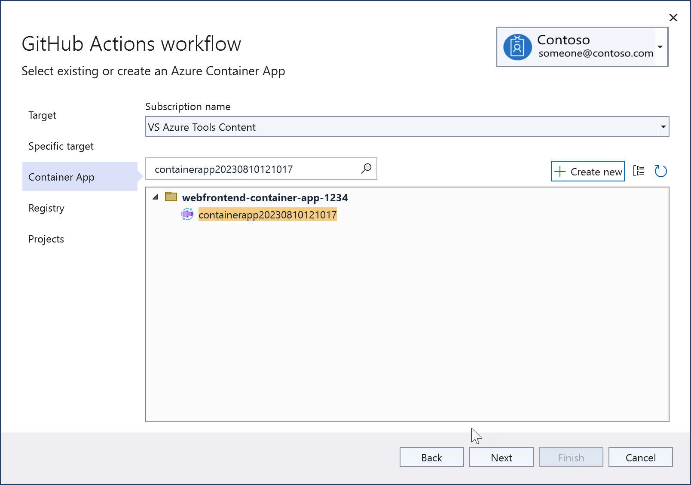

1. Choose **Next** to advance to the **Registry** screen. Choose an existing Azure Container Registry, or create a new one.

   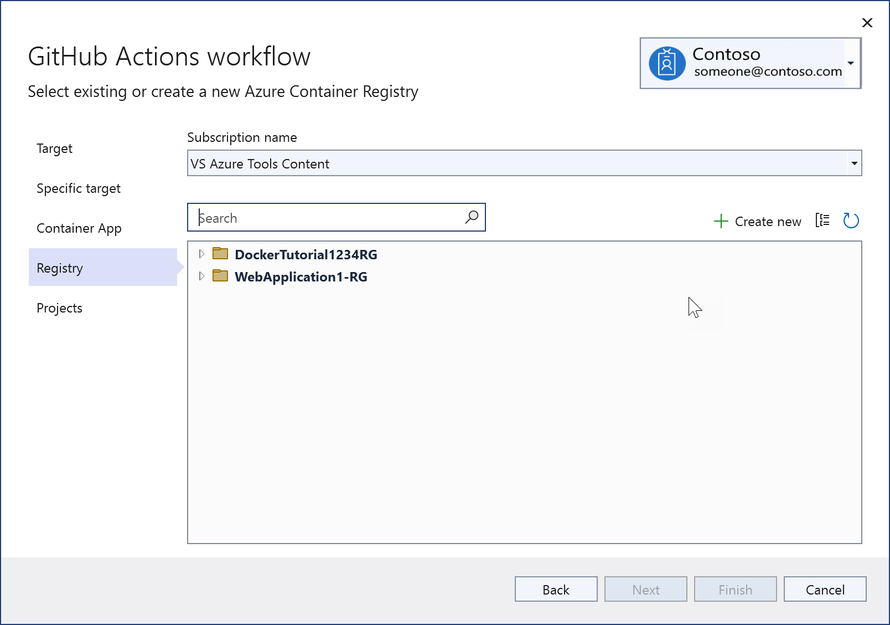

   If you choose to create a new one, you see this screen. Provide the resource group, SKU, and choose the same region, if possible, as before. For information about the SKUs for Azure Container Registry, see [Azure Container Registry service tiers](/azure/container-registry/container-registry-skus).

   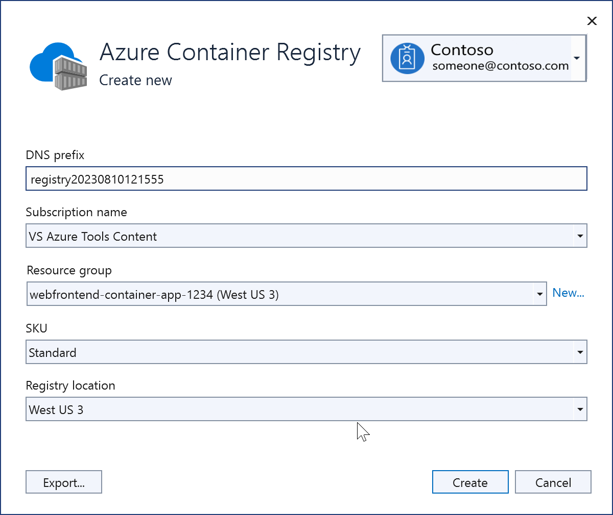

   Once created, the new registry shows on the screen.

   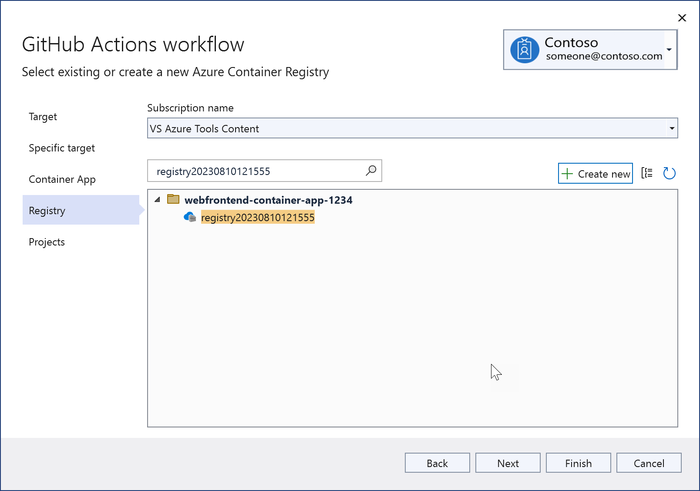

1. The deployable projects in your solution are displayed; choose the projects you want to deploy together in the same Azure Container Apps instance.

   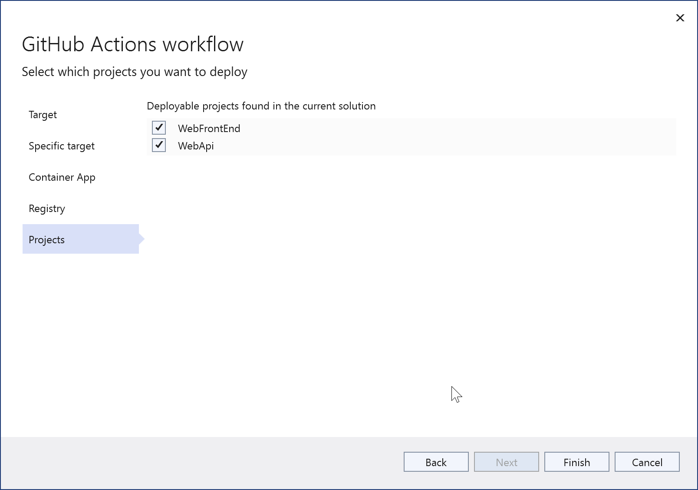

1. Choose **Finish**. You can see the commands being issued to create the assets in Azure and set up the authentication. If anything fails, note the command line used, because you can try it again from the CLI. Don't worry too much if you get an authorization failure at this stage. You can also set up the authentication later in Visual Studio.

1. Once it finishes, the summary screen appears. The summary screen shows the credentials, which match the entries that Visual Studio creates in your GitHub repo under the GitHub Actions secrets. Check for any yellow warning signs. If any of the authentication steps failed during the creation process, you have the opportunity to correct that here by clicking on the link by the warning sign, and following a few steps.

1. Open the workflow file to check what Visual Studio generated. While Visual Studio does its best to generate a workflow for your situation, every app and repo is unique, so you often have to manually edit the workflow YML file generated by Visual Studio before it will run successfully. To open it, expand the GitHub Actions node in Solution Explorer, right-click on the workflow that was just created, and choose **Edit**.

The following shows an example of a workflow file created by Visual Studio for a solution with two deployable projects, WebAPI and WebFrontEnd.

```yml
on:
push:
  branches:
  - main
env:
CONTAINER_REGISTRY_LOGIN_SERVER: registry20230810121555.azurecr.io
CONTAINER_APP_NAME: containerapp20230810121017
CONTAINER_APP_RESOURCE_GROUP_NAME: webfrontend-container-app-1234
CONTAINER_APP_CONTAINER_NAME: containerapp
jobs:
WebApi_buildImageAndDeploy:
  runs-on: ubuntu-latest
  steps:
  - name: Checkout source code
    uses: actions/checkout@v3
  - name: Set up Docker Buildx
    uses: docker/setup-buildx-action@v2
  - name: Login to Docker registry
    uses: docker/login-action@v2
    with:
      registry: ${{ env.CONTAINER_REGISTRY_LOGIN_SERVER }}
      username: ${{ secrets.registry20230810121555_USERNAME_6891 }}
      password: ${{ secrets.registry20230810121555_PASSWORD_6891 }}
  - name: Build and push Docker image to Azure Container Registry
    uses: docker/build-push-action@v4
    with:
      push: true
      tags: ${{ env.CONTAINER_REGISTRY_LOGIN_SERVER }}/webapi:${{ github.sha }}
      file: WebApi\Dockerfile
  - name: Azure login
    uses: azure/login@v1
    with:
      creds: ${{ secrets.containerapp20230810121017_SPN }}
  - name: Deploy to Azure container app
    uses: azure/CLI@v1
    with:
      inlineScript: >-
        az config set extension.use_dynamic_install=yes_without_prompt
        az containerapp registry set --name ${{ env.CONTAINER_APP_NAME }} --resource-group ${{ env.CONTAINER_APP_RESOURCE_GROUP_NAME }} --server ${{ env.CONTAINER_REGISTRY_LOGIN_SERVER }} --username ${{ secrets.registry20230810121555_USERNAME_2047 }} --password ${{ secrets.registry20230810121555_PASSWORD_2047 }}
        az containerapp update --name ${{ env.CONTAINER_APP_NAME }} --container-name ${{ env.CONTAINER_APP_CONTAINER_NAME }} --resource-group ${{ env.CONTAINER_APP_RESOURCE_GROUP_NAME }} --image ${{ env.CONTAINER_REGISTRY_LOGIN_SERVER }}/webapi:${{ github.sha }}
  - name: Azure logout
    run: az logout
WebFrontEnd_buildImageAndDeploy:
  runs-on: ubuntu-latest
  needs: WebApi_buildImageAndDeploy
  steps:
  - name: Checkout source code
    uses: actions/checkout@v3
  - name: Set up Docker Buildx
    uses: docker/setup-buildx-action@v2
  - name: Login to Docker registry
    uses: docker/login-action@v2
    with:
      registry: ${{ env.CONTAINER_REGISTRY_LOGIN_SERVER }}
      username: ${{ secrets.registry20230810121555_USERNAME_2047 }}
      password: ${{ secrets.registry20230810121555_PASSWORD_2047 }}
  - name: Build and push Docker image to Azure Container Registry
    uses: docker/build-push-action@v4
    with:
      push: true
      tags: ${{ env.CONTAINER_REGISTRY_LOGIN_SERVER }}/webfrontend:${{ github.sha }}
      file: WebFrontEnd\Dockerfile
  - name: Azure login
    uses: azure/login@v1
    with:
      creds: ${{ secrets.containerapp20230810121017_SPN }}
  - name: Deploy to Azure container app
    uses: azure/CLI@v1
    with:
      inlineScript: >-
        az config set extension.use_dynamic_install=yes_without_prompt
        az containerapp registry set --name ${{ env.CONTAINER_APP_NAME }} --resource-group ${{ env.CONTAINER_APP_RESOURCE_GROUP_NAME }} --server ${{ env.CONTAINER_REGISTRY_LOGIN_SERVER }} --username ${{ secrets.registry20230810121555_USERNAME_2047 }} --password ${{ secrets.registry20230810121555_PASSWORD_2047 }}
        az containerapp update --name ${{ env.CONTAINER_APP_NAME }} --container-name ${{ env.CONTAINER_APP_CONTAINER_NAME }} --resource-group ${{ env.CONTAINER_APP_RESOURCE_GROUP_NAME }} --image ${{ env.CONTAINER_REGISTRY_LOGIN_SERVER }}/webfrontend:${{ github.sha }}
  - name: Azure logout
    run: az logout
```

The main function of the workflow is to sign in to the Azure services with the right authentication and run the commands to build and deploy the app.

### Editing and testing the workflow

The above procedure generates a workflow YML file, but you normally need to review and customize it before it can be used for a deployment. You might need to refer to GitHub's guidance on writing workflow actions; see [About custom actions](https://docs.github.com/en/actions/creating-actions/about-custom-actions). The workflow file contains many configurable elements, such as the settings for the environment variables and names of the secrets. You can see references to the locations of your Dockerfiles, the name of your Azure container app, the branch in the repo you will use to trigger the workflow runs, and references to the secrets in GitHub. Secrets are referenced using the syntax `${{ secrets.SECRET_NAME }}`. See [GitHub Actions secrets](https://docs.github.com/en/rest/actions/secrets).

If your projects are not located at the root of the repo, you need to change the workflow to specify the path to find the Dockerfiles. Add environment variables for the relative paths to the Dockerfile in both projects.

```yml
DOCKER_FILEPATH_WEBAPI: docker/ComposeSample/WebApi/Dockerfile
DOCKER_FILEPATH_WEBFRONTEND: docker/ComposeSample/WebFrontend/Dockerfile
```

Use the values of these environment variables for the `file` parameter as follows:

  ```yml
  - name: Build and push Docker image to Azure Container Registry
    uses: docker/build-push-action@v4
    with:
      push: true
      tags: ${{ env.CONTAINER_REGISTRY_LOGIN_SERVER }}/webfrontend:${{ github.sha }}
      file: ${{ env.DOCKER_FILEPATH_WEBFRONTEND }}
  ```

If you need to make changes to the Dockerfile, make and save the changes, commit, and push to the remote repo. The workflow that Visual Studio generates contains a trigger that causes it to run if updated on a specified branch. If you're pushing to the `working` branch, it should resemble the following code:

```yml
on:
  push:
  branches:
  - working
```

To test the changes, commit them and push to the branch of the repo specified in the trigger code. You don't need to create a pull request (PR). The workflow runs as long as the `push` trigger is set to the right branch.

In the **Actions** tab on your repo at GitHub.com, look for the workflow run. You can get there directly by using a link on GitHub Actions summary tab in Visual Studio. In GitHub, you can open the workflow run to view the logs.

### Troubleshooting

The following troubleshooting tips might be helpful if your workflow doesn't run successfully.

#### Issue: Build stage does not build

One issue you might encounter in the Dockerfile is that the build stage won't work as it does in Visual Studio. The default Dockerfile that Visual Studio generates for a project demonstrates this issue. Consider the following modifications to the build stage if you have such a Dockerfile. Here's an example where a project was located at `docker/ComposeSample/WebApi` in a repo. The full path is given because the Dockerfile context in the workflow build container is set to the root of the repo, but in Visual Studio, it's set to the folder above the project folder. The suffix `_build` is appended here to create the build folder, and instead of just copying the project file, the whole folder is copied. Compared to the default Dockerfile generated by Visual Studio, the file part of the path in the first argument of the COPY command was removed so that we're copying the whole folder instead of just the project file. Without these changes, this stage produces an MSBuild error.

```dockerfile
FROM mcr.microsoft.com/dotnet/sdk:6.0 AS build
WORKDIR /src
COPY ["docker/ComposeSample/WebApi/", "WebApi_build/"]
RUN dotnet restore "WebApi_build/WebApi.csproj"
COPY . .
WORKDIR "/src/WebApi_build"
RUN dotnet build "WebApi.csproj" -c Release -o /app/build
```

#### Issue: Authentication credentials

The workflow requires the right username and password secrets to be set up for Azure access. Visual Studio tries to do this automatically when you're creating the Azure assets or from the GitHub Actions screen in the Microsoft Visual Studio IDE. You can check the secrets in GitHub and make sure they're there, or regenerate them and add them again to GitHub if necessary using the Settings section in the repo. Check the secrets ID against what is referenced in each section of the workflow. If necessary, you can go to the container registry in the Azure portal and get the username and password for the container registry and use those values to update the secrets in GitHub.

If you ran the `az ad sp create-for-rbac` command to set up a service principal and get a client ID, client secret, and tenant ID, add the client ID and client secret as secrets in the [GitHub Actions Secrets](https://docs.github.com/en/rest/actions/secrets) section for your GitHub repo. You can provide Azure login credentials in the form of a username (client ID for the app) and password (client secret) for the Azure Container App authentication. To do that, replace the step `Azure login` with the following code. Use your own GitHub secret names you created for the client ID and client secret, and use the tenant ID from the output of the same command.

```yml
- name: Azure login
  uses: azure/CLI@v1
  with:
    inlineScript: |
      az login --service-principal -u ${{ secrets.GITHUB_SECRETID_FOR_USERNAME }} -p ${{ secrets.GITHUB_SECRETID_FOR_PASSWORD }} --tenant {your tenant ID}
      az account list
```

If the Dockerfile works correctly, and authentication is correct, and you're still seeing problems with your workflow, consider the following resources:

- [Azure Container Apps on GitHub](https://github.com/microsoft/azure-container-apps)
- [Azure Container Apps on Stack Overflow](https://stackoverflow.com/questions/tagged/azure-container-apps)

## Which project types are supported?

- ASP.NET Core
- ASP.NET 5 and above
- Azure Functions

## Which Azure services are supported?

- Azure Web Apps
- Azure Functions
- Azure API Management
