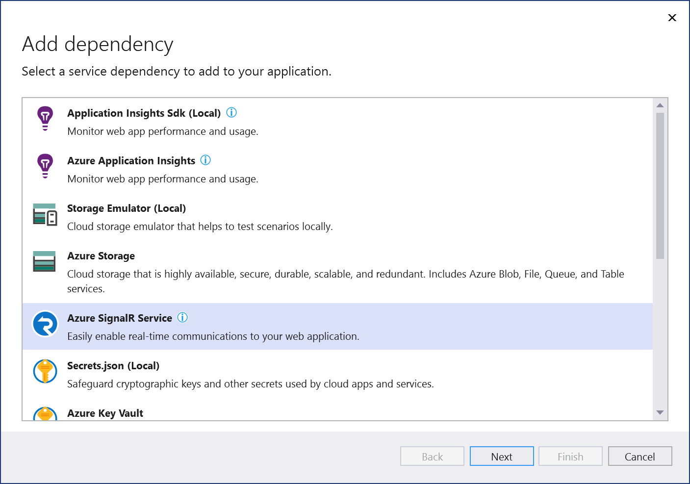
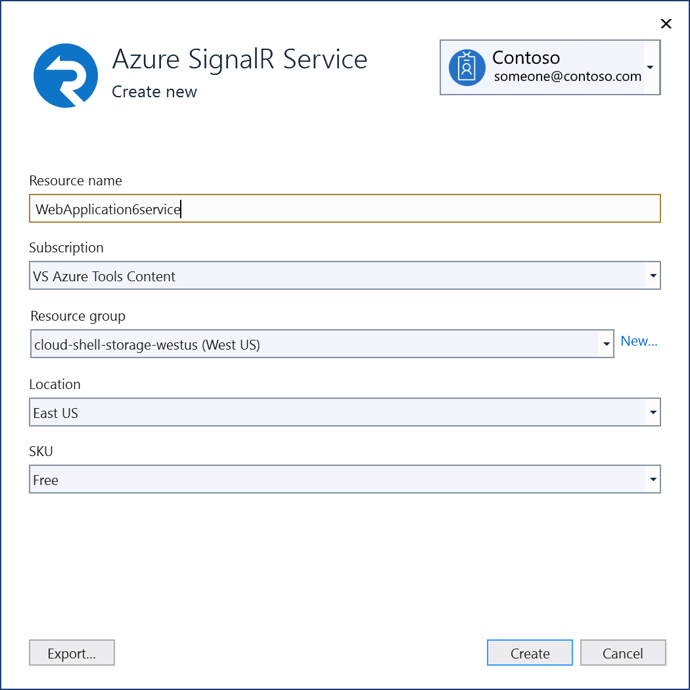
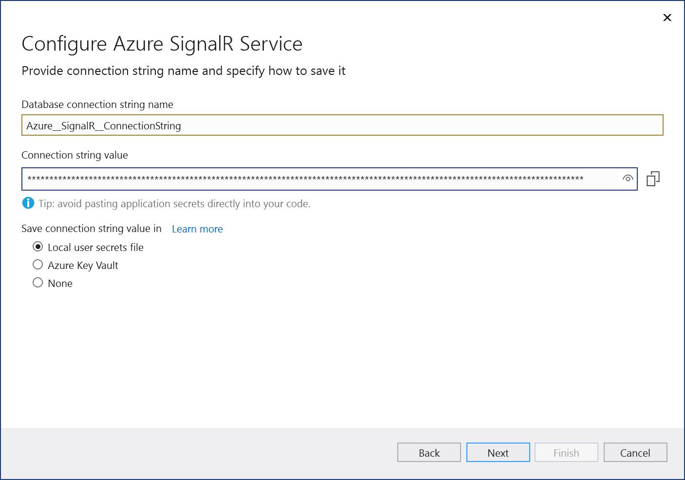
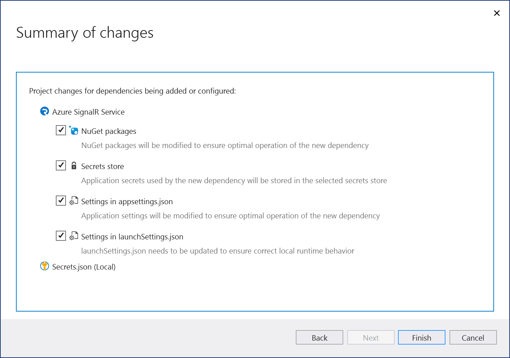
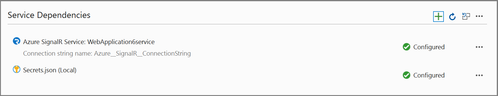
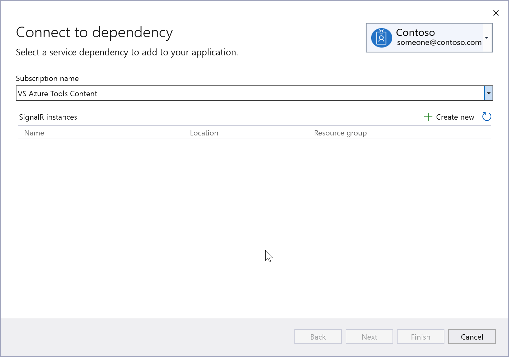
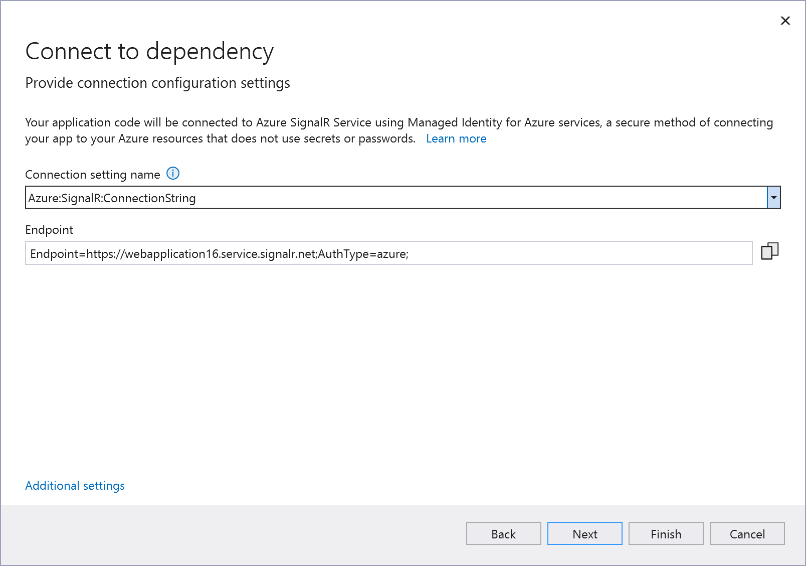
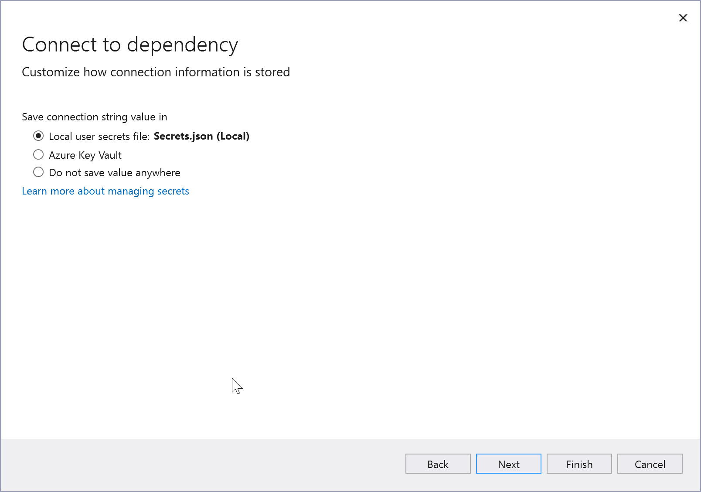

# Add Azure SignalR by using Visual Studio Connected Services

With Visual Studio, you can connect any of the following to Azure SignalR service by using the **Connected Services** feature:

- .NET Framework console app
- ASP.NET Model-View-Controller (MVC) (.NET Framework)
- ASP.NET Core
- .NET Core (including console app, WPF, Windows Forms, class library)
- .NET Core Worker Role
- Azure Functions
- Universal Windows Platform App
- Cordova

The connected service functionality adds all the needed references and connection code to your project, and modifies your configuration files appropriately.

## Prerequisites

- Visual Studio with the Azure workload installed.
- A project of one of the supported types
- [!INCLUDE [prerequisites-azure-subscription](includes/prerequisites-azure-subscription.md)]

:::moniker range="vs-2019"

## Connect to Azure SignalR using Connected Services

1. Open your project in Visual Studio.

1. In **Solution Explorer**, right-click the **Connected Services** node, and, from the context menu, select **Add Connected Service**.

   If you don't see the **Connected Services** node, choose **Project** > **Connected Services** > **Add**.

1. In the **Connected Services** tab, select the + icon for **Service Dependencies**.

    

1. In the **Add Dependency** page, select **Azure SignalR Service**.

    

    If you aren't signed in already, sign in to your Azure account. If you don't have an Azure account, you can sign up for a [free trial](https://azure.microsoft.com/free/).

1. In the **Configure Azure SignalR** screen, select an existing Azure SignalR component, and select **Next**.

    If you need to create a new component, go to the next step. Otherwise, skip to step 7.

    

1. To create an Azure SignalR service instance:

   1. Select **Create a new Azure SignalR Service instance** at the bottom of the screen.

   1. Fill out the **Azure SignalR Service: Create new** screen, and select **Create**.

       

   1. When the **Configure Azure SignalR Service** screen is displayed, the new instance appears in the list. Select the new instance in the list, and select **Next**.

1. Enter a connection string name, or choose the default, and choose whether you want the connection string stored in a local secrets file, or in [Azure Key Vault](/azure/key-vault).

   

1. The **Summary of changes** screen shows all the modifications that will be made to your project if you complete the process. If the changes look OK, choose **Finish**.

   

1. The connection appears under the **Service Dependencies** section of the **Connected Services** tab.

   
:::moniker-end

:::moniker range=">=vs-2022"

## Connect to Azure SignalR using Connected Services

> [!NOTE]
> For .NET Framework projects, Connected Services UI is slightly different. To see the differences, compare to the [Visual Studio 2019 version of this page](./azure-signalr-add-connected-service.md?view=vs-2019&preserve-view=true).

1. Open your project in Visual Studio.

1. In **Solution Explorer**, right-click the **Connected Services** node, and, from the context menu, select **Add** to open the menu of available services.

   

   If you don't see the **Connected Services** node, choose **Project** > **Connected Services** > **Add**.

1. Choose **Azure SignalR Service**. The **Connect to dependency** page appears.

   

    If you aren't signed in already, sign in to your Azure account. If you don't have an Azure account, you can sign up for a [free trial](https://azure.microsoft.com/free/).

1. Select an existing Azure SignalR component, and select **Next**.

    If you need to create a new component, go to the next step. Otherwise, skip to step 7.

    

1. To create an Azure SignalR service instance:

   1. Select **Create new** at the middle right of the screen.

   1. Fill out the **Azure SignalR Service: Create new** screen, and select **Create**.

       

   1. When the **Configure Azure SignalR Service** screen is displayed, the new instance appears in the list. Select the new instance in the list, and select **Next**.

1. Enter a connection setting name, or accept the default.

   

   > [!NOTE]
   > For improved security, in Visual Studio 17.12 and later, this step creates a connection setting name; previous versions create a connection string. Connection strings stored in the local filesystem can lead to a security risk, if they're inadvertently exposed.

1. Click on **Additional settings** and choose whether you want the connection information stored in a local secrets file, or in [Azure Key Vault](/azure/key-vault).

   

1. The **Summary of changes** screen shows all the modifications that will be made to your project if you complete the process. If the changes look OK, choose **Finish**.

   

1. In Solution Explorer, double-click on the **Connected Services** node to open the **Connected Services** tab. The connection appears under the **Service Dependencies** section:

   

   If you click on the three dots next to the dependency you added, you can see various options such as **Connect** to reopen the wizard and change the connection. You can also click the three dots at the top right of the window to see options to start local dependencies, change settings, and more.
:::moniker-end

## Next steps

Continue by following the Azure SignalR quickstart. You can skip the initial setup, since you've already done that, and continue with the section [Add Azure SignalR to the web app](/azure/azure-signalr/signalr-quickstart-dotnet-core#add-azure-signalr-to-the-web-app). The code you use varies depending on your version of ASP.NET Core, so you might have to modify the code in the tutorial to suit your project template if your ASP.NET Core version doesn't match the version used in the quickstart.

## Related content

- [Azure SignalR product page](https://azure.microsoft.com/services/signalr-service/)
- [Azure SignalR Service documentation](/azure/azure-signalr)
