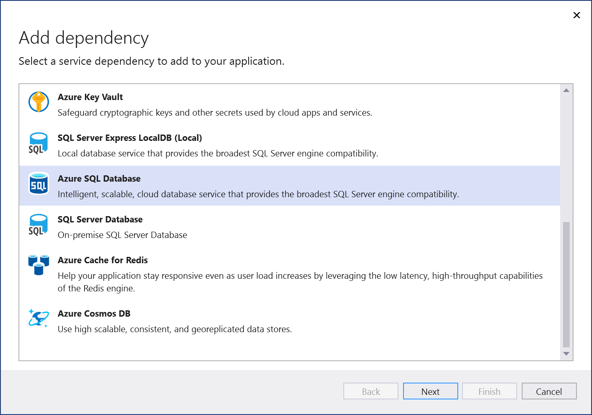

# Add a connection to Azure SQL Database

 [!INCLUDE [Visual Studio](~/includes/applies-to-version/vs-windows-only.md)]

With Visual Studio, you can connect any of the following to Azure SQL Database by using the **Connected Services** feature:

- .NET Framework console app
- ASP.NET MVC (.NET Framework) 
- ASP.NET Core
- .NET Core (including console app, WPF, Windows Forms, class library)
- .NET Core Worker Role
- Azure Functions
- Universal Windows Platform App
- Xamarin
- Cordova

The connected service functionality adds all the needed references and connection code to your project, and modifies your configuration files appropriately.

> [!NOTE]
> This topic applies to Visual Studio on Windows. For Visual Studio for Mac, see [Connected services in Visual Studio for Mac](/visualstudio/mac/connected-services).
## Prerequisites

- Visual Studio with the Azure workload installed.
- A project of one of the supported types

## Connect to Azure SQL Database using Connected Services

1. Open your project in Visual Studio.

1. In **Solution Explorer**, right-click the **Connected Services** node, and, from the context menu, select **Add Connected Service**.

1. In the **Connected Services** tab, select the + icon for **Service Dependencies**.

    

1. In the **Add Dependency** page, select **Azure SQL Database**.

    

    If you aren't signed in already, sign into your Azure account. If you don't have an Azure account, you can sign up for a [free trial](https://azure.microsoft.com/free/).

1. In the **Configure Azure SQL Database** screen, select an existing Azure SQL Database, and select **Next**.

    If you need to create a new component, go to the next step. Otherwise, skip to step 7.

    

1. To create an Azure SQL Database:

   1. Select **Create a SQL Database** at the bottom of the screen.

   1. Fill out the **Azure SQL Database: Create new** screen, and select **Create**.

       

   1. When the **Configure Azure SQL Database** screen is displayed, the new database appears in the list. Select the new database in the list, and select **Next**.

1. Enter a connection string name, or choose the default, and choose whether you want the connection string stored in a local secrets file, or in [Azure Key Vault](/azure/key-vault).

   

1. The **Summary of changes** screen shows all the modifications that will be made to your project if you complete the process. If the changes look OK, choose **Finish**.

   

   If prompted to set a firewall rules, choose **Yes**.

   

1. The connection appears under the **Service Dependencies** section of the **Connected Services** tab.

   

## Access the connection string

Learn how to store secrets safely by following [Safe storage of app secrets in development in ASP.NET Core](/aspnet/core/security/app-secrets?tabs=windows). In particular, to read the connection string from the secrets store, you can add code as in [Read the secret via the configuration API](/aspnet/core/security/app-secrets?tabs=windows#read-the-secret-via-the-configuration-api). See also [Dependency injection in ASP.NET Core](/aspnet/core/fundamentals/dependency-injection).

## Entity Framework migrations

It might be convenient to work with a local data store during early development, but with Entity Framework Core, when you're ready to move to the cloud, you can use Visual Studio's support for Entity Framework migration to move your database, or merge changes with a remote data store. See [Migrations overview](/ef/core/managing-schemas/migrations/?tabs=vs).

On the **Connected Services** tab, you can find the migration commands by clicking on the three dots, as shown in the screenshot:

Commands are available there to create new migrations, apply them directly, or generate SQL scripts that apply the migrations.

:::moniker range=">=vs-2022"

### Add migration

When a data model change is introduced, you can use Entity Framework Core tools to add a corresponding migration that describes in code the updates necessary to keep the database schema in sync. Entity Framework Core compares the current model against a snapshot of the old model to determine the differences, and generates migration source files. The files are added to your project, usually in a folder called *Migrations* and can be tracked in your project's source control like any other source file.

When you choose this option, you're asked to provide the context class name that represents the database schema you want to migrate.

### Update database

After a migration has been created, it can be applied to a database. Entity Framework updates your database and your schema with the changes specified in the migration code. When you choose this option, you're asked to provide the context class name that represents the database schema you want to migrate.

### Generate SQL script

The recommended way to deploy migrations to a production database is by generating SQL scripts. The advantages of this strategy include the following:

- SQL scripts can be reviewed for accuracy; this is important since applying schema changes to production databases is a potentially dangerous operation that could involve data loss.
- In some cases, the scripts can be tuned to fit the specific needs of a production database.
- SQL scripts can be used in conjunction with a deployment technology, and can even be generated as part of your CI process.
- SQL scripts can be provided to a DBA, and can be managed and archived separately.

When you use this option, you're asked the database context class and the location for the script file.

### Open in SQL Server Object Explorer

For convenience, this command lets you jump to the SQL Server Object Explorer, so you can view tables and other database entities, and work directly with your data. See [Object explorer](/sql/ssms/object/object-explorer).

:::moniker-end

## See also

- [Azure SQL Database product page](https://azure.microsoft.com/services/sql-database/)
- [Azure SQL Database documentation](/azure/azure-sql/database/)
- [Connected services (Visual Studio for Mac)](/visualstudio/mac/connected-services)
