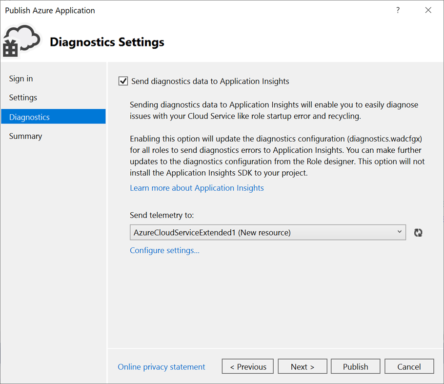

# Create and deploy to Cloud Services (extended support) in Visual Studio

Starting with [Visual Studio 2019 version 16.9](https://visualstudio.microsoft.com/vs/), you can work with cloud services by using Azure Resource Manager, which greatly simplifies and modernizes maintenance and management of Azure resources. This is enabled by a new Azure service referred to as *Cloud Services (extended support)*. You can publish an existing cloud service to Cloud Services (extended support). For information on this Azure service, see [Cloud Services (extended support) documentation](/azure/cloud-services-extended-support/overview).

## Publish to Cloud Services (extended support)

When you publish your existing Azure Cloud Service project to Cloud Services (extended support), you still retain the capability to publish to a classic Azure Cloud Service. In Visual Studio 2019 version 16.9 and later, classic cloud service projects have a special version of the **Publish** command, **Publish (extended support)**. This command appears on the shortcut menu in **Solution Explorer**.

There are some differences when you publish to Cloud Services (extended support). For example, you are not asked if you are publishing to **Staging** or **Production**, because these deployment slots are not part of the extended support publishing model. Instead, with Cloud Services (extended support), you can set up multiple deployments, and swap deployments in the Azure portal. Although the Visual Studio tooling allows for setting this in 16.9, the swap feature will not be enabled until a later release of Cloud Services (extended support) and may result in a failure at deployment time during the Preview.

Before publishing a classic Azure Cloud Service to Cloud Services (extended support), check the storage accounts your project uses and make sure they are Storage V1 or Storage V2 accounts. The classic storage account types will fail with an error message at deploy time. Be sure to check the storage account used by diagnostics. To check the diagnostics storage account, see [Set up diagnostics for Azure Cloud Services and virtual machines](vs-azure-tools-diagnostics-for-cloud-services-and-virtual-machines.md). If your service uses a classic storage account, you can upgrade it; see [Upgrade to a general-purpose v2 storage account](/azure/storage/common/storage-account-upgrade?tabs=azure-portal).  For general information on the types of storage accounts, see [Storage account overview](/azure/storage/common/storage-account-overview).

### To publish a classic Azure Cloud Service project to Cloud Services (extended support)

1. Right-click on the project node in your Azure Cloud Service (classic) project and choose **Publish (extended support)...**. The **Publish wizard** opens at the first screen.

   

   The **Publish** wizard appears.

   

1. **Account** - Select an account or select **Add an account** in the account dropdown list.

1. **Choose your subscription** - Choose the subscription to use for your deployment.

1. Choose **Next** to move to the **Settings** page.

   

1. **Cloud Service (extended support)** - Using the dropdown, either select an existing cloud service (extended support), or select **Create new**, and create one. The data center displays in parentheses for each cloud service (extended support). It is recommended that the data center location for the cloud service (extended support) be the same as the data center location for the storage account.

   If you choose to create a new service, you'll see the **Create Cloud Service (extended support)** dialog. Specify the location and resource group you want to use for the cloud service (extended support).

   

1. **Build configuration** - Select either **Debug** or **Release**.

1. **Service configuration** - Select either **Cloud** or **Local**.

1. **Storage account** - Select the storage account to use for this deployment, or **Create new** to create a storage account. The region displays in parentheses for each storage account. It is recommended that the data center location for the storage account is the same as the data center location for the cloud service (Common Settings).

   The Azure storage account stores the package for the application deployment.

1. **Key vault** - Specify the key vault that contains the secrets for this cloud service (extended support). This is enabled if remote desktop is enabled, or if certificates are added to the configuration.

1. **Enable Remote Desktop for all roles** - Select this option if you want to be able to remotely connect to the service. You'll be asked to specify credentials.

   

1. Choose **Next** to move to the **Diagnostics settings** page.

   

   Diagnostics enables you to troubleshoot an Azure cloud service (extended support). For information about diagnostics, see [Configuring Diagnostics for Azure Cloud Services and Virtual Machines](./vs-azure-tools-diagnostics-for-cloud-services-and-virtual-machines.md). For information about Application Insights, see [What is Application Insights?](/azure/application-insights/app-insights-overview).

1. Choose **Next** to move to the **Summary** page.

   

1. **Target profile** - You can choose to create a publishing profile from the settings that you have chosen. For example, you might create one profile for a test environment and another for production. To save this profile, choose the **Save** icon. The wizard creates the profile and saves it in the Visual Studio project. To modify the profile name, open the **Target profile** list, and then choose **Manage…**.

   > [!Note]
   > The publishing profile appears in Solution Explorer in Visual Studio, and the profile settings are written to a file with an *.azurePubxml* extension. Settings are saved as attributes of XML tags.

1. Once you configure all the settings for your project's deployment, select **Publish** at the bottom of the dialog. You can monitor the process status in the **Azure Activity Log** output window in Visual Studio. Choose the **Open in portal** link to 

Congratulations! You've published your cloud service (extended support) project to Azure. To publish again with the same settings, you can reuse the publishing profile, or repeat these steps to create a new one. The Azure Resource Manager (ARM) template and parameters that are used for deployment are saved in the *bin/\<configuration\>/Publish* folder.

## Clean up Azure resources

To clean up the Azure resources you created by following this tutorial, go to the [Azure portal](https://portal.azure.com), choose **Resource groups**, find and open the resource group you used to create the cloud service (extended support), and choose **Delete resource group**.

## Next steps

Set up continuous integration (CI) using the **Configure** button on the **Publish** screen. For more information, see [Azure Pipelines documentation](/azure/devops/pipelines/?view=azure-devops&preserve-view=true).
