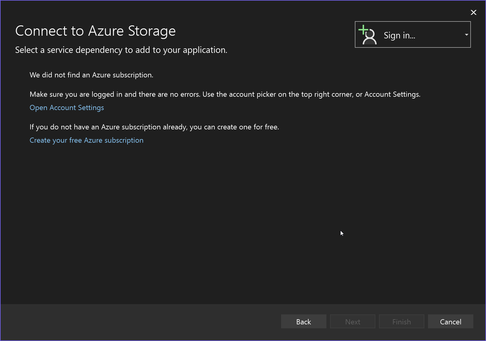
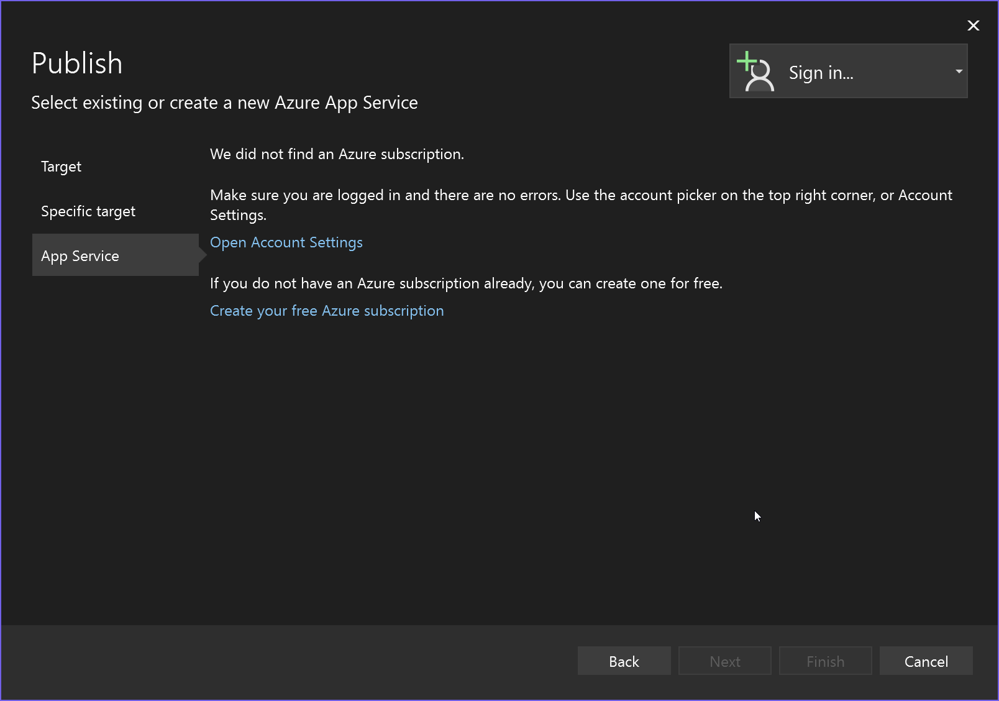

# Sign in with an Azure subscription

If you are not already signed in with an Azure subscription, you may encounter a dialog like the ones below.

If you have a Visual Studio subscription, you already have an Azure subscription with some credits. Just [activate them](https://signup.azure.com/signup?offer=Azure_MSDN) and sign into Visual Studio.

Visual Studio also gives you the opportunity to [create a new, free Azure account](https://signup.azure.com/signup?offer=Azure_MSDN) to try things out with. 

> [!NOTE]
> Visual Studio allows you to sign in with multiple accounts and it let's you work with Azure resources across multiple Azure subscriptions so no need to sign-out of one in order to sign-in with another!
