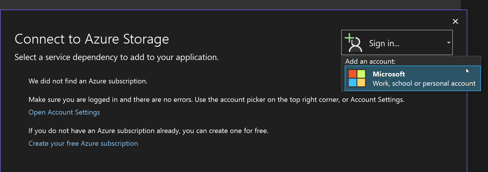

# Sign in with an Azure subscription

If you are not already signed in with an Azure subscription, you might encounter a dialog like these:

If you have a Visual Studio subscription, you already have an Azure subscription with some credits. Just [activate them](https://signup.azure.com/signup?offer=Azure_MSDN) and sign in to Visual Studio.

Visual Studio also gives you the opportunity to [create a new, free Azure account](https://signup.azure.com/signup?offer=Azure_MSDN) to try things out with.

Visual Studio allows you to sign in with multiple accounts and it let's you work with Azure resources across multiple Azure subscriptions so no need to sign-out of one in order to sign-in with another!

> [!NOTE]
> For Azure CLI users, be aware that the sign-in from Azure CLI is separate from the sign-in used in Visual Studio, so even if you're signed in to Azure by using `az login` on the same machine where you're running Visual Studio, you still need to provide credentials within Visual Studio.

## To sign in to Azure from a dialog or wizard screen

1. Select the **Sign In** button, and then choose **Add an account**. You should see options such as **Microsoft Work, school, or personal account**. This option means Microsoft Entra ID (Microsoft Account).

   

1. Next, you see a screen listing Microsoft Accounts. Choose the account that has access to the Azure resources you require. Accounts known to Visual Studio are shown, but you can add another if the account you're looking for is not listed.

1. Once you choose an account, you might be asked for credentials and two-factor authentication, depending on the security environment on your computer and your account's security settings.

1. After a successful sign-in, focus returns to the dialog, and you should see your subscription listed in the place where the **Sign In** box was previously.

To avoid having to sign in when you connect to an Azure service or publish to Azure, you can use Visual Studio's account management features to add your Azure subscription to your Visual Studio accounts. In that case, you are automatically signed in whenever you're using Visual Studio. See [Add and switch user accounts to Visual Studio](../ide/signing-in-to-visual-studio.md#add-and-switch-user-accounts-in-visual-studio).

## Related content

- [Sign in to Visual Studio with accounts that require multifactor authentication (MFA)](../ide/work-with-multi-factor-authentication.md)
