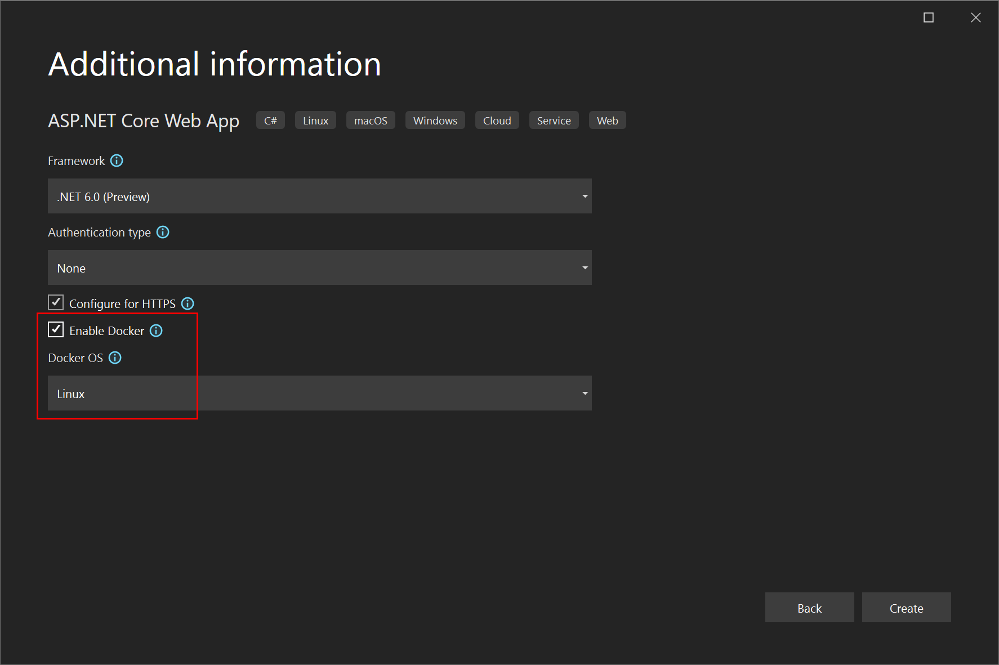

1. In the Visual Studio start window, select **Create a new project**.
1. Select **ASP.NET Core Web App**, and then select **Next**.
1. Enter a name for your new application (or use the default name), specify the location on disk, and then select **Next**.
1. Choose the .NET version you want to target. If you don't know, [choose the LTS (long-term support) release](https://dotnet.microsoft.com/download/dotnet).

   

1. Choose whether you want SSL support by selecting or clearing the **Configure for HTTPS** check box.
1. Select the **Enable Docker** check box.
1. In the **Docker OS** textbox, select the type of container you want (Windows or Linux), and then select **Create**.
