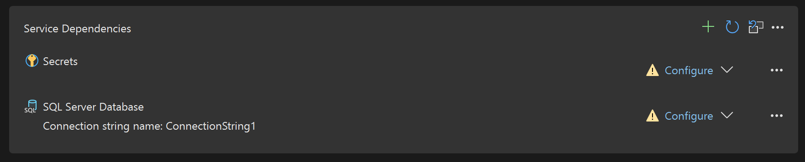

# Connect to Azure services, gRPC, OpenAPI, and more

Developers are building apps with an increasing number of services, yet the service technologies are evolving just as fast.

With Visual Studio's **Connected Services**, you get a modern service consumption experience that enables each service the ability to tailor their consumption experience, prompting you for the relevant questions you need to get started quickly.

Connected Services includes a collection of tools in Visual Studio that help you connect your application to the following:
- [Azure services](#connect-your-app-to-azure-services)
- OpenAPI endpoints
- gRPC (Remote Procedure Call) endpoints
- Windows Communication Foundation (WCF) endpoints
- Databases and data providers

:::moniker range="vs-2019"
Get started by right-clicking on the **Connected Services** node in **Solution Explorer** and select **Manage Connected Services**.
:::moniker-end

:::moniker range="vs-2022"
Get started by right-clicking on the project node, and choosing **Add > Connected Service**. You can also right-click on the **Connected Services** node in **Solution Explorer** and choose a specific service to add.
:::moniker-end

Supported project types vary by the type of service. You'll see the options that apply to your project type in the listed selections.

[!INCLUDE [subscription-azure-benefits](includes/subscription-azure-benefits.md)]

## Connect your app to Azure services

Use Connected Services to connect your application to live Azure services emulators and other local alternatives to Azure services. Visual Studio currently supports the following:

| Name | Description |
| - | - |
| [Azure App Configuration](/azure/azure-app-configuration/overview) | Access key-value settings and feature flags that are managed centrally in Azure. |
| [Azure App Insights](/azure/azure-monitor/app/app-insights-overview) | Provides extensible application performance management and monitoring for live web apps. |
| [Azure App Service](/azure/app-service/overview) | Provides full-service, scalable hosting of live web apps. |
| [Azure Functions](/azure/azure-functions/functions-overview) | Provides scalable compute-on-demand services for web APIs and more. |
| [Azure Storage](/azure/storage) | Scalable cloud storage with support for blobs, tables, queues, disks. |
| [Azure SignalR Service](/azure/azure-signalr/signalr-overview) | Real-time web functionality over HTTP. |
| [Azure Key Vault](/azure/key-vault/general/overview) | Secure cloud storage for cryptographic keys and other secrets used by your Azure applications. |
| [Azure SQL Database](/azure/azure-sql) | Cloud-hosted SQL Database. |
| [Azure Cache for Redis](/azure/azure-cache-for-redis/cache-overview)| In-memory data store based on the Redis software. |
| [Azure Cosmos DB](/azure/cosmos-db/introduction) | A fully managed NoSQL database for modern app development.|
| [Microsoft Identity Platform](/azure/active-directory/develop/v2-overview) | Authentication with Microsoft identities and social accounts. |

> [!NOTE]
> Using Publish you can deploy your application to Azure hosting services like Azure VMs, Azure App Service, Azure Functions and Azure Container Registry

## Databases and data providers

Visual Studio provides options to connect to on-premises databases, locally emulated versions of data providers, as well as Azure database services.

| Name | Description |
| - | - |
| [Azure Cosmos DB Emulator on container](/azure/cosmos-db/introduction) | Azure Cosmos DB emulator running in a local container. |
| [MongoDB on container](/azure/cosmos-db/introduction) | MongoDB document databases provides high reliability and easy scalability. This option makes it available in a local container. |
| [PostgreSQL on container](/azure/postgresql/overview) | PostgreSQL is an object-relational database system that provides reliability and data integrity. This option makes it available in a local container. |
| [SQLite](/ef/core/providers/sqlite/?tabs=dotnet-core-cli) | SQLite is an in-process library that provides a self-contained, transactional SQL Server Database Engine with no configuration. |
| [SQL Server Database](/sql/sql-server/) | On-premises SQL Server Database. |

## Support for Azure emulators and local alternatives

Visual Studio makes it easier to develop Azure applications locally by easing the transition from locally emulated services to services running in the cloud. You can use Connected Services to connect your application to local emulators, some of which run in a local container, and other local alternatives to Azure services. Visual Studio currently supports the following:

Visual Studio generates any necessary client or server code to facilitate the communication.

| Name | Description |
| - | - |
| [Azure Cosmos DB Emulator on container](/azure/cosmos-db/introduction) | Azure Cosmos DB emulator running in a local container. |
| [Azure Storage Emulator](/azure/storage/common/storage-use-azurite?toc=%2Fazure%2Fstorage%2Fblobs%2Ftoc.json&tabs=visual-studio) | Azurite is an Azure Storage emulator that runs on your local machine. |
| [Application Insights SDK](/azure/azure-monitor/app/app-insights-overview) | Local mode for the Application Insights service.  |
| [RabbitMQ on container](/azure/azure-functions/functions-bindings-rabbitmq) | RabbitMQ is an open-source multiprotocol message broker. This option makes it available in a local container. |
| [Azure Cache for Redis on container](/azure/azure-cache-for-redis/cache-overview) | Azure Cache for Redis hosted in a local container. |
| [Secrets.json](/aspnet/core/security/app-secrets?tabs=windows) | Local alternative for Key Vault. |
| [SQL Server Express LocalDB](/sql/database-engine/configure-windows/sql-server-express-localdb) | Local alternative to Azure SQL Database. |

## Connect your app to gRPC, OpenAPI and WCF endpoints

Use Connected Services to connect your application to any of the following services:

| Name | ASP.NET Link | Description |
|-|-|-|
| [OpenAPI](https://github.com/OAI/OpenAPI-Specification) endpoints | [OpenAPI support in ASP.NET Core API apps](/aspnet/core/fundamentals/openapi/overview) | A standard format for describing the capabilities of a service in computer-readable and human-readable form. |
| [gRPC](https://grpc.io/docs/) endpoints | [Introduction to gRPC services on .NET](/aspnet/core/grpc/) | An open-source real-time procedure calling service. |
| [WCF](/dotnet/framework/wcf/) endpoints | N/A | A .NET Framework solution supporting programming with a distributed network of services. |

## Containers

Connected Services can help you run application dependencies that are emulating Azure services locally in a container. For example, you can run the Azure Storage emulator called Azurite in a container locally. The next section describes what support Visual Studio provides for transitioning your app from development mode, when you are using these mock services in containers, to using the real services running in Azure.

## Local and connected configurations

During development, you usually use a local emulator, a local database, or a mock service running in a local container. When you use the publish process in Visual Studio to deploy to the cloud, whether it's Azure, Docker Hub, or another supported remote environment, Visual Studio can guide you through the transition to connecting to the real services and databases. When you right-click on the project node in **Solution Explorer** and choose **Publish**, you are guided through the deployment of your app to the cloud, but after that, the service dependencies you previously configured for local use are now shown in the Connected Services UI with a yellow caution icon and a **Configure** link:

If you click those links, Visual Studio will present a few screens that ask for the connection information to the "real" service running in the cloud that your cloud app will use instead of the local service. For example, if you initially configured an app to run with a locally running instance of SQL LocalDB, you would have provided a connection string name and an initial value that referenced that LocalDB database. After your app is first deployed to a cloud environment, you can use the **Configure** links to specify the connection string to use in the cloud. For Azure deployment scenarios, Visual Studio also gives the option of using an [Azure Key Vault](/azure/key-vault/general/overview) to securely store the connection string and other secrets.

## How it works

Visual Studio creates two new files visible in Solution Explorer under Properties called *serviceDependencies.json* and *serviceDependencies.local.json*. Both of these files are safe to check in as they do not contain any secrets.

Visual Studio also creates a file called *serviceDependencies.local.json.user* which is not visible in Solution Explorer by default. This file contains information that could be considered a secret (for example, resource IDs in Azure) and we do not recommend you check it in.
