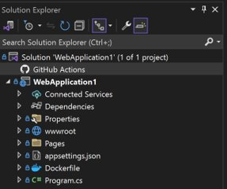
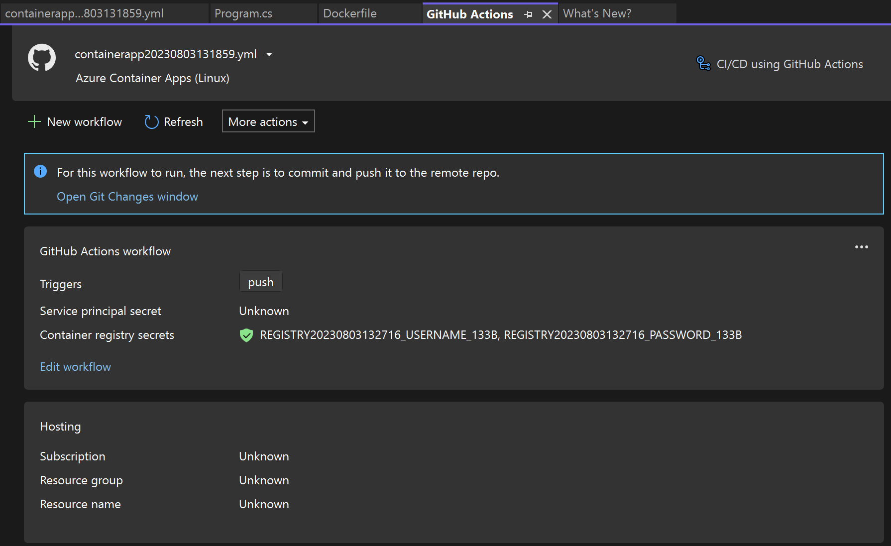
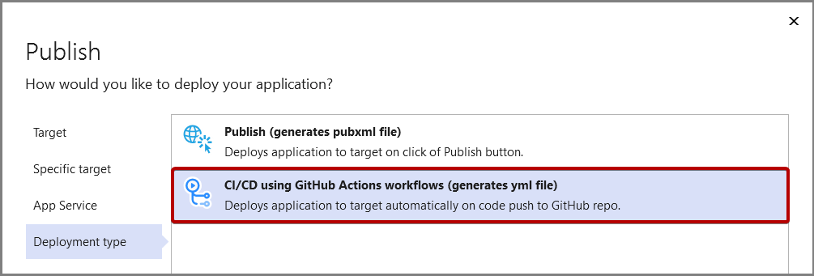

# GitHub Actions deployment to Azure in Visual Studio

[GitHub Actions](https://github.com/features/actions) is the continuous integration and continuous delivery (CI/CD) solution offered by GitHub. You can host your code for free on GitHub.com and you can use GitHub Actions to automatically build, test, and deploy your application when code changes are made.

:::moniker range=">=vs-2022"

## GitHub Actions in Solution Explorer

Whenever you open a project from a GitHub repo in Visual Studio 2022 version 17.7 and later, any GitHub Actions in the repo are shown under the GitHub Actions node in Solution Explorer.

If you double-click on the action YML file, or select and press **Enter** to open it, the GitHub Actions tab opens with information about the action, including secrets and hosting information in Azure.

You can also right-click on the YML file to open it in GitHub, or choose **Edit** to open the YML file itself locally.
:::moniker-end

## Visual Studio generates working GitHub Actions workflows for you

If your codebase is hosted on GitHub.com and your deployment target is an Azure hosting service that Visual Studio supports, you will automatically be offered to configure GitHub Actions for your repo.

Visual Studio also simplifies the process by handling your application secrets for you.

Get started by right-clicking on your project in Solution Explorer and selecting **Publish** from the context menu. For a tutorial, see [Deploy your application to Azure using GitHub Actions workflows created by Visual Studio](/visualstudio/azure/azure-deployment-using-github-actions).

## How do I get my project on GitHub.com?

For more information, see [Create a new Git repository](../version-control/git-with-visual-studio.md?view=vs-2019&preserve-view=true#create-a-new-git-repository-in-visual-studio-2019).

## See also

[GitHub Actions and .NET](/dotnet/devops/github-actions-overview)
