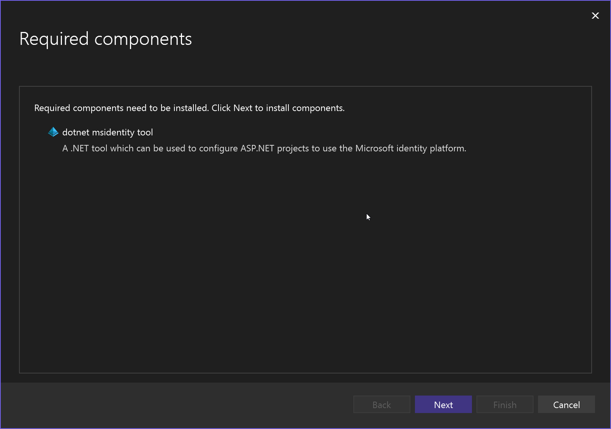
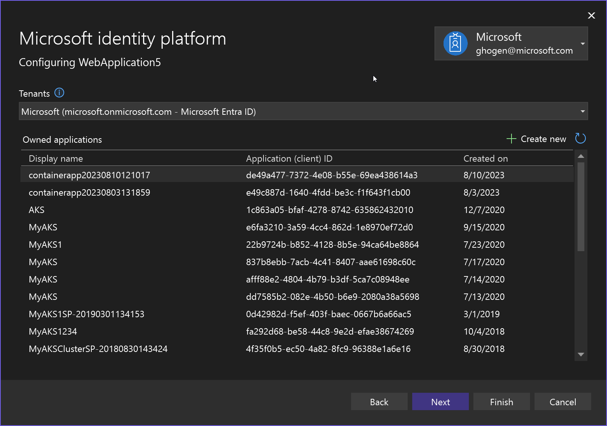
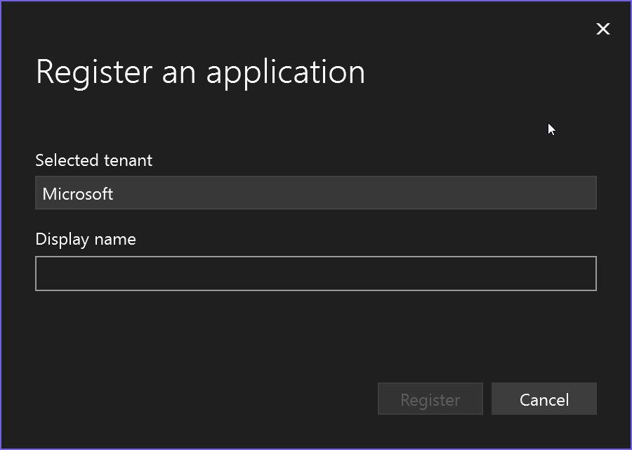
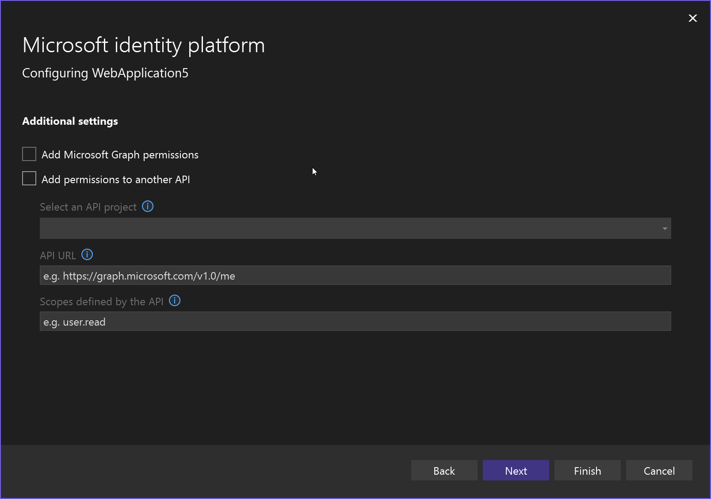
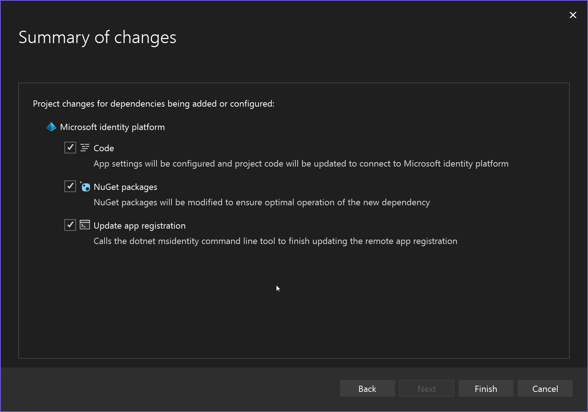
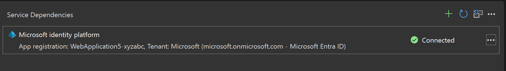
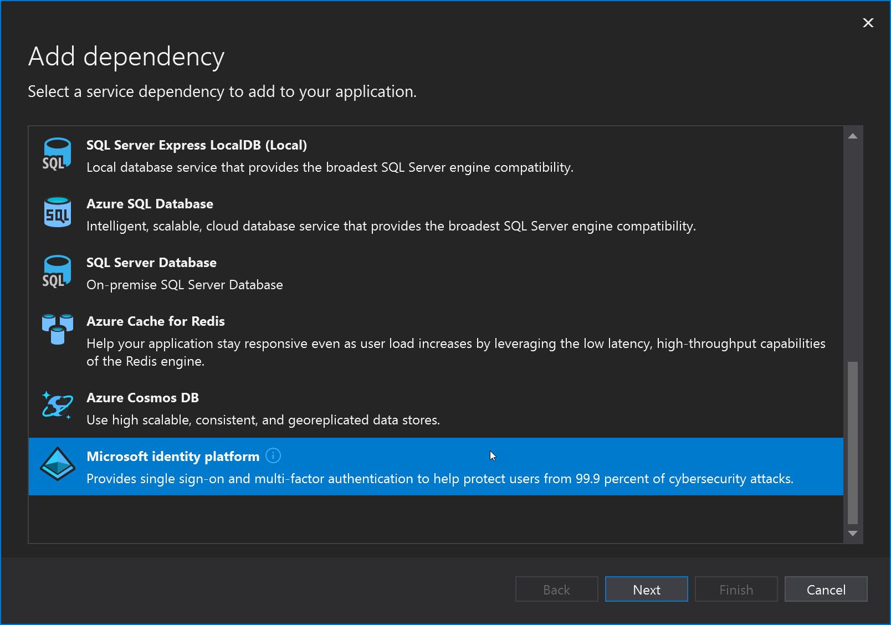

# Add Microsoft Entra ID authentication by using Connected Services in Visual Studio

You can add support for Microsoft Entra ID to an ASP.NET web app by using the Microsoft Identity platform connected service.

By using Microsoft Entra ID, you can support user authentication for ASP.NET Model-View-Controller (MVC) web applications, or Active Directory Authentication in web API services. With Microsoft Entra authentication, your users can use their accounts from Microsoft Entra ID to connect to your web applications. The advantages of Microsoft Entra authentication with web API include enhanced data security when exposing an API from a web application. With Microsoft Entra ID, you do not have to manage a separate authentication system with its own account and user management.

This article and its companion articles provide details of using the Visual Studio Connected Service feature for Active Directory.

## Prerequisites

- [!INCLUDE [prerequisites-azure-subscription](includes/prerequisites-azure-subscription.md)]
- **Visual Studio 2015** or later. [Download Visual Studio now](https://aka.ms/vsdownload?utm_source=mscom&utm_campaign=msdocs).

### Connect to Microsoft Identity platform

:::moniker range=">=vs-2022"

1. In Visual Studio, create or open an ASP.NET MVC project, or an ASP.NET Web API project.

1. Select the **Project**, **Connected Services**, **Add** menu command, or right-click the **Connected Services** node found under the project in Solution Explorer, and choose **Add**, **Microsoft Identity platform**.

   If you are missing the .NET MSIdentity tool, the screen prompts you to install it.

   

1. The **Configure Microsoft identity platform** screen appears. If you haven't signed in to Azure, you're asked to sign in. Once you're signed in, you see a list of your applications.

   

1. If you don't have an application, choose **Create new**, and enter the application name. For Microsoft Entra ID, choose Microsoft as the tenant.

   

   The application you entered now shows in the list. Select it and choose **Next**.

1. On the next screen, you can choose to enable Microsoft.Graph or allow another API project to have access. You can configure this later if you don't have the information yet.

   

1. Choose **Next**. The **Summary of changes** screen appears showing what is being changed in the project.

   

1. The **Dependency configuration process** screen shows the specific changes that are being made to your project.

Now the new service dependency shows on the Connected Services screen.

If you want to modify it, such as to add support for an API such as Microsoft.Graph, click on the three dots, and then choose **Edit dependency**. You can repeat the steps and choose the APIs that you want to grant access to.

You can also see the Active Directory domain on the [Azure portal](https://go.microsoft.com/fwlink/p/?LinkID=525040).

:::moniker-end
:::moniker range="<=vs-2019"
1. In Visual Studio, create or open an ASP.NET MVC project, or an ASP.NET Web API project.

1. Select the **Project**, **Manage Connected Services** menu command, or right-click the **Connected Services** node found under the project in Solution Explorer, and choose **Manage Connected Services**, and then select the link **Add a service dependency** and choose **Microsoft Identity platform**.

   

   If you are missing the .NET MSIdentity tool, the screen prompts you to install it.

   

   If you had to install the tool, you might need to restart the process again from step 1.

1. The **Configure Microsoft identity platform** screen appears. If you haven't signed in to Azure, you're asked to sign in. Once you're signed in, you see a list of your applications.

   

1. If you don't have an application, choose **Create new**, and enter the application name. For Microsoft Entra ID, choose Microsoft as the tenant.

   

   The application you entered now shows in the list. Select it and choose **Next**.

1. On the next screen, you can choose to enable Microsoft.Graph or allow another API project to have access. You can configure this later if you don't have the information yet.

   

1. Choose **Next**. The **Summary of changes** screen appears showing what is being changed in the project.

   

1. The **Dependency configuration process** screen shows the specific changes that are being made to your project.

Now the new service dependency shows on the Connected Services screen.

If you want to modify it, such as to add support for an API such as Microsoft.Graph, click on the three dots, and then choose **Edit dependency**. You can repeat the steps and choose the APIs that you want to grant access to.

You can also see the Active Directory domain on the [Azure portal](https://go.microsoft.com/fwlink/p/?LinkID=525040).
:::moniker-end

## Related content

- [Authentication scenarios for Microsoft Entra ID](/azure/active-directory/develop/authentication-vs-authorization)
- [Add sign-in with Microsoft to an ASP.NET web app](/azure/active-directory/develop/quickstart-v2-aspnet-webapp)
