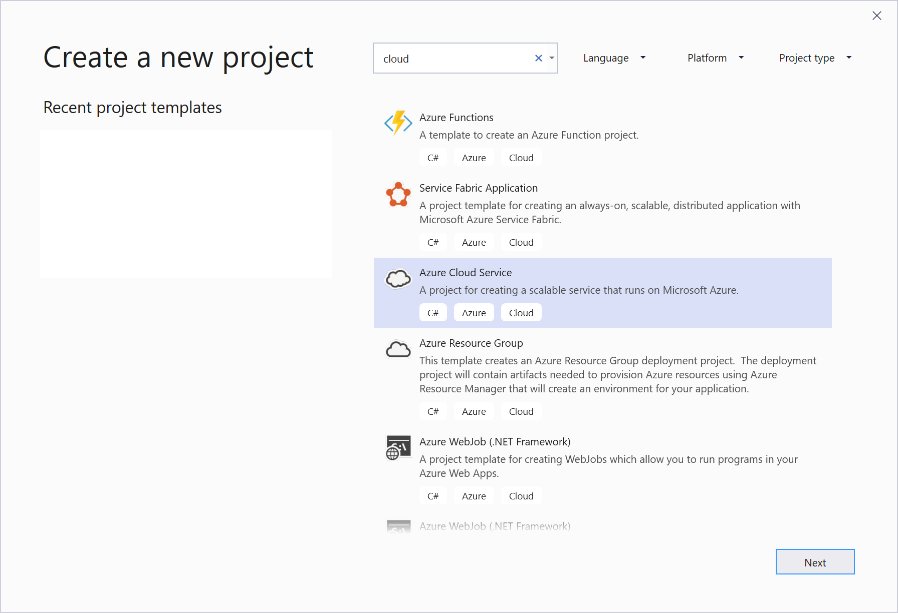
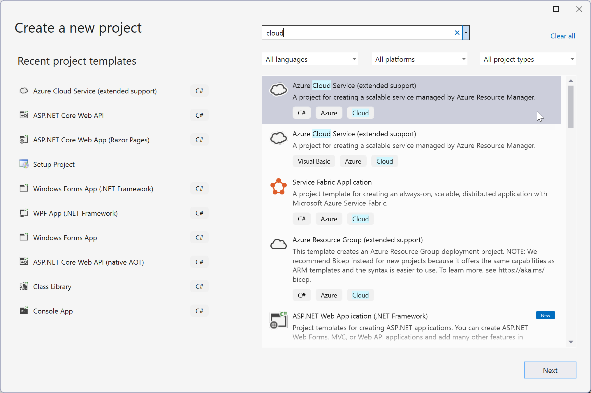

# Create an Azure Cloud Services (extended support) project with Visual Studio

 [!INCLUDE [Cloud Services](./includes/cloud-services-legacy.md)]

Visual Studio provides a project template that lets you create an [Azure Cloud Services (extended support)](/azure/cloud-services/cloud-services-choose-me) project, which is a simple general-purpose Azure service. Once the project has been created, Visual Studio enables you to configure, debug, and deploy the cloud service to Azure.

## Prerequisites

- Visual Studio (see [Visual Studio downloads] (https://aka.ms/vs/download/?cid=learn-onpage-download-cta)) with the **Azure development** workload installed, and the Individual Component **.NET Framework project and item templates** installed. See [Modify Visual Studio](../install/modify-visual-studio.md).
- [!INCLUDE [prerequisites-azure-subscription](includes/prerequisites-azure-subscription.md)]

## Steps to create an Azure Cloud Services (extended support) project in Visual Studio

This section walks you through creating an Azure Cloud Services (extended support) project in Visual Studio with one or more web roles.

1. From the start window, choose **Create a new project**.

1. In the search box, type in *Cloud*, and then choose **Azure Cloud Services (extended support)**.

   :::moniker range="<=vs-2019"
   
   :::moniker-end
   :::moniker range=">=vs-2022"
   
   :::moniker-end

1. Give the project a name and choose **Create**.

   :::moniker range="<=vs-2019"
   
   :::moniker-end
   :::moniker range=">=vs-2022"
   
   :::moniker-end

1. In the **New Microsoft Azure Cloud Services (extended support)** dialog, select the roles that you want to add, and choose the right arrow button to add them to your solution.

    

1. To rename a role that you've added, hover on the role in the **New Microsoft Azure Cloud Services (extended support)** dialog, and, from the context menu, select **Rename**. You can also rename a role within your solution (in the **Solution Explorer**) after it has been added.

    

The Visual Studio Azure project has associations to the role projects in the solution. The project also includes the *service definition file* and *service configuration file*:

- **Service definition file** - Defines the run-time settings for your application, including what roles are required, endpoints, and virtual machine size.
- **Service configuration file** - Configures how many instances of a role are run and the values of the settings defined for a role.

For more information about these files, see [Configure the Roles for an Azure Cloud Services (extended support) with Visual Studio](vs-azure-tools-configure-roles-for-cloud-service.md).

## Next steps

- [Managing roles in Azure Cloud Services (extended support) projects with Visual Studio](./vs-azure-tools-cloud-service-project-managing-roles.md)
