# Adding Azure Storage by using Visual Studio Connected Services

With Visual Studio, you can connect any of the following to Azure Storage by using the **Connected Services** feature:

- .NET Framework console app
- ASP.NET Model-View-Controller (MVC) (.NET Framework)
- ASP.NET Core
- .NET Core (including console app, WPF, Windows Forms, class library)
- .NET Core Worker Role
- Azure Functions
- Universal Windows Platform App
- Cordova

The connected service functionality adds all the needed references and connection code to your project, and modifies your configuration files appropriately.

## Prerequisites

- Visual Studio (see [Visual Studio downloads] (https://visualstudio.microsoft.com/downloads/?cid=learn-onpage-download-cta)) with the **Azure development** workload installed.
- A project of one of the supported types
- [!INCLUDE [prerequisites-azure-subscription](includes/prerequisites-azure-subscription.md)]

## Connect to Azure Storage using Connected Services

:::moniker range="vs-2019"

1. Open your project in Visual Studio.

1. In **Solution Explorer**, right-click the **Connected Services** node, and, from the context menu, select **Add Connected Service**.

    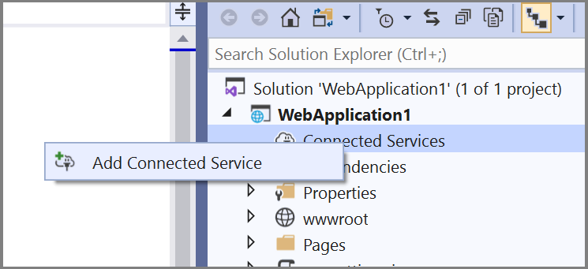

1. In the **Connected Services** tab, select the + icon for **Service Dependencies**.

    

1. In the **Add Dependency** page, select **Azure Storage**.

    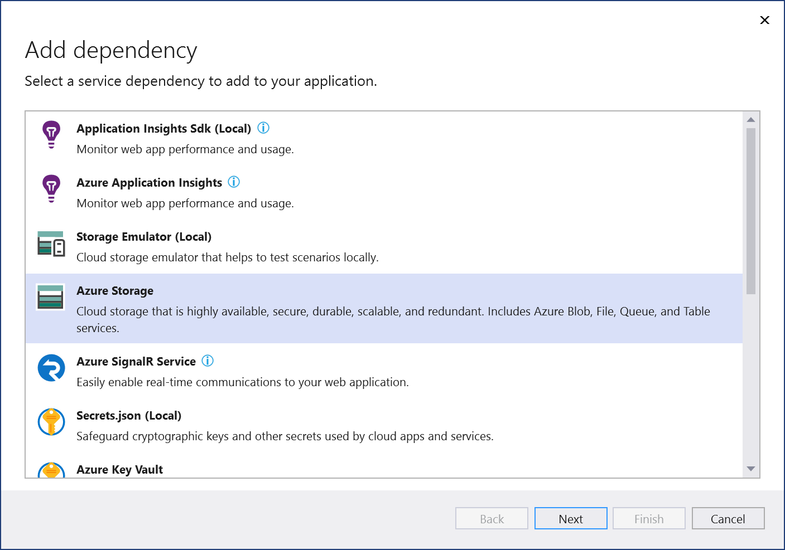

    If you aren't signed in already, sign in to your Azure account. If you don't have an Azure account, you can sign up for a [free trial](https://azure.microsoft.com/free/).

1. In the **Configure Azure Storage** screen, select an existing storage account, and select **Next**.

    If you need to create a storage account, go to the next step. Otherwise, skip to step 6.

    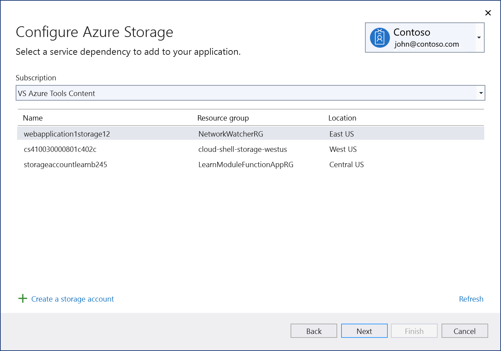

1. To create a storage account:

   1. Select **Create a storage account** at the bottom of the dialog.

   1. Fill out the **Azure Storage: Create new** dialog, and select **Create**.

       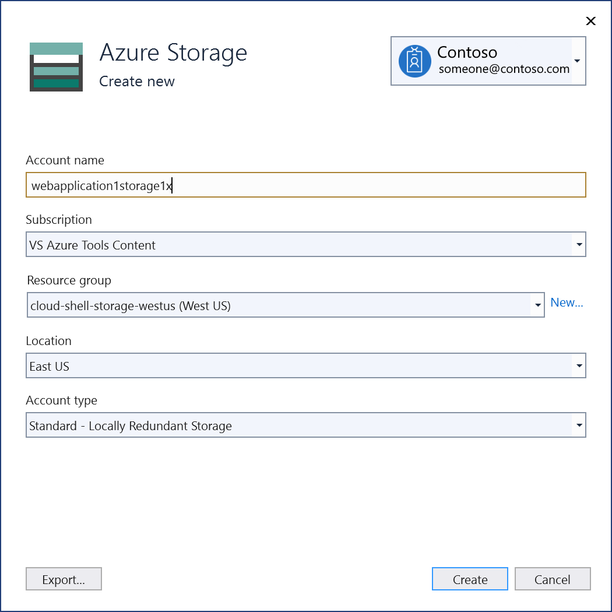

   1. When the **Azure Storage** dialog is displayed, the new storage account appears in the list. Select the new storage account in the list, and select **Next**.

1. Enter a connection string name, and choose whether you want the connection string stored in a local secrets file, or in [Azure Key Vault](/azure/key-vault).

   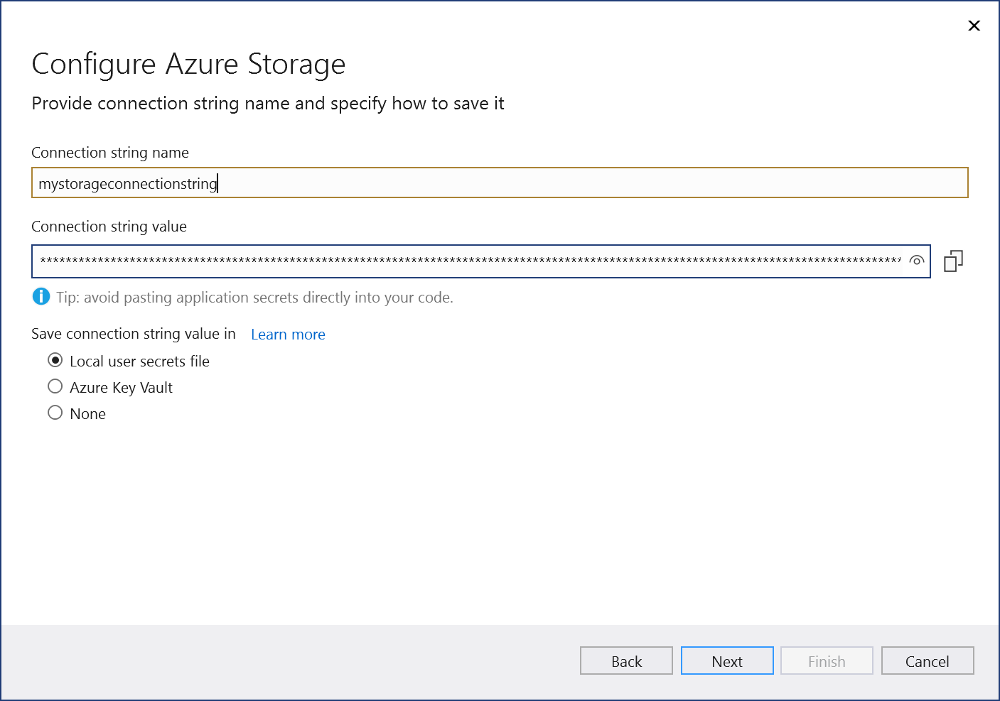

1. The **Summary of changes** screen shows all the modifications that will be made to your project if you complete the process. If the changes look OK, choose **Finish**.

   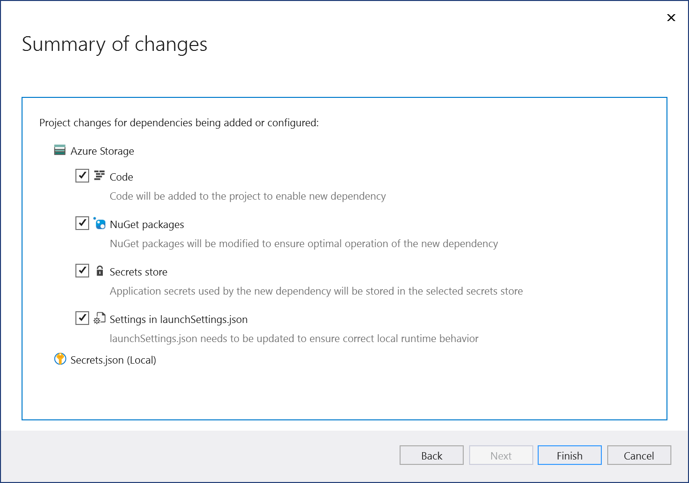

1. The storage connected service appears under the **Connected Services** node of your project.
:::moniker-end

:::moniker range=">=vs-2022"

1. Open your project in Visual Studio.

1. Press **Ctrl**+**Q** (or use the **Search** button in the Visual Studio IDE to the right of the main menu bar).

1. In **Feature search**, enter `Azure Storage`, and choose **Azure Storage - Project > Connected Services > Add > Azure Storage**.

   

1. In the **Connect to dependency** page, select **Azure Storage**, and then select **Next**.

    

    If you aren't signed in already, sign in to your Azure account. If you don't have an Azure account, you can sign up for a [free trial](https://azure.microsoft.com/free/).

1. In the **Connect to Azure Storage** screen, select an existing storage account, and select **Next**.

    If you need to create a storage account, go to the next step. Otherwise, skip to the following step.

    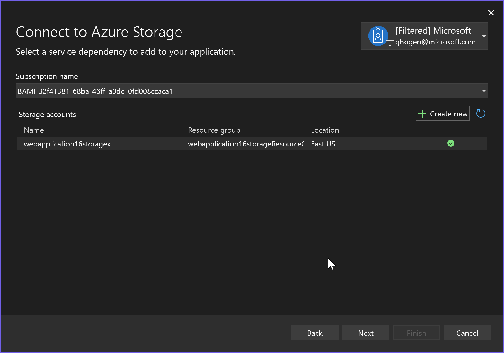

1. To create a storage account:

   1. Select **Create new** by the green plus sign.

   1. Fill out the **Azure Storage: Create new** dialog, and select **Create**.

       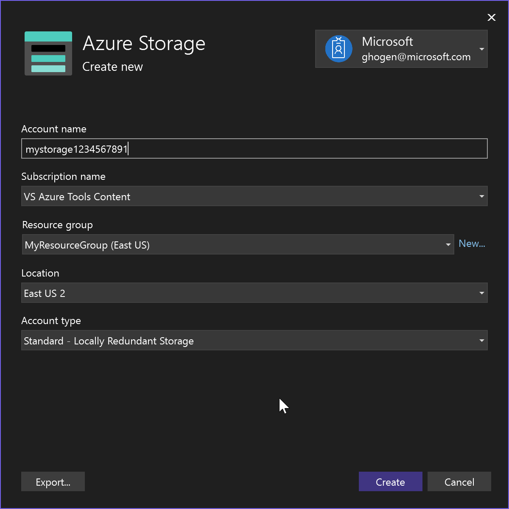

   1. When the **Azure Storage** dialog is displayed, the new storage account appears in the list. Select the new storage account in the list, and select **Next**.

1. Enter a connection string setting name. The setting name references the name of the connection string setting as it appears in the *secrets.json* file, or in Azure Key Vault.

   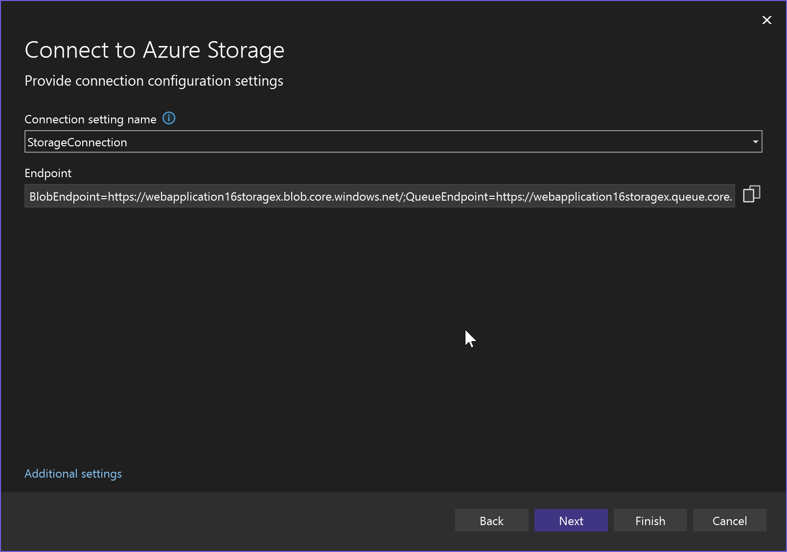

1. Choose whether you want the connection string stored in a local secrets file, in [Azure Key Vault](/azure/key-vault), or not stored anywhere.

   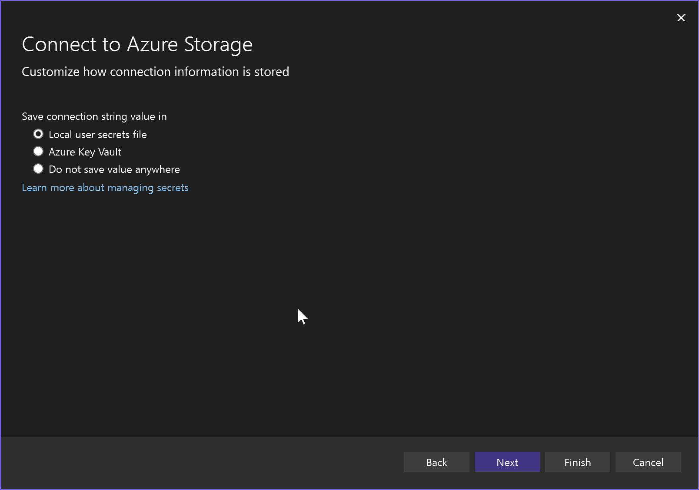

   > [!CAUTION]
   > If you're using a version of Visual Studio earlier than Visual Studio 17.12, and you choose to use a *secrets.json* file, you must take security precautions, since the connection string in the local secrets.json file could be exposed. If you're using Visual Studio 2022 version 17.12 or later, this procedure produces more secure result, because it yields a connection setting value, instead of a connection string with authentication credentials.

1. The **Summary of changes** screen shows all the modifications that will be made to your project if you complete the process. If the changes look OK, choose **Finish**.

   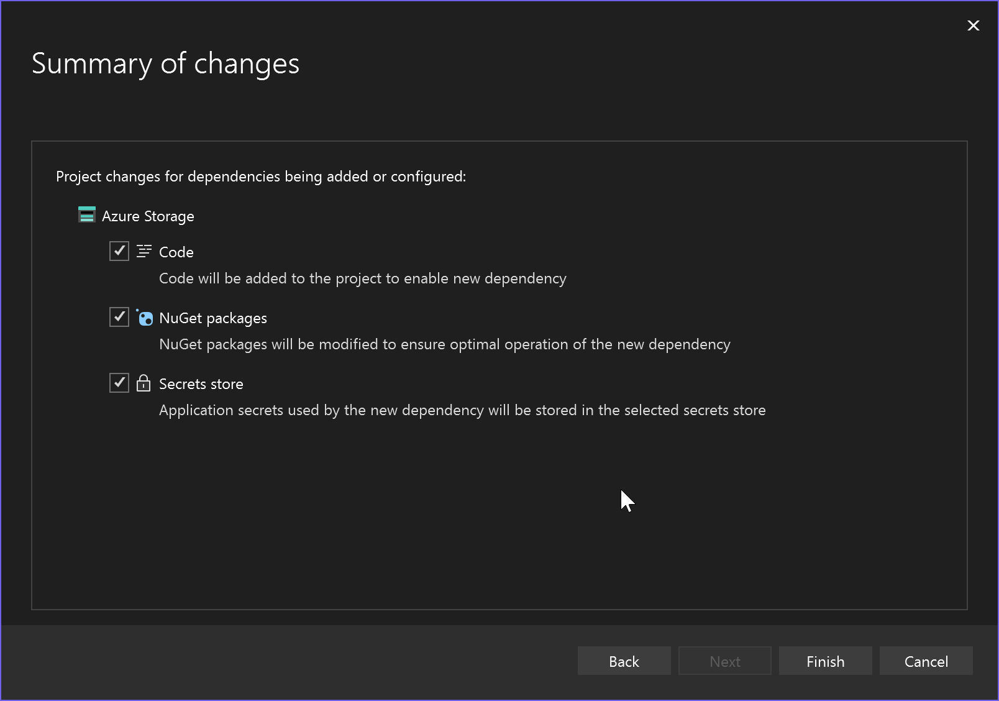

1. The storage connected service appears under the **Connected Services** node of your project.

## Understand authentication

After you run the previous procedure, your app is set up to use authentication to access the storage account. The connection information for this authentication are stored locally, if you chose the *secrets.json* method, or in your Azure Key Vault.

If you used the *secrets.json* file, open the file by using the three dots next to **Secrets.json** on the **Connected Services** tab to open a menu, and choose **Manage user secrets**. With Visual Studio 2022 version 17.12 and later, this file contains settings that reference a URI to obtain the secure connection string, rather than the connection string itself.

```json
{
  "StorageConnection:blobServiceUri": "https://webapplication16storagex.blob.core.windows.net/",
  "StorageConnection:queueServiceUri": "https://webapplication16storagex.queue.core.windows.net/",
  "StorageConnection:tableServiceUri": "https://webapplication16storagex.table.core.windows.net/"
}
```

With these settings in Visual Studio 17.12 and later, authentication is automatic and flexible. When you run or debug locally from Visual Studio, your Azure credentials saved by Visual Studio are used to access the Azure Storage account. If you launch your app from the command-line, you first need to sign in using the Azure CLI, and those credentials are automatically detected and used. But when your app is deployed to Azure and runs in Azure, it uses managed identity, without any code changes. The authentication works in all hosting environments because the Azure Identity APIs check for all chained credentials in sequence and use them when they're found. See [DefaultAzureCredential](/dotnet/api/azure.identity.defaultazurecredential?view=azure-dotnet&preserve-view=true).

:::moniker-end

## Next steps

Azure Storage supports blobs and queues, as well as other features.

To learn about working with blobs, you can continue with the quickstart for blob storage, but instead of starting at the beginning, you can start at [Azure blobs quickstart (.NET) - Code examples](/azure/storage/blobs/storage-quickstart-blobs-dotnet?tabs=visual-studio%2Cmanaged-identity%2Croles-azure-portal%2Csign-in-azure-cli%2Cidentity-visual-studio#code-examples).

To learn about working with queues, start at [Azure Queue Storage quickstart (.NET) - Code examples](/azure/storage/queues/storage-quickstart-queues-dotnet?tabs=passwordless%2Croles-azure-portal%2Cenvironment-variable-windows%2Csign-in-azure-cli#code-examples).

## Related content

- [Azure Storage forum](https://social.msdn.microsoft.com/forums/azure/home?forum=windowsazuredata)
- [Azure Storage documentation](/azure/storage/)
