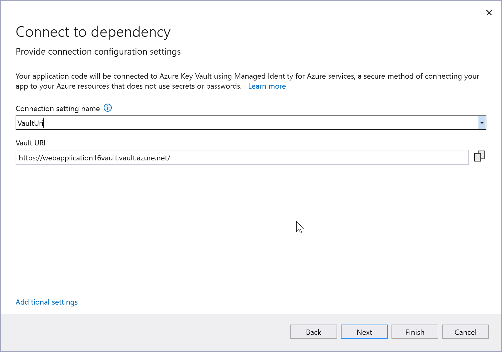

# Add Key Vault to your web application by using Visual Studio Connected Services

In this tutorial, you will learn how to easily add everything you need to start using Azure Key Vault to manage your secrets for web projects in Visual Studio, whether you are using ASP.NET Core or any type of ASP.NET project. By using the Connected Services feature in Visual Studio, you can have Visual Studio automatically add all the NuGet packages and configuration settings you need to connect to Key Vault in Azure.

## Prerequisites

- [!INCLUDE [prerequisites-azure-subscription](includes/prerequisites-azure-subscription.md)]
- **Visual Studio 2019 version 16.3** or later [Download it now](https://aka.ms/vsdownload?utm_source=mscom&utm_campaign=msdocs).

## Add Key Vault support to your project

:::moniker range=">=vs-2022"

Before you begin, make sure that you're signed in to Visual Studio. Sign in with the same account that you use for your Azure subscription. Then open an ASP.NET 4.7.1 or later, or ASP.NET Core web project, and do the following steps. The steps shown are for Visual Studio 2022 version 17.4. The flow might be slightly different for other versions of Visual Studio.

1. In **Solution Explorer**, right-click the project that you want to add the Key Vault support to, and choose **Add** > **Connected Service**, or right-click on the **Connected Services** node, and select **Add**.

   If you don't see the **Connected Services** node, choose **Project** > **Connected Services** > **Add**.

1. Under **Service Dependencies**, choose the **+** icon.
   The Connected Service page appears with services you can add to your project.
1. In the menu of available services, choose **Azure Key Vault** and click **Next**.

   

1. Select the subscription you want to use, and then if you already have a key vault you want to use, select it and click **Next**.

   

1. If you don't have an existing Key Vault, or if you need a key vault that you can set with different permissions than an existing one, click on **Create new Key Vault**. You'll be asked to provide the resource group, location, and SKU.

   

1. In the **Configure Key Vault** screen, you can change the name of the environment variable that references the Key Vault URI. The connection string is not stored here; it's stored in the key vault.

   

   > [!NOTE]
   > For improved security, in Visual Studio 17.12 and later, this step creates a connection setting name; previous versions create a connection string. Connection strings stored locally can lead to a security risk, if they're inadvertently exposed.

1. Click **Next** until you see a summary of the changes and then **Finish**.

:::moniker-end

:::moniker range="<=vs-2019"

Before you begin, make sure that you're signed in to Visual Studio. Sign in with the same account that you use for your Azure subscription. Then open an ASP.NET 4.7.1 or later, or ASP.NET Core web project, and do the following steps.

1. In **Solution Explorer**, right-click the project that you want to add the Key Vault support to, and choose **Add** > **Connected Service**, or right-click on the **Connected Services** node, and select **Add**.

   If you don't see the **Connected Services** node, choose **Project** > **Connected Services** > **Add**.

1. Under **Service Dependencies**, choose the **+** icon.
   The Connected Service page appears with services you can add to your project.
1. In the menu of available services, choose **Azure Key Vault** and click **Next**.

   

1. Select the subscription you want to use, and then if you already have a key vault you want to use, select it and click **Next**.

   

1. If you don't have an existing Key Vault, click on **Create new Key Vault**. You'll be asked to provide the resource group, location, and SKU.

   

1. In the **Configure Key Vault** screen, you can change the name of the environment variable that references the Key Vault URI. The connection string is not stored here; it's stored in the key vault.

   

1. Click **Next** to review a summary of the changes and then **Finish**.

:::moniker-end

Now, connection to Key Vault is established and you can access your secrets in code. If you just created a new key vault, test it by creating a secret that you can reference in code. You can create a secret by using the [Azure portal](/azure/key-vault/secrets/quick-create-portal), [PowerShell](/azure/key-vault/secrets/quick-create-powershell), or the [Azure CLI](/azure/key-vault/secrets/quick-create-cli).

See code examples of working with secrets at [Azure Key Vault Secrets client library for .NET - Code examples](/azure/key-vault/secrets/quick-create-net?tabs=azure-cli#code-examples).

## Configure access to the key vault

If you followed this tutorial with Visual Studio 2022 version 17.11 or earlier, your Key Vault permissions are set up to run with your own Azure subscription, but that might not be desirable for a production scenario. You can create a managed identity to manage Key Vault access for your app. See [How to Authenticate to Key Vault](/azure/key-vault/general/authentication) and [Assign a Key Vault access policy](/azure/key-vault/general/assign-access-policy-portal).

If your key vault is running on a different Microsoft account than the one you're signed in to Visual Studio (for example, the key vault is running on your work account, but Visual Studio is using your private account) you get an error in your Program.cs file, that Visual Studio can't get access to the key vault. To fix this issue, go to the [Azure portal](https://portal.azure.com), open your key vault, and choose **Access control (IAM)** to set permissions. See [Provide access to Key Vault keys, certificates, and secrets with an Azure role-based access control (RBAC)](/azure/key-vault/general/rbac-guide?tabs=azure-cli).

> [!NOTE]
> Older key vaults might use a legacy access policy model. It is recommended to migrate older key vaults to use Azure RBAC. See [Azure role-based access control (RBAC) vs. access policies](/azure/key-vault/general/rbac-access-policy).

## Next steps

Learn more about Key Vault development by reading the [Key Vault Developer's Guide](/azure/key-vault/general/developers-guide).

If your goal is to store configuration for an ASP.NET Core app in an Azure Key Vault, see [Azure Key Vault configuration provider in ASP.NET Core](/aspnet/core/security/key-vault-configuration).
