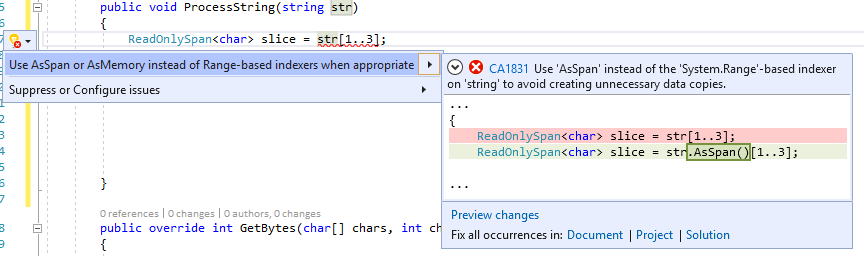

# CA1831: Use AsSpan instead of Range-based indexers for string when appropriate

|||
|-|-|
|CheckId|CA1831|
|Category|Microsoft.Performance|
|Breaking change|Non-breaking|

## Cause

When using a range-indexer on a string and assigning to a ReadOnlySpan&lt;char&gt; type, since strings are immutable the method <xref:System.String.Substring%2A?#System_String_Substring_System_Int32_System_Int32_> will be used instead of <xref:System.Span%601.Slice%2A?#System_Span_1_Slice_System_Int32_System_Int32_>, thus produces a copy of requested portion of the string.

## Rule description

Using a range-indexer on string or array and assigning to a memory/span type: The range indexer on a <xref:System.Span> is a non-copying <xref:System.Span%601.Slice%2A?#System_Span_1_Slice_System_Int32_System_Int32_> operation, but the range indexer on strings and arrays produce copies. This copy is usually unnecessary when it is implicitly used as a <xref:System.ReadOnlySpan%601> or <xref:System.ReadOnlyMemory%601> value. If a copy isn't intended, use the <xref:System.MemoryExtensions.AsSpan%2A?#System_MemoryExtensions_AsSpan_System_String_AsSpan> method to avoid the unnecessary copy. If the copy is intended either assign it to a local variable first or add an explicit cast, the analyzer only reports when an implicit cast is used on the result of the range indexer operation.

### Detects

Implicit conversions:
`ReadOnlySpan<char> slice = str[a..b];`

### Does not detect

Explicit conversions:
`ReadOnlySpan<char> slice = (ReadOnlySpan<char>)str[a..b];`

## How to fix violations

To fix the violation of this rule: use <xref:System.MemoryExtensions.AsSpan%2A?#System_MemoryExtensions_AsSpan_System_String_AsSpan> instead of the <xref:System.Range>-based indexer on 'string' to avoid creating unnecessary data copies.

```csharp
class C
{
    public void TestMethod(string str)
	{
        // The violation occurs
        ReadOnlySpan<char> slice = str[1..3];
		...
	}
}
```

```csharp
class C
{
	public void TestMethod(string str)
	{
        // The violation fixed with AsSpan extension method
        ReadOnlySpan<char> slice = str.AsSpan()[1..3];
		...
	}
}
```

> [!TIP]
> A code fix is available for this rule in Visual Studio. To use it, position the cursor on the array violation and press **Ctrl**+**.** (period). Choose **Use 'AsSpan' instead of the 'System.Range'-based indexer on 'string' to avoid creating unnecessary data copies.** from the list of options that is presented.
>
> 

## When to suppress warnings

It's safe to suppress a violation of this rule if creating a copy is intended, to suppress can simply add an explicit cast.

```csharp
class C
{
    public void TestMethod(string str)
	{
        // The violation occurs
        ReadOnlySpan<char> slice = str[1..3];
		...
	}
}
```

```csharp
class C
{
    public void TestMethod(string str)
	{
        // The violation fixed with explicit casting
        ReadOnlySpan<char> slice = (ReadOnlySpan<char>)str[1..3];
		...
	}
}
```

## Related rules

- [CA1832: Use AsSpan or AsMemory instead of Range-based indexers for getting ReadOnlySpan or ReadOnlyMemory portion of an array](ca1832.md)
- [CA1833: Use AsSpan or AsMemory instead of Range-based indexers for getting Span or Memory portion of an array](ca1833.md)

## See also

- [Performance warnings](../code-quality/performance-warnings.md)
