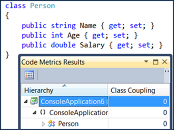
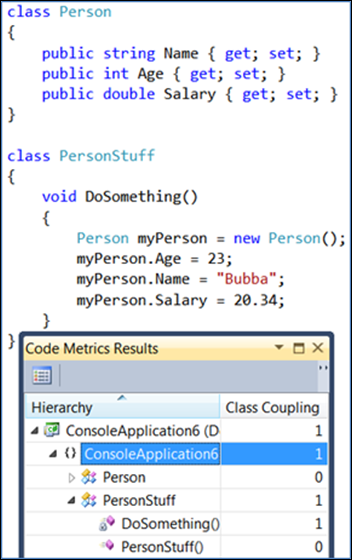
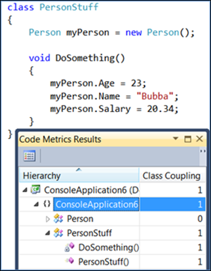
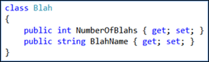
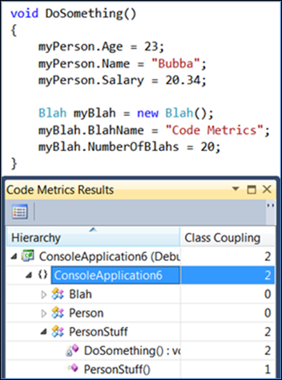
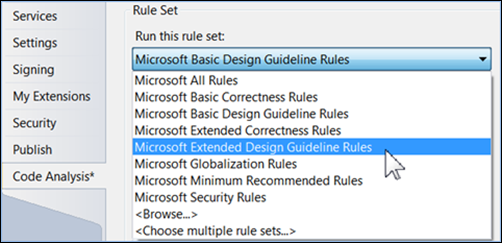

# Code metrics - Class coupling

Class coupling also goes by the name Coupling Between Objects (CBO) as originally defined by [CK94](#ck94). Basically, class coupling is a measure of how many classes a single class uses. A high number is bad and a low number is usually good with this metric. Class coupling has been shown to be an accurate predictor of software failure and recent studies have shown that an upper-limit value of 9 is the most efficient [S2010](#s2010).

According to the Microsoft documentation, class coupling "measures the coupling to unique classes through parameters, local variables, return types, method calls, generic or template instantiations, base classes, interface implementations, fields defined on external types, and attribute decoration. Good software design dictates that types and methods should have high cohesion and low coupling. High coupling indicates a design that is difficult to reuse and maintain because of its many interdependencies on other types."

The concepts of coupling and cohesion are clearly related. To keep this discussion on topic, we will not get into depth with cohesion other than to give a brief definition from [KKLS2000](#kkls2000):

"Module cohesion was introduced by Yourdon and Constantine as 'how tightly bound or related the internal elements of a module are to one another' [YC79](#yc79). A module has a strong cohesion if it represents exactly one task [...], and all its elements contribute to this single task. They describe cohesion as an attribute of design, rather than code, and an attribute that can be used to predict reusability, maintainability, and changeability."

## Class Coupling Example

Let's look at class coupling in action. First, create a new console application and create a new class called Person with some properties in it then immediately calculate the code metrics:

Notice the class coupling is 0 since this class doesn't use any other classes. Now create another class called PersonStuff with a method that creates an instance of Person and sets the property values. Calculate the code metrics again:

See how the class coupling value goes up? Also notice that, no matter how many properties you set, the class coupling value just goes up by 1 and not by some other value. Class coupling measures each class only once for this metric no matter how much it is used. In addition, can you see that `DoSomething()` has a 1 but the constructor, `PersonStuff()`, has a 0 for its value? Currently there is no code in the constructor that is using another class.

What if you put code in the constructor that used another class? Here is what you get:

Now the constructor clearly has code that uses another class and the class coupling metric shows this fact. Again, you can see the overall class coupling for `PersonStuff()` is 1 and `DoSomething()` is also 1 to show that only one external class is being used no matter how much internal code you have that uses it.

Next, create another new class. Give this class some name and create some properties inside it:

Now consume the class in our `DoSomething()` method within the `PersonStuff` class and calculate code metrics again:

As you can see, the class coupling for the PersonStuff class goes up to 2 and, if you drill into the class, you can see that the `DoSomething()` method has the most coupling in it but the constructor still only consumes 1 class. Using these metrics, you can see the overall max number for a given class and drill down into the details on a per-member basis.

## The Magic Number

As with cyclomatic complexity, there is no limit that fits all organizations. However, [S2010](#s2010) does indicate that a limit of 9 is optimal:

"Therefore, we consider the threshold values [...] as the most effective. These threshold values (for a single member) are CBO = 9[...]." (emphasis added)

## Code Analysis

Code analysis includes a category of Maintainability rules. For more information, see [Maintainability rules](/dotnet/fundamentals/code-analysis/quality-rules/maintainability-warnings). When using legacy code analysis, the Extended Design Guideline rule set contains a maintainability area:

Inside the maintainability area is a rule for class coupling:

This rule issues a warning when the class coupling is excessive. For more information, see [CA1506: Avoid excessive class coupling](/dotnet/fundamentals/code-analysis/quality-rules/ca1506).

## Citations

### CK94

Chidamber, S. R. & Kemerer, C. F. (1994). A Metrics Suite for Object Oriented Design (IEEE Transactions on Software Engineering, Vol. 20, No. 6). Retrieved May 14, 2011, from the University of Pittsburgh web site: [`http://www.pitt.edu/~ckemerer/CK%20research%20papers/MetricForOOD_ChidamberKemerer94.pdf`](http://www.pitt.edu/~ckemerer/CK%20research%20papers/MetricForOOD_ChidamberKemerer94.pdf)

### KKLS2000

Kabaili, H., Keller, R., Lustman, F., and Saint-Denis, G. (2000). Class Cohesion Revisited: An Empirical Study on Industrial Systems (Proceedings of the Workshop on Quantitative Approaches in Object-Oriented Software Engineering). Retrieved May 20, 2011, from Université de Montréal web site [`http://www.iro.umontreal.ca/~sahraouh/qaoose/papers/Kabaili.pdf`](http://www.iro.umontreal.ca/~sahraouh/qaoose/papers/Kabaili.pdf)

### SK2003

Subramanyam, R. & Krishnan, M. S. (2003). Empirical Analysis of CK Metrics for Object-Oriented Design Complexity: Implications for Software Defects (IEEE Transactions on Software Engineering, Vol. 29, No. 4).

### S2010

Shatnawi, R. (2010). A Quantitative Investigation of the Acceptable Risk Levels of Object-Oriented Metrics in Open-Source Systems (IEEE Transactions on Software Engineering, Vol. 36, No. 2).

### YC79

Edward Yourdon and Larry L. Constantine. Structured Design. Prentice Hall, Englewood Cliffs, N.J., 1979.
