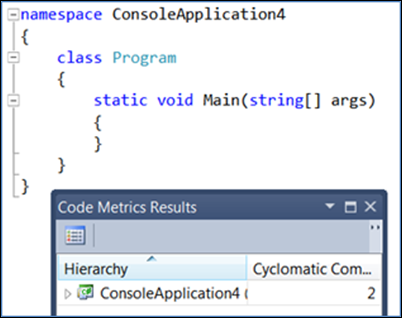
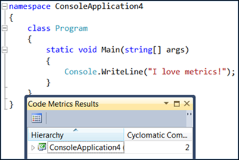
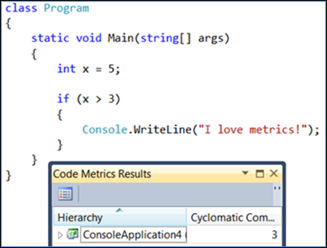
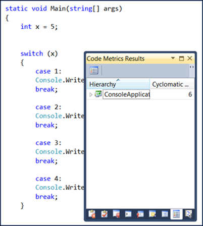
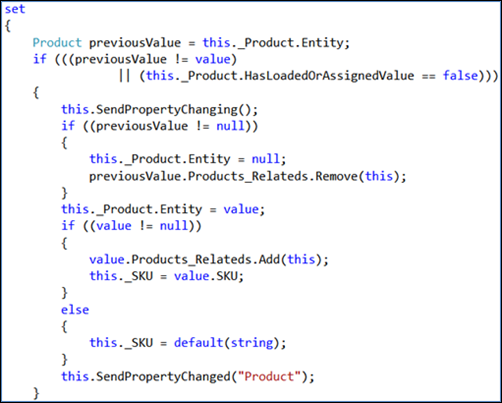
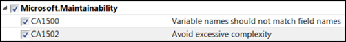

# Code metrics - Cyclomatic complexity

When working with code metrics, one of the least understood items seems to be cyclomatic complexity. Essentially, with cyclomatic complexity, higher numbers are bad and lower numbers are good. You can use cyclomatic complexity to get a sense of how hard any given code may be to test, maintain, or troubleshoot as well as an indication of how likely the code will be to produce errors. At a high level, we determine the value of cyclomatic complexity by counting the number of decisions made in your source code. In this article, you start out with a simple example of cyclomatic complexity to understand the concept quickly, then look at some additional information on actual usage and suggested limits. Finally, there's a section of citations that can be used to dig deeper into this subject.

## Example

Cyclomatic complexity is defined as measuring “the amount of decision logic in a source code function” [NIST235](#nist235). Simply put, the more decisions that have to be made in code, the more complex it is.

Let’s see it in action. Create a new console application and immediately calculate your code metrics by going to **Analyze > Calculate Code Metrics for Solution**.

Notice the cyclomatic complexity is at 2 (the lowest value possible). If you add non-decision code, notice the complexity doesn’t change:

If you add a decision, the cyclomatic complexity value goes up by 1:

When you change the if statement to a switch statement with 4 decisions to be made then, it goes from the original 2 to 6:

Let’s take a look at a (hypothetical) larger code base.

Notice that most of the items, as you drill down into the Products_Related class, have a value of 1 but a couple of them have a complexity of 5. By itself, this may not be a big deal, but given that most other members have a 1 in the same class, you should definitely look closer at those two items and see what is in them. You can do this by right-clicking the item and choosing **Go To Source Code** from the context menu. Take a closer look at `Product.set(Product)`:

Given all the if statements, you can see why the cyclomatic complexity is at a 5. At this point, you may decide that this is an acceptable level of complexity, or you might refactor to reduce the complexity.

## The Magic Number

As with many metrics in this industry, there is no exact cyclomatic complexity limit that fits all organizations. However, [NIST235](#nist235) does indicate that a limit of 10 is a good starting point:

“The precise number to use as a limit, however, remains somewhat controversial. The original limit of 10 as proposed by McCabe has significant supporting evidence, but limits as high as 15 have been used successfully as well. Limits over 10 should be reserved for projects that have several operational advantages over typical projects, for example experienced staff, formal design, a modern programming language, structured programming, code walkthroughs, and a comprehensive test plan. In other words, an organization can pick a complexity limit greater than 10, but only if it is sure it knows what it is doing and is willing to devote the additional testing effort required by more complex modules.” [NIST235](#nist235)

## Cyclomatic Complexity and Line Numbers

Just looking at the number of lines of code by itself is, at best, a very broad predictor of code quality. There is some basic truth to the idea that the more lines of code in a function, the more likely it is to have errors. However, when you combine cyclomatic complexity with lines of code, then you have a much clearer picture of the potential for errors.

As described by the Software Assurance Technology Center (SATC) at NASA:

“The SATC has found the most effective evaluation is a combination of size and (Cyclomatic) complexity. The modules with both a high complexity and a large size tend to have the lowest reliability. Modules with low size and high complexity are also a reliability risk because they tend to be very terse code, which is difficult to change or modify.” [SATC](#satc)

## Code Analysis

Code analysis includes a category of Maintainability rules. For more information, see [Maintainability rules](/dotnet/fundamentals/code-analysis/quality-rules/maintainability-warnings). When using legacy code analysis, the Extended Design Guideline rule set contains a maintainability area:

Inside the maintainability area is a rule for complexity:

This rule issues a warning when the cyclomatic complexity reaches 25, so it can help you avoid excessive complexity. To learn more about the rule, see [CA1502](/dotnet/fundamentals/code-analysis/quality-rules/ca1502)

## Putting It All Together

The bottom line is that a high complexity number means greater probability of errors with increased time to maintain and troubleshoot. Take a closer look at any functions that have a high complexity and decide if they should be refactored to make them less complex.

## Citations

### MCCABE5

McCabe, T. and A. Watson (1994), Software Complexity (CrossTalk: The Journal of Defense Software Engineering).

### NIST235

Watson, A. H., & McCabe, T. J. (1996). Structured Testing: A Testing Methodology Using the Cyclomatic Complexity Metric (NIST Special Publication 500-235). Retrieved May 14, 2011, from McCabe Software web site: [http://www.mccabe.com/pdf/mccabe-nist235r.pdf](http://www.mccabe.com/pdf/mccabe-nist235r.pdf)

### SATC

Rosenberg, L., Hammer, T., Shaw, J. (1998). Software Metrics and Reliability (Proceedings of IEEE International Symposium on Software Reliability Engineering). Retrieved May 14, 2011, from Penn State University web site: [http://citeseerx.ist.psu.edu/viewdoc/download?doi=10.1.1.104.4041&rep=rep1&type=pdf](http://citeseerx.ist.psu.edu/viewdoc/download?doi=10.1.1.104.4041&rep=rep1&type=pdf)