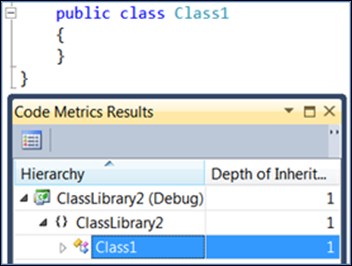
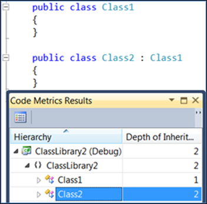
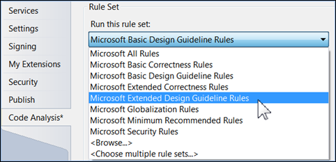
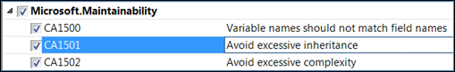

# Code metrics - Depth of inheritance (DIT)

In this article, you learn about one of the metrics designed specifically for object-oriented analysis: Depth of Inheritance. Depth of inheritance, also called depth of inheritance tree (DIT), is defined as "the maximum length from the node to the root of the tree" [CK](#ck). You can see this with a simple example. Create a new Class Library project and, before writing any code, calculate the code metrics by choosing **Analyze > Calculate Code Metrics for Solution**.

Since all classes inherit from `System.Object`, the depth is 1 currently. If you inherit from this class and examine the new class, you can see the result:

Notice that the lower the node in the tree (`Class2` in this case), the higher the depth of inheritance. You could continue to create children and cause the depth to increase as much as you want.

## Assumptions

Depth of inheritance is predicated on three fundamental assumptions [CK](#ck):

1. The deeper a class in the hierarchy, the greater the number of methods it will probably inherit, which makes it harder to predict its behavior.

2. Deeper trees involve greater design complexity since more classes and methods are involved.

3. Deeper classes in the tree have a greater potential for reusing inherited methods.

Assumptions 1 and 2 tell you that having a higher number for depth is bad. If that is where it ended, you would be in good shape; however, assumption 3 indicates that a higher number for depth is good for potential code reuse.

## Analysis

Here is how you read the depth metric:

- Low number for depth

  A low number for depth implies less complexity but also the possibility of less code reuse through inheritance.

- High number for depth

  A high number for depth implies more potential for code reuse through inheritance but also higher complexity with a higher probability of errors in the code.

## Code Analysis

Code analysis includes a category of Maintainability rules. For more information, see [Maintainability rules](/dotnet/fundamentals/code-analysis/quality-rules/maintainability-warnings). When using legacy code analysis, the Extended Design Guideline rule set contains a maintainability area:

Inside the maintainability area is a rule for inheritance:

This rule issues a warning when the depth of inheritance reaches 6 or greater, so it is a good rule to help prevent excessive inheritance. To learn more about the rule, see [CA1501](/dotnet/fundamentals/code-analysis/quality-rules/ca1501).

## Putting It All Together

High values for DIT mean the potential for errors is also high, low values reduce the potential for errors. High values for DIT indicate a greater potential for code reuse through inheritance, low values suggest less code reuse though inheritance to use. Due to lack of sufficient data, there is no currently accepted standard for DIT values. Even studies done recently did not find sufficient data to determine a viable number that could be used as a standard number for this metric [Shatnawi](#shatnawi). Although there is no empirical evidence to support it, several resources suggest that a DIT around 5 or 6 should be an upper limit. For example, see [`https://www.devx.com/architecture-zone/45611/`](https://www.devx.com/architecture-zone/45611/).

## Citations

### CK

Chidamber, S. R. & Kemerer, C. F. (1994). A Metrics Suite for Object Oriented Design (IEEE Transactions on Software Engineering, Vol. 20, No. 6). Retrieved May 14, 2011, from the University of Pittsburgh web site: [`http://www.pitt.edu/~ckemerer/CK%20research%20papers/MetricForOOD_ChidamberKemerer94.pdf`](http://www.pitt.edu/~ckemerer/CK%20research%20papers/MetricForOOD_ChidamberKemerer94.pdf)

### Krishnan

Subramanyam, R. & Krishnan, M. S. (2003). Empirical Analysis of CK Metrics for Object-Oriented Design Complexity: Implications for Software Defects (IEEE Transactions on Software Engineering, Vol. 29, No. 4). Retrieved May 14, 2011, originally obtained from University of Massachusetts Dartmouth web site [`https://ieeexplore.ieee.org/abstract/document/1191795`](https://ieeexplore.ieee.org/abstract/document/1191795)

### Shatnawi

Shatnawi, R. (2010). A Quantitative Investigation of the Acceptable Risk Levels of Object-Oriented Metrics in Open-Source Systems (IEEE Transactions on Software Engineering, Vol. 36, No. 2).
