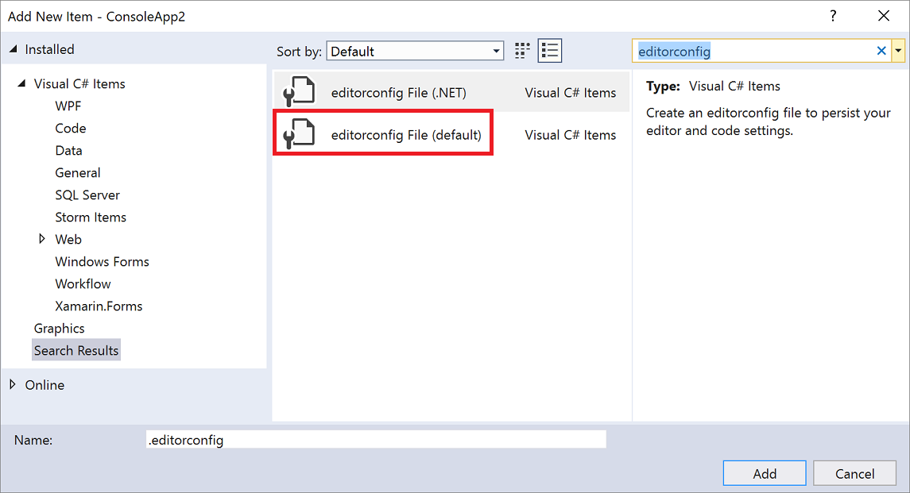

# Configure FxCop analyzers

The [FxCop analyzers package](install-fxcop-analyzers.md) consists of the most important "FxCop" rules from legacy analysis converted to .NET Compiler Platform-based code analyzers. For certain FxCop rules, you can refine which parts of your codebase they should be applied to through [configurable options](fxcop-analyzer-options.md). Each option is specified by adding a key-value pair to an [EditorConfig](https://editorconfig.org) file. A configuration file can be [specific to a project](#per-project-configuration) or it can be [shared](#shared-configuration) between two or more projects.

> [!TIP]
> Add an .editorconfig file to your project by right-clicking on the project in **Solution Explorer** and selecting **Add** > **New Item**. In the **Add New Item** window, enter **editorconfig** in the search box. Select the **editorconfig File (default)** template and choose **Add**.
>
> 

::: moniker range=">=vs-2019"

For information about configuring a rule's severity (for example, whether it's an error or a warning), see [Set rule severity in an EditorConfig file](use-roslyn-analyzers.md#set-rule-severity-in-an-editorconfig-file). Or, you can choose one of the built-in [EditorConfig files or rule sets](analyzer-rule-sets.md) to quickly enable or disable a category of rules.

::: moniker-end

The remainder of this article discusses general syntax for the [options that refine](fxcop-analyzer-options.md) where FxCop rules are applied.

> [!NOTE]
> You cannot configure legacy FxCop rules by using an EditorConfig file. For information about the differences between legacy analysis and FxCop analyzers, see [FxCop analyzers FAQ](fxcop-analyzers-faq.md).

## Option scopes

Each refining option can be configured for all rules, for a category of rules (for example, Naming or Design), or for a specific rule.

### All rules

The syntax for configuring an option for *all* rules is as follows:

|Syntax|Example|
|-|-|
| dotnet_code_quality.OptionName = OptionValue | `dotnet_code_quality.api_surface = public` |

### Category of rules

The syntax for configuring an option for a *category* of rules (such as Naming, Design, or Performance) is as follows:

|Syntax|Example|
|-|-|
| dotnet_code_quality.RuleCategory.OptionName = OptionValue | `dotnet_code_quality.Naming.api_surface = public` |

### Specific rule

The syntax for configuring an option for a *specific* rule is as follows:

|Syntax|Example|
|-|-|
| dotnet_code_quality.RuleId.OptionName = OptionValue | `dotnet_code_quality.CA1040.api_surface = public` |

## Per-project configuration

To enable EditorConfig-based analyzer configuration for a specific project, add an *.editorconfig* file to the project's root directory.

Currently there is no hierarchical support for "combining" .editorconfig files that exist at different directory levels, for example, the solution and project level.

## Shared configuration

You can share an .editorconfig file for FxCop analyzer configuration between two or more projects, but it requires some additional steps.

1. Save the *.editorconfig* file to a common location.

2. Create a *.props* file with the following content:

   ```xml
   <Project DefaultTargets="Build" xmlns="http://schemas.microsoft.com/developer/msbuild/2003">
     <PropertyGroup>
       <SkipDefaultEditorConfigAsAdditionalFile>true</SkipDefaultEditorConfigAsAdditionalFile>
     </PropertyGroup>
     <ItemGroup Condition="Exists('<your path>\.editorconfig')" >
       <AdditionalFiles Include="<your path>\.editorconfig" />
     </ItemGroup>
   </Project>
   ```

3. Add a line to your *.csproj* or *.vbproj* file to import the *.props* file you created in the previous step. This line must be placed before any lines that import the FxCop analyzer *.props* files. For example, if your .props file is named *editorconfig.props*:

   ```xml
   ...
   <Import Project="..\..\editorconfig.props" Condition="Exists('..\..\editorconfig.props')" />
   <Import Project="..\packages\Microsoft.CodeAnalysis.FxCopAnalyzers.2.6.3\build\Microsoft.CodeAnalysis.FxCopAnalyzers.props" Condition="Exists('..\packages\Microsoft.CodeAnalysis.FxCopAnalyzers.2.6.3\build\Microsoft.CodeAnalysis.FxCopAnalyzers.props')" />
   ...
   ```

4. Reload the project.

> [!NOTE]
> The arbitrary shared location of the EditorConfig file described here applies only to configuring the scope of certain FxCop analyzer rules. For other settings, such as rule severity, general editor settings, and code style, the EditorConfig file must always be placed in the project folder or a parent folder.

## See also

- [Rule scope options for FxCop analyzers](fxcop-analyzer-options.md)
- [Analyzer configuration](https://github.com/dotnet/roslyn-analyzers/blob/master/docs/Analyzer%20Configuration.md)
- [FxCop analyzers](install-fxcop-analyzers.md)
- [.NET coding conventions for EditorConfig](../ide/editorconfig-code-style-settings-reference.md)
