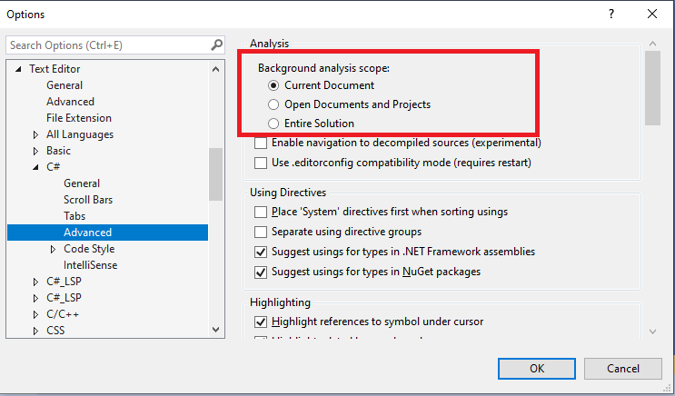

# Configure live code analysis for .NET

 [!INCLUDE [Visual Studio](~/includes/applies-to-version/vs-windows-only.md)]

Visual Studio analyzes code while you're editing source files in the editor. This is referred to as *background analysis*. Some of it is required minimal analysis for an acceptable Visual Studio IDE editing experience. Some of it is for improved responsiveness for IDE features. While some of it is to enable additional IDE functionality, such as diagnostics and code fixes from Roslyn analyzers. Based on the functionality, these analyses can be grouped as follows:

- **Background computation of diagnostics**: Analysis to compute errors, warnings, and suggestions in source files. These diagnostics show up as entries in the error list and as squiggles in the editor. They can be classified into two categories:
  - C# and Visual Basic compiler diagnostics
  - Roslyn analyzer diagnostics, which includes:

    - Built-in IDE analyzers for code-style suggestions
    - Built-in CA analyzers for code-quality suggestions
    - Third party analyzer packages [installed](./install-roslyn-analyzers.md) for projects in the current solution.

- **Other background analyses**: Analysis to improve the responsiveness and Visual Studio interaction for IDE features. Some examples of such analyses are:
  - Background parsing of open files.
  - Background compilation of projects with open files to realize symbols for improved responsiveness of certain IDE features.
  - Building syntax and symbol caches.
  - Detecting designer association for source files, such as forms and controls.

## Default analysis scope

By default, compiler diagnostics run on all open documents, and, in Visual Studio 2022 and later, Roslyn analyzer diagnostics run on the currently active document only. A few of the _other background analyses_ mentioned previously execute for all projects that have at least one open file. A few background analyses execute for the entire solution.

## Custom analysis scope

The default scope of each background analysis has been tuned for the optimal user experience, functionality, and performance for a majority of customer scenarios and solutions. However, there are cases where customers may want to customize this scope to decrease or increase the background analysis. For example:

- Power save mode: If you're running on laptop battery, you may want to minimize the power consumption for longer battery life. In this scenario, you'd want to minimize the background analysis.
- On-demand code analysis: If you prefer turning off live analyzer execution and running code analysis manually when required, you'd want to minimize background analysis. See [How to: Manually run code analysis on-demand](./how-to-run-code-analysis-manually-for-managed-code.md).
- Full solution analysis: You may want to see all diagnostics in all files in the solution, regardless of whether they are open in the editor or not. In this scenario, you'd want to maximize the background analysis scope to the entire solution.

Starting in Visual Studio 2019, you can explicitly customize the scope of all live code analysis, including diagnostics computation, for C# and Visual Basic projects. Available analysis scopes are:

::: moniker range=">=vs-2022"

| Option | Description |
| - | - |
| None | All analyzers and corresponding code fixes are disabled.  Compiler diagnostics and corresponding code fixes are enabled on *all open* documents. |
| Current document (default) | All analyzers run just on the currently active document.  Compiler diagnostics are enabled on *all open* documents. |
| Open documents | All analyzers and compiler diagnostics are enabled on *all open* documents. |
| Entire solution | All analyzers and compiler diagnostics are enabled on *all* documents in the solution, whether open or closed. |

::: moniker-end

::: moniker range="<=vs-2019"

- **Current document**: Minimizes the live code analysis scope to only execute for the current or visible file in the editor.
- **Open documents**: The live code analysis scope includes all open documents. This is the default.
- **Entire solution**: Maximizes the live code analysis scope to execute for all files and projects in the entire solution.

::: moniker-end

You can choose one of the above custom analysis scopes in **Options** by following these steps:

1. To open the **Options** dialog box, on the menu bar in Visual Studio choose **Tools** > **Options**.

2. In the **Options** dialog box, choose **Text Editor** > **C#** (or **Visual Basic**) > **Advanced**.

3. Select the desired **Background analysis scope** to customize the analysis scope. Choose **OK** when you're done.

::: moniker range=">=vs-2022"

::: moniker-end

::: moniker range="<=vs-2019"

::: moniker-end

> [!NOTE]
> Prior to Visual Studio 2019, you can customize the analysis scope for diagnostics computation to the entire solution using the **Enable full solution analysis** check box from **Tools** > **Options** > **Text Editor** > **C#** (or **Visual Basic**) > **Advanced** tab. There is no support to minimize the background analysis scope in prior Visual Studio versions.

## Automatically minimize live code analysis scope

If Visual Studio detects that 200 MB or less of system memory is available to it, it automatically minimizes the live code analysis scope to "Current Document". If this occurs, an alert appears informing you that Visual Studio has disabled some features. For more information, see [Automatic feature suspension](automatic-feature-suspension.md).

## See also

- [Automatic feature suspension](./automatic-feature-suspension.md)
- [Power save mode feature request](https://github.com/dotnet/roslyn/issues/38429)
