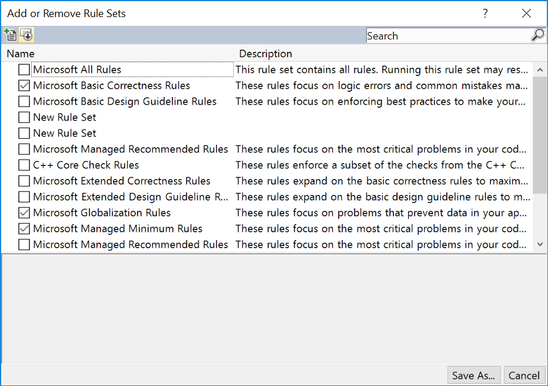

# Customize a rule set

You can create a custom rule set to meet specific project needs for code analysis.

## Create a custom rule set from an existing rule set

To create a custom rule set, you can open a built-in rule set in the **rule set editor**. From there, you can add or remove specific rules, and you can change the action that occurs when a rule is violated&mdash;for example, show a warning or an error.

1. In **Solution Explorer**, right-click the project and then select **Properties**.

2. On the **Properties** pages, select the **Code Analysis** tab.

::: moniker range="vs-2017"

3. In the **Run this rule set** drop-down list, do one of the following:

::: moniker-end

::: moniker range=">=vs-2019"

3. In the **Active rules** drop-down list, do one of the following:

::: moniker-end

   - Choose the rule set that you want to customize.

     \- or -

   - Select **\<Browse>** to specify an existing rule set that is not in the list.

4. Select **Open** to display the rules in the rule set editor.

> [!NOTE]
> If you have a .NET Core or .NET Standard project, the process is a little different because the **Code Analysis** tab in the project properties does not support the same options. Follow the steps to [copy a predefined rule set to your project and set it as the active rule set](/dotnet/fundamentals/code-analysis/code-quality-rule-options). After you've copied over a rule set, you can [edit it in the Visual Studio rule set editor](working-in-the-code-analysis-rule-set-editor.md) by opening it from **Solution Explorer**.

## Create a new rule set

You can create a new rule set file from the **New File** dialog:

1. Select **File** > **New** > **File**, or press **Ctrl**+**N**.

2. In the **New File** dialog box, select the **General** category on the left, and then select **Code Analysis Rule Set**.

3. Select **Open**.

   The new *.ruleset* file opens in the rule set editor.

## Create a custom rule set from multiple rule sets

> [!NOTE]
> The following procedure does not apply to .NET Core or .NET Standard projects, which don't support the same features in the **Code Analysis** property tab.

1. In **Solution Explorer**, right-click the project and then select **Properties**.

2. On the **Properties** pages, select the **Code Analysis** tab.

::: moniker range="vs-2017"

3. Select **\<Choose multiple rule sets>** from **Run this rule set**.

::: moniker-end

::: moniker range=">=vs-2019"

3. Select **\<Choose multiple rule sets>** from **Active rules**.

::: moniker-end

4. In the **Add or Remove Rule Sets** dialog box, choose the rule sets you want to include in your new rule set.

   

5. Select **Save As**, enter a name for the *.ruleset* file, and then select **Save**.

   The new rule set is selected in the **Run this rule set** list.

6. Select **Open** to open the new rule set in the rule set editor.

## Rule precedence

- If the same rule is listed two or more times in a rule set with different severities, the compiler generates an error. For example:

   ```xml
   <RuleSet Name="Rules for ClassLibrary21" Description="Code analysis rules for ClassLibrary21.csproj." ToolsVersion="15.0">
     <Rules AnalyzerId="Microsoft.Analyzers.ManagedCodeAnalysis" RuleNamespace="Microsoft.Rules.Managed">
       <Rule Id="CA1021" Action="Warning" />
       <Rule Id="CA1021" Action="Error" />
     </Rules>
   </RuleSet>
   ```

- If the same rule is listed two or more times in a rule set with the *same* severity, you may see the following warning in the **Error List**:

   **CA0063 : Failed to load rule set file '\[your].ruleset' or one of its dependent rule set files. The file does not conform to the rule set schema.**

- If the rule set includes a child rule set by using an **Include** tag, and the child and parent rule sets both list the same rule but with different severities, then the severity in the parent rule set takes precedence. For example:

   ```xml
   <!-- Parent rule set -->
   <?xml version="1.0" encoding="utf-8"?>
   <RuleSet Name="Rules for ClassLibrary21" Description="Code analysis rules for ClassLibrary21.csproj." ToolsVersion="15.0">
     <Include Path="classlibrary_child.ruleset" Action="Default" />
     <Rules AnalyzerId="Microsoft.Analyzers.ManagedCodeAnalysis" RuleNamespace="Microsoft.Rules.Managed">
       <Rule Id="CA1021" Action="Warning" /> <!-- Overrides CA1021 severity from child rule set -->
     </Rules>
   </RuleSet>

   <!-- Child rule set -->
   <?xml version="1.0" encoding="utf-8"?>
   <RuleSet Name="Rules from child" Description="Code analysis rules from child." ToolsVersion="15.0">
     <Rules AnalyzerId="Microsoft.Analyzers.ManagedCodeAnalysis" RuleNamespace="Microsoft.Rules.Managed">
       <Rule Id="CA1021" Action="Error" />
     </Rules>
   </RuleSet>
   ```

## Name and description

To change the display name of a rule set that's open in the editor, open the **Properties** window by selecting **View** > **Properties Window** on the menu bar. Enter the display name in the **Name** box. You can also enter a description for the rule set.

## Next steps

Now that you have a rule set, the next step is to customize the rules by adding or removing rules or modifying the severity of rule violations.

> [!div class="nextstepaction"]
> [Modify rules in the rule set editor](../code-quality/working-in-the-code-analysis-rule-set-editor.md)

## See also

- [How to: Configure Code Analysis for a Managed Code Project](../code-quality/how-to-configure-code-analysis-for-a-managed-code-project.md)
- [Code analysis rule set reference](../code-quality/rule-set-reference.md)